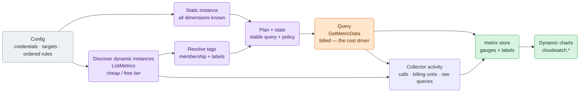
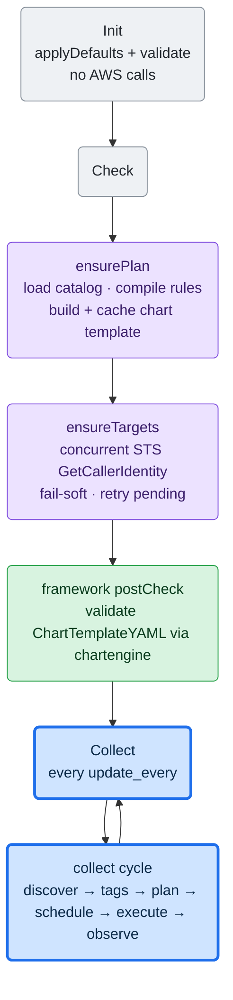
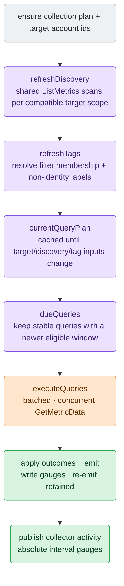

# AWS CloudWatch Collector Architecture

Maintainer-oriented map of `cloudwatch`, written to be read top to bottom as a
journey: the plain model and the big picture first, then the lifecycle and the
collection cycle, then each stage in detail, and finally the profile schema,
invariants, and where to change things. Per-service metric and chart details live
in the profile YAMLs (`config/go.d/cloudwatch.profiles/`) and the focused tests,
not here.

The one rule that shapes most of what follows:

> `GetMetricData` is billed by requested metrics, so the collector normally queries
> each series only when its next aligned effective-period window is eligible and re-emits cached values in between.
> Transient failures use bounded per-query backoff; `update_every` therefore affects failure-time retry cost, not the
> normal successful cadence.

## What It Does

`cloudwatch` is a framework-V2 go.d collector that pulls AWS CloudWatch metrics
for a curated set of AWS services and renders them as dynamic Netdata charts. It
is **profile-driven**: each service is a YAML profile (see Profiles) declaring its
CloudWatch namespace, the dimension set that identifies one instance, the
metrics/statistics to query, and a chart template — so adding or adjusting a
service is usually a YAML edit, not Go.

It does not generate per-account or per-resource nodes: AWS resources are chart
*instances* keyed by `by_labels`. All output follows the job's configured
`vnode`, when present, otherwise the Agent host; the collector creates no host
scopes of its own.

## Big Picture

Config picks the services; the collector discovers what actually exists when a
profile has identifying dimensions, queries each resulting instance on a
per-period schedule, and renders the results as charts under the `cloudwatch.`
namespace. A profile whose dimensions are all constants already describes one
complete instance, so compilation creates that static instance directly.



Each collection cycle (`collect.go`), in order:

1. compile the raw configuration and resolve one AWS account id per target
   (`plan.go`, `identity.go`);
2. use compiler-created instances for all-constant profiles; for dynamic
   profiles, share one `ListMetrics` scan per (target, region, namespace) and
   match each participating profile against that stream (`discover.go`);
3. resolve resource-tag membership and optional chart labels (`tags.go`);
4. reuse or rebuild the stable per-series query blueprint
   (`query_plan.go`);
5. execute the due queries in concurrent batches (`query_executor.go`);
6. apply explicit per-query outcomes to completion, retry, and source-observation state (`observe.go`);
7. write retained observations or synthetic zero presentation as float gauges into `metrix`, stamped with
   `{account_id, region, <dimension labels>}`, and re-emit not-due series (`query_emit.go`);
8. publish absolute collector activity for the commit-acknowledged interval (`activity.go`);
9. serve a chart template built once from the selected profiles plus one collector-activity group (`chart.go`).

## Lifecycle

Framework V2: `Init` → `Check` → repeated `Collect`; there is no background
`Run` (the collector does not implement `CollectorV2Runner`). `collector.go`
owns the `Collector` struct and lifecycle.



- **Init** does config only (`applyDefaults`, `validate`) — no network.
- **Check** compiles the configuration, builds the chart template, and resolves
  up to 64 target account IDs concurrently through STS. The template is built here because the
  framework's `postCheck`
  validates `ChartTemplateYAML()` through `chartengine.LoadYAML` before the
  first `Collect`; an unbuilt template would fail the job.
- **Collect** runs the whole cycle (below). `ensurePlan` short-circuits once
  compiled; `ensureTargets` retries only unresolved targets.
- **Cleanup** resets the collection plan, resolved targets, cached template,
  discovery/query snapshots, client caches, and per-query observation state so a framework
  re-Init after failed autodetection starts clean. Pending collector activity and
  its known interval-gauge keys are reset as well. The `metrix` store is created
  once in `New` and persists — it is not recreated.
- **ChartTemplateYAML** returns the cached string; no work at call time.

## Collection Cycle

`collect.go` ties the stages together, in order:



## Configuration Compilation

`config.go`, `config_validate.go`, `plan.go`, `plan_compiler.go`, and
`runtime.go` separate the raw operator contract,
compiler state, and installed execution plan:

- YAML and JSON use normal typed decoding; unknown keys are ignored. `Config.validate`
  decides whether the resulting configuration is valid during `Init` / `Check`.
- Named credential sources describe only credential acquisition. Named targets
  describe monitored identities and optional role assumption. Ordered rules bind
  targets to profile selectors, optional exact metric/statistic allowlists,
  regions, and effective resource-tag predicates. Omitting `metrics` selects every
  exported series from the selected profiles. When present, `metrics` contains one
  group per narrowed profile: group statistics are inherited by included exact
  MetricNames unless an entry supplies a replacement statistics list.
- `rule_defaults.filters.resource_tags` is inherited when a rule omits
  `filters.resource_tags`; a present list replaces the default and `[]` disables it.
  Predicates are canonicalized once: exact case-sensitive keys are ANDed and the
  exact values for one key are ORed.
- `compileConfig` coordinates a private staged compiler that resolves every reference, rejects unused credential/target
  definitions, applies profile defaults/include/exclude semantics, rejects duplicate
  profile groups/MetricNames/normalized statistics, resolves inherited and replaced
  statistics into canonical exact exported-series descriptors, intersects
  intrinsic supported regions, enforces target/role partition consistency, and
  emits immutable ordered scopes.
- Ordered policy scopes and tag-membership identities are separate. Scopes with the
  same target/profile/region/predicate share one membership identity, and already-owned
  exported series are removed statically with one bounded aggregate diagnostic per
  affected rule. A fully overlapping later scope is removed, so one exported series
  cannot acquire two competing query policies; a partially overlapping scope retains
  its unshadowed series.
  Same-account cross-target overlap remains until discovery, where final instance
  identity can be evaluated correctly. Scopes with different predicates remain
  ordered policy scopes even when they share one discovery scan.
- A profile whose dimensions are all constants compiles one immutable static
  instance into each eligible target/region scope. It consumes no discovery-group
  budget and needs no resource-tag fetch; query ownership and every final-instance
  and query-work limit still apply normally.
- Fixed internal caps bound credentials, 64 targets, rules, list references,
  candidate-scope evaluation, and compiled scopes. Overflow fails compilation and never installs a partial plan;
  `limits.max_instances` and `limits.max_discovery_groups` are operator safeguards for final selected instances and
  intended discovery breadth.

## Discovery

*Which* profiles to query is decided by config, not by discovery (see Profiles):
the selected profiles are the CloudWatch namespaces `ListMetrics` runs against.
Discovery then finds which *instances* of those profiles exist per target and region.

`discover.go`. `refreshDiscovery` re-runs only when the snapshot TTL
(`discovery.refresh_every`, default 300s) has expired.

All-constant scopes are omitted from discovery groups. A static-only plan makes
`refreshDiscovery` a true no-op: no `ListMetrics`, snapshot installation, TTL
advance, or dependent tag/query invalidation.

- `discoveryGroups` coalesces compiled scopes by target, region, and namespace.
  Each target/profile/region matcher first evaluates the full horizons of its selected series;
  the shared namespace scan then takes the least restrictive result, so
  one long-horizon participant disables PT3H instead of creating a redundant
  filtered ListMetrics stream beside the unfiltered superset.
  `discoverAll` fans out over those groups concurrently
  (bounded by `apiConcurrency`), with one CloudWatch client per (target, region).
- `discoverAll` uses two phases: every non-skipped group that resolves a client
  attempts its first admitted `ListMetrics` operation before any group may request
  a continuation page. Skipped groups and client-resolution failures consume no
  operation budget. Continuations share the remaining job-level budget. Explicit
  authorization denial cancels queued namespace work only in the same
  `(target, region)` lane.
- Each `discoveryGroupScanner` pages one shared namespace and applies an index
  compiled from each profile's canonical exact dimension-name set.
  Each returned metric's dimensions are canonicalized once; profiles with a different
  shape are rejected by the index lookup, while same-shape profiles evaluate only
  their pinned constants. This collapses CloudWatch's multi-granularity fan-out to
  the chosen instance grain and dedups shared instances. Constant mismatches fail
  closed, so a constant dimension can never merge distinct instances onto one
  unlabeled series.
- **Recently-active-only** is horizon-aware: the `ListMetrics RecentlyActive=PT3H`
  filter is applied only when every selected series participating in the shared
  target/region/namespace scan has `publication_delay + lookback + period ≤ 3h`. PT3H is the only value CloudWatch
  accepts, so applying it to a daily profile (S3) would hide the metric most of
  the day. Configurable (`discovery.recently_active_only`, default true).
- `limits.max_discovery_groups` bounds unique `(target, region, namespace)` groups
  (default 64, valid 1..100). Compatible rules and profiles share one group. The
  default is an accidental-expansion safeguard; larger jobs may raise it to 100,
  while larger collection must be split across jobs. Each group is additionally bounded to 100 pages, 50,000 scanned metrics,
  1,000,000 residual same-shape profile matches, and 20,000 candidate profile instances;
  repeated pagination tokens fail the whole group rather than truncating it. The
  residual bound was measured after indexed routing and prevents adversarial
  metric-by-profile CPU expansion without limiting profile count directly.
- One discovery refresh has aggregate ceilings of 100 admitted ListMetrics SDK
  operations, 50,000 scanned metrics, 1,000,000 residual matches, 20,000 retained
  candidates, and 64 MiB of conservatively weighted retained-candidate storage.
  The configured `timeout` is shared by the whole discovery stage. Admission happens
  immediately before every actual first-page or continuation call; the AWS SDK may
  still retry an admitted operation up to five wire attempts.
- **Snapshot + carry-forward**: `buildDiscoverySnapshot` stores instances for
  successful target/region/namespace groups and **carries forward the previous
  instances for errored groups**, so a transient group failure never drops series.
  The merged effective snapshot is rechecked against the aggregate candidate-count
  and weighted-memory bounds before installation, preventing rotating partial
  failures from accumulating retained groups beyond the refresh envelope. Only a
  first-ever pass where every group errors is fatal only when no executable static
  scope exists. With static work, the empty prior dynamic state is retained and a
  retry is scheduled after `discovery.refresh_every`.
- **Aggregate discovery failure is atomic**: budget/stage-timeout exhaustion or a
  merged-snapshot bound violation discards all results from that refresh. An existing
  snapshot and its dependent tag/query/observation state remain active, with the next
  attempt scheduled after `discovery.refresh_every`. A first-ever aggregate failure
  is returned to the job runner only when no executable static scope exists.
  Otherwise static queries continue while dynamic discovery waits for its retry.
  Parent cancellation changes neither snapshot state nor retry scheduling and is
  always returned.
- **One terminal disposition gate owns cancellation precedence**: refresh work computes
  exactly one install, retry-schedule, or first-pass-error outcome and prepares all
  diagnostics without mutating discovery state. Diagnostics run first; one final parent
  cancellation check then immediately applies or returns the outcome with no logging,
  clock read, or callback between the gate and disposition. Earlier checks only avoid
  unnecessary local work.
- A warning fires at ≥1000 discovered instances as an early cost signal. The
  separate final-instance limit is applied later, after tag filtering and overlap.

## Resource Tag Filtering And Labels

`tags.go`, `tag_fetch.go`, `tagjoin.go`, and `tagresolve.go` form the stage
between discovery and query planning. Resource-tag predicates decide which
discovered instances a rule may query. Separately, `labels.resource_tags`
copies selected AWS tags to **non-identity** chart labels.

- **Focused fetches.** A Resource Groups Tagging API (RGTA) client is cached per
  `{target, region}`. Policy scopes sharing target, region, and canonical predicate
  share a fetch group. Each request supplies native `TagFilters` and the union of
  compatible `ResourceTypeFilters`; pages are streamed directly into membership and
  label indexes, locally rechecked, and intersected with discovered candidates.
  Fetch topology is rebuilt only when discovery changes, and predicate groups share
  one candidate index per target/region/profile. Cached results retain membership,
  labels, shared membership ids, and freshness—not fetch-time candidate maps.
- **Failure state.** A failed filtered group becomes `unknown`. On the first failure,
  its selected series are withheld for every candidate and reserved from lower-priority
  rules; disjoint series remain eligible. After a success, last-known matched members
  continue to query those series while the same series remain reserved for every other
  candidate. Freshness and retry state are fetch-group-local: failed groups retry next
  collect while successful groups keep their result until its discovery TTL expires.
  Optional label enrichment carries last-known labels and never controls identity.
- **Label resolution (`tagresolve.go`).** `resolveTagPlan` turns
  `labels.resource_tags` into a per-profile `awsKey → label` plan once. Global config
  validation rejects malformed or duplicate entries; profile-specific collisions with
  `account_id`, `region`, or dimension labels are skipped with one warning. The optional
  `label` resolves collisions; the default is the sanitized key (`Name` → `name`).
- **ARN↔dimension join (`tagjoin.go`).** RGTA returns ARN + tags; the cache is keyed by
  the profile's ARN-projectable `joinKey`. A namespace-bound per-profile mapper (a
  default single-component resource-id extractor plus overrides for ALB/NLB/target-group/ECS/OpenSearch/
  Step-Functions) derives the `joinKey` from the ARN, and the instance side projects its
  dimension values onto the same key. The compiler accepts a registered mapper only
  when an override retains its expected CloudWatch namespace and every join dimension
  remains identifying (not constant). Parent-resource profiles (S3,
  DynamoDB-operation, ALB-target, and PrivateLink endpoint-by-subnet) key on the
  parent dimension so children inherit its tags.
  A default-selected profile without a safe association is skipped when filtering is
  effective; explicitly including one is a config error unless that rule disables or
  replaces the filter. Labels-only use remains best-effort for unsupported profiles.
- **Emission split.** Identity `labels` (`{account_id, region, <dims>}`) and `tagLabels`
  travel separately through `plannedQuery`. `writeSample` emits `labels + tagLabels`
  in a fresh slice; the stable query key uses identity labels but excludes tag labels,
  so a tag change never churns query state. `chartengine` `auto_intersection` then
  promotes the tag labels as non-identity chart labels—no template change. A changed
  effective label set invalidates the plan once; the current plan supplies the new
  labels and the normal numeric snapshot causes chartengine to emit a label-only
  chart-definition update for an existing chart.

## Journey Of One Stable Query

The query subsystem is easiest to understand as one series moving through the
same state machine on every collection cycle:

```text
resolved policy + discovered instance + selected exported series
  → stable query identity
  → aligned eligible window
  → due or retry decision
  → cost-aware GetMetricData batch
  → per-query outcome
  → completion, retry, and observation state
  → retained value, synthetic zero, or gap
```

The rolling window is `end = align_down(now - publication_delay, period)` and
`start = end - lookback`. For example, with `period=5m`, `lookback=15m`,
`publication_delay=10m`, and `now=12:17`, the eligible window is
`[11:50, 12:05)`. The next window becomes eligible at `12:20`; intervening
collection cycles after terminal completion re-emit the retained presentation
without another AWS query.

One batch can contain queries that finish differently. Outcomes update each
stable query independently:

| Outcome | Completion state | Retry state | Retained observation | Current emission |
| --- | --- | --- | --- | --- |
| `Complete` with a datapoint | Advance to this window | Clear | Keep the newest eligible point | Value |
| `Complete` without a datapoint | Advance to this window | Clear | Keep only while still inside lookback; otherwise clear | Retained value while present; after expiry, synthetic zero for `nil_as_zero`, otherwise gap |
| `Forbidden` | Advance to this window | Clear | Clear | Gap |
| Transient failure | Do not advance | Exponential backoff | Preserve, even beyond lookback | Retained value or zero when available; otherwise gap |
| Parent cancellation | Do not advance | Do not change | Do not change | Abort the frame |

## Query Plan And Stable Identity

`query_plan.go` builds the immutable per-series blueprint.

- `currentQueryPlan` reuses an immutable blueprint until a target resolves or a
  discovery/tag snapshot changes. `buildQueryPlan` emits one `plannedQuery` per
  `instance × selected exported series` when that blueprint is invalidated.
  Identity labels are `{account_id, region}` plus one label per identifying
  instance dimension (a `constant` dimension is sent in the query but not
  labeled). The exported series name is `<profile>.<metric_id>_<statistic>`.
- Resource-tag membership is applied before selected-series expansion. Compiled
  scope order and `{final instance, exported series}` ownership enforce rule precedence:
  the first matching rule/target owns each overlapping series. Unknown tag membership
  reserves only the scope's selected series, so disjoint lower-rule selections remain
  eligible while failures stay fail-closed. This also catches dynamic overlap when
  distinct targets resolve to the same account and see the same resource.
- The first scope that emits any series for a final instance supplies one immutable
  identity/dimension/tag-label presentation reused by sibling series, even when later
  siblings are owned by another target. Chart-level mutable labels therefore remain
  deterministic.
- `limits.max_instances` counts final instances that emit at least one selected series,
  not planned metric queries. Overflow rejects the candidate plan atomically; the
  current collection cycle returns an error and does **not** execute or emit the
  previous plan. The previous immutable plan and its state remain intact, and the
  dirty flag remains set so a later cycle can rebuild from corrected inputs. There
  is no first-N truncation.
- Each `plannedQuery` contains a fully resolved `{period, lookback,
  publication_delay}` policy. Resolution is field-by-field: rule, rule defaults,
  profile metric, profile defaults, then the built-in lookback/publication-delay
  fallbacks. Profile `query.period` is required; the lookback fallback follows the
  resolved period.
  Publication delay is collector scheduling policy, not an AWS SLA. In particular,
  the stock S3 storage profile's `1d` is a conservative choice; AWS documents that
  storage metrics are reported once per day but does not guarantee delivery within
  one day.
- Its stable key includes execution target, region, structural AWS query, final
  series identity, and effective policy. Rule name, scope order, request ID,
  batch membership, and mutable tag labels are excluded. Equivalent rule-only
  ownership transfers preserve state; target/query/identity/policy changes do not.

## Scheduling And State Transitions

`observe.go` owns due-window selection, completion, retry, and retained
observation state per stable query.

- Completion is per stable query. A query is due when the aligned eligible window
  end is newer than its last terminal completion. Adding a sibling query never
  makes completed siblings due, and clock jumps query only the current rolling
  window rather than backfilling missed buckets.
- A transient attempt leaves completion unchanged and starts retry state for that
  stable query and eligible window. The first retry waits one `update_every`; each
  later delay doubles and is capped at the effective period. A new eligible window
  is immediately due and resets the sequence. `Complete` and `Forbidden` clear it;
  parent-context cancellation advances neither retry nor completion state.

## Batching And AWS Responses

`query_batch.go` + `query_executor.go` + `query_response.go`:

- Due queries are grouped deterministically by target, region, and exact policy,
  then packed into bounded concurrent `GetMetricData` requests.
- A page failure preserves siblings already marked `Complete`; only unresolved
  queries inherit the request failure.
- Values are paired with their timestamps; response/page order is not trusted.
  The newest finite pair is eligible only when its full bucket lies inside the
  window. `PartialData` may contribute a candidate but remains transient unless
  a later result for that query is `Complete`.
- `Complete` is terminal success. `Forbidden` is terminal authorization failure.
  Client/request failure, `InternalError`, missing/unknown status, unresolved
  `PartialData`, and pagination overflow are transient for only the affected
  queries. Bounded warnings identify those unresolved results; successful siblings
  remain complete and are not reissued.

## Emission And Sample-And-Hold

`observe.go` keeps per-query completion and retained raw CloudWatch values;
`query_emit.go` writes one snapshot frame per cycle:

- `meter := store.Write().SnapshotMeter("")`; each sample becomes
  `meter.WithLabels(labels...).Gauge(series, metrix.WithFloat(true)).Observe(v)`.
- **Always a gauge.** CloudWatch returns per-period aggregates (Sum, Average, …)
  as absolute points, so gauge last-write-wins maps directly. Every profile
  chart must declare `algorithm: absolute` (enforced by profile validation);
  there is no counter/delta tracking.
- **Float is a metric-level hint.** `metrix.WithFloat(true)` marks the metric
  family float-native; `chartengine` inherits that onto the chart dimension, so
  fractional values render at full precision without a per-dimension
  `options.float`.
- **Retention re-emit (sample-and-hold).** This decouples two cadences: the
  **query cadence** follows each series' aligned effective period, while the **write cadence** is the collect loop
  (`update_every`, free `metrix` writes). Netdata expects a value per dimension
  per collect cycle, so a stable query that is not due, or whose current attempt
  is transient, is re-written from its last cached value—a long-period metric
  (e.g. daily S3) renders as a continuous step line instead of gaps, at no extra
  AWS cost. Queries sharing one request still retain and emit independently. A
  successful rolling-window query keeps the newest eligible
  datapoint while it remains inside `lookback`; once expired, `nil_as_zero` records
  zero and other metrics gap.
  Synthetic zero is presentation state, not a timestamped source observation, so
  it cannot outrank a real older bucket that appears in a later rolling query.
  Without an explicit override, only `rate: true` metrics at `sum` or
  `sample_count` default to zero; every other statistic gaps. The cache otherwise
  persists until a terminal success expires/replaces it or `reconcilePlan` drops
  the stable key. Transient failures intentionally replay retained values beyond
  lookback and follow the per-query retry backoff. `Forbidden` clears the value and completes
  only the attempted window.
- Rate totals are cached raw and divided by the effective period during emission.
  A collection cycle returns an error when every due query is transient and the
  complete current plan emits zero samples. This is not limited to the first cycle:
  it can also happen after a plan change leaves no retained presentation. Any retained
  observation or retained synthetic zero makes the cycle fail-soft and is replayed.
  Parent cancellation aborts before state is advanced or a frame is committed.

## Query Implementation Safeguards

These details bound cost and memory, but do not change the query state machine:

- Internal ownership, observation, and billing maps use domain-separated 256-bit
  structural digests so maximum-length dimension payloads are hashed once instead
  of copied into every series key. Emitted labels, chart identity, and AWS query
  dimensions remain exact strings.
- Query-plan construction atomically rejects more than 20,000 queries, 600,000
  all-due datapoints, 40 all-due batches, or 1,440 buckets per query. A lightweight
  candidate/work preflight applies those bounds before constructing AWS query structs
  or stable keys, so raising `max_instances` cannot allocate an unbounded query plan
  before rejection.
- Batch width is `min(500, 30000 / bucket_count)`. Queries sharing one structural
  CloudWatch metric identity are divided into billing units of at most five statistics;
  deterministic packing keeps each unit whole while respecting width. Work preflight
  and execution use the same packer. Every request sets exact `MaxDatapoints =
  queries_in_batch × bucket_count`; concurrency remains bounded by `apiConcurrency`,
  with one configured timeout shared by the batch's pages.
- Request IDs (`q0`, `q1`, …) exist only inside one batch. Pagination is bounded
  to two calls.

## Dynamic Charts

`chart.go`, built once by `ensurePlan` and cached in `chartTemplateYAML`.

```text
for each selected profile:
  group := profile.Template.Clone()          # typed deep copy; never mutate the catalog
  group.Metrics = sorted(visible series)     # collector-owned visible-series list
assemble charttpl.Spec{Version, ContextNamespace: "cloudwatch", Groups}
return spec.MarshalTemplate()                # Validate + yaml.v2 marshal, then cached
```

- Uses the framework `charttpl` primitives: `Group.Clone()` (typed deep copy, so
  the shared profile catalog is never mutated) and `Spec.MarshalTemplate()`.
- Rate divisors are not part of the chart template because rules can override
  nested profile query defaults. Rate normalization happens on the emitted
  numeric value using the effective period.

## Profiles (`cwprofiles/`)

`profile.go` defines the schema; `catalog.go` loads and resolves; stock profiles
live under `config/go.d/cloudwatch.profiles/default/` (one YAML per service; a
user file with the same basename overrides its stock counterpart). The public
authoring contract lives in [profile-format.md](profile-format.md); keep it in
lockstep with every profile-schema change.

A `Profile` declares: `namespace` (e.g. `AWS/EC2`), optional
`supported_regions` (an intrinsic restriction for services such as CloudFront),
required nested `query.period` plus optional `query.lookback` and
`query.publication_delay`, `instance`
dimensions (the CloudWatch dimension names that identify one instance; each is
either mapped to a Netdata `label`, or pinned to a `constant` value — a
match-and-query-only dimension that is matched and queried but not emitted as a
label, for a constant CloudWatch dimension such as CloudFront's `Region=Global`),
`metrics` (with `statistics`, optional `rate`,
optional per-metric nested `query` field overrides, and optional `nil_as_zero` —
record 0 vs gap on a no-datapoint result; when unset, rate-normalized `sum` and
`sample_count` series default to 0 while other statistics default to a gap), and a
`charttpl.Group` `template`.

Load and resolution (`catalog.go`):

- Stock profiles ship under the stock dir; user profiles under the user dir. A
  user profile **overrides** a stock profile with the same basename.
- Invalid **stock** profiles are fatal; invalid **user** profiles are logged and
  skipped.
- Decode is **non-strict** (unknown keys ignored), matching collector job
  decoding. Validation remains authoritative for supported typed profile fields
  and their semantic invariants.
- **Profile selection is rule-driven**, not discovery-driven. Omitting
  `rules[].profiles` includes every default-enabled profile. `defaults: false`
  with `include` selects only named profiles; `defaults: true` with `include`
  adds disabled opt-in profiles; `exclude` removes names from the union. Explicit
  include/exclude overlap is invalid. The compiler intersects each rule's regions
  with `supported_regions`: an incompatible defaults-selected profile is skipped
  with a startup diagnostic, while an explicitly included incompatible profile
  fails configuration.

Profile validation invariants (`profile.go`) — these are load-bearing:

- Every chart's `instances.by_labels` must include `account_id`, `region`, and
  every identifying instance-dimension label (a `constant` match-and-query-only
  dimension has no label and is excluded). Chart-instance identity is built solely
  from `by_labels`; a missing label would silently merge distinct AWS resources
  onto one chart instance.
- Every chart must declare `algorithm: absolute` (CloudWatch aggregates are not
  cumulative counters; this also blocks incremental suffix inference).
- `template.metrics` must be empty — the collector owns the visible-series list
  and fills it at build time.
- `rate: true` requires a `sum` or `sample_count` statistic (the per-second value
  divides a per-period total — the summed value or the observation count — by the
  period).

### PrivateLink endpoint grains

`AWS/PrivateLinkEndpoints` demonstrates why one namespace can need multiple
profiles. AWS publishes the same metric names at two exact dimension sets:

- `privatelink_endpoint` identifies the endpoint by `endpoint_type`,
  `service_name`, `vpc_endpoint_id`, and `vpc_id`. It is default-enabled.
- `privatelink_endpoint_subnet` adds `subnet_id`. It is opt-in because one
  endpoint can fan out into several chart instances.

The profiles share one namespace discovery scan. Both join RGTA
`ec2:vpc-endpoint` resources on `VPC Endpoint Id`; subnet instances therefore
inherit their parent endpoint's filter membership and mutable tag labels.

Each instance exports seven series across five CloudWatch MetricNames. Mixed
`Average` and `Sum` entries are intentional: `Average` remains the raw gauge,
while `rate: true` normalizes only the `Sum` sibling to a per-second value. Stock
timing is `period=5m`, `lookback=5m`, and `publication_delay=5m`. Exact
metric/statistic rules can assign one-minute Average and six-hour Sum policies
without either rule shadowing the other's series.

### PrivateLink service grains

`AWS/PrivateLinkServices` is the provider-side companion namespace. AWS
publishes traffic metrics at five exact dimension sets, so the stock catalog
uses five profiles rather than merging incompatible identities:

- `privatelink_service` identifies the endpoint service by `service_id`. It is
  default-enabled and is the only grain with `EndpointsCount`.
- `privatelink_service_az` adds `availability_zone`.
- `privatelink_service_load_balancer` adds `load_balancer_arn`.
- `privatelink_service_az_load_balancer` adds both detail dimensions.
- `privatelink_service_vpc_endpoint` adds the consumer `vpc_endpoint_id`.

The four detailed profiles are opt-in because one service can fan out across
Availability Zones, load balancers, and consumer endpoints. All five share one
namespace discovery scan per target/region. They also share one RGTA association:
`ec2:vpc-endpoint-service` joined by `Service Id`. Detailed instances therefore
inherit the parent service's filter membership and mutable tag labels; endpoint
or load-balancer tags are intentionally not consulted.

Traffic profiles export raw `Average` gauges and per-second `Sum` siblings for
bytes, new connections, and sent reset packets. Stock timing is 5m/5m/5m.
`EndpointsCount` is a five-minute service-only gauge that records zero when AWS
returns no datapoint; absent traffic gauges remain gaps. Exact rules can select
one-minute traffic Average, five-minute endpoint count, and six-hour byte Sum as
independent query policies.

## Credentials, Targets, And Account Identity

`internal/awsauth` is collector-local. A named credential source is either the
AWS SDK default chain (environment, shared config, EC2 instance profile, EKS
IRSA) or explicit static/session credentials. A target uses one source directly
or layers one `AssumeRole` provider over it, so static credentials can bootstrap
cross-account roles without environment indirection. The collector builds an
`aws.Config` per (target, region).

Credential sources are a list of named entries. Each entry uses a required
`type` selector. `type: default` has no branch-specific configuration;
`type: static` requires a `type_static` object containing `access_key_id`,
`secret_access_key`, and an optional `session_token`. Keeping branch-specific
fields nested makes the runtime model match the conditional DynCfg form. After
validation, the plan compiler builds a private name index for target reference
resolution; list order has no credential precedence semantics.

Each target's AWS account id is resolved through STS `GetCallerIdentity`
(`identity.go`, `ensureTargets`) and stamped on its series. Resolution is
fail-soft and retried: an unresolved target stays pending while healthy targets
continue; only a cycle with no resolved target fails. Named targets are never
deduplicated by account id because their permissions and visible resources may
differ. Dynamic final-instance overlap is deduplicated later by ordered
rule/target precedence. AWS does not require an explicit IAM permission grant for
`GetCallerIdentity`.

Partition consistency is enforced per target. A target cannot span AWS
partitions, and an assumed-role ARN partition must match the selected regions
(aws / aws-us-gov / aws-cn / aws-iso / aws-iso-b / aws-iso-e / aws-iso-f /
aws-eusc).

## Concurrency

- `apiConcurrency` (5) bounds ListMetrics discovery, RGTA fetch groups, and
  GetMetricData chunk execution via `conc/pool`. `maxQueriesPerRequest` (500) is
  the AWS request ceiling; the datapoint budget may reduce actual batch width.
  Both are internal constants, not config.
- ListMetrics discovery first pages and continuation pages use separate bounded
  fan-out phases so continuation depth cannot starve another group of its first call.
- `clientCache` builds at most one CloudWatch client per (target, region), under
  a mutex, caching only successes (a transient credential error is retried next
  call).
- The top-level `collect` stages run sequentially, and the per-cycle `store`
  write is single-threaded. Discovery, resource-tag lookup, and query execution
  fan out within their respective stages.

## Cost Model

The two CloudWatch APIs bill differently, and the design leans on that:

- **`ListMetrics` (dynamic discovery) is cheap** — it falls under CloudWatch's free API
  tier (~1M requests/month), then ~$0.01 per 1,000 requests, and returns only
  metric metadata (no per-datapoint charge). So `discovery.refresh_every`
  (default 300s) barely moves the bill; the recently-active filter further trims
  result pages. All-constant profiles make no `ListMetrics` call. Raise
  `discovery.refresh_every` only to cut API load on very large dynamic catalogs.
- **`GetMetricData` (query) is the cost driver** — it is always billed (~$0.01
  per 1,000 metrics requested) and scales with metric count × query frequency.
  Point-aware batching keeps each AWS billing unit of up to five statistics for
  one structural metric in a single request, avoiding duplicate billing at a
  batch boundary.
- **Per-query aligned-window completion is the governor** — a metric is queried
  once per effective period (a 300s metric every aligned 300s window, a daily metric every ~24h),
  not every collect cycle, so cost tracks each series' effective query period rather than
  `update_every`. Between queries, values are re-emitted from cache at zero AWS
  cost (see Emission And Sample-And-Hold).

Narrow the bill with focused rule target/profile/region selections or longer effective
periods configured through rule/default query timing; nested profile query defaults are the fallback.
Discovery frequency is a minor lever. (Rates are AWS's published model — verify current
per-region prices on the CloudWatch pricing page.)

### Collector activity and billing inputs

`activity.go` keeps three bounded activity accumulators. Three chart templates
under the public `cloudwatch.collector_*` contexts render their exact counts as
absolute gauges for the interval since the preceding successfully committed
collector frame:

- **CloudWatch API Calls** counts collector-issued `ListMetrics` and
  `GetMetricData` method calls. It materializes one chart per
  `(account_id, region, operation)` with a fixed `calls` dimension. Every requested
  continuation page is another call.
- **CloudWatch Metric Requests** counts the calculated `GetMetricData` billing
  units submitted by the collector. Up to five statistics for one structural AWS
  metric in one request form one unit; a pagination page submits those units again.
  It materializes per `(account_id, region)` with a fixed `requests` dimension.
- **CloudWatch Raw Queries** counts submitted `MetricDataQuery` items, split by
  profile. It materializes one chart per `(account_id, region, profile)` with a
  fixed `queries` dimension. This is the profile-level tuning view, not AWS's
  billing unit.

Physical calls and billing units are attributed only to account and region because
one shared discovery stream or query batch can serve multiple profiles. Targets that
resolve to the same account therefore aggregate. Raw queries keep their profile of
origin because every planned series has exactly one.

`netdata.go.plugin.collector.cloudwatch.*` names the internal `metrix` selectors;
it is not a chart-context prefix. The chart spec's `context_namespace: cloudwatch`
keeps all three activity contexts beside the service-profile contexts in the UI.

Pending activity lives outside the staged `metrix` frame. At the start of the next
cycle, `activity.go` checks `CollectMeta.LastSuccessSeq` and clears the prior interval
only when that sequence proves its frame committed. A failed collection or failed
metric-store commit therefore carries its work into the next successful frame. Once
a series is known, a successful cached interval with no real AWS work publishes zero.
Cleanup, job replacement, and process restart reset the pending activity and known
keys. The gauges count calls issued by the collector, not retry attempts performed
internally by the AWS SDK. These metrics are cost inputs, not an AWS invoice: AWS owns
the billing rules, may change them, and does not separately document pagination
billing semantics.

## Key Invariants

- **Instance identity = exact dimension-name match** — a metric joins a profile
  only if its dimension-name set equals the profile's exactly.
- **Query window is policy-driven** — `end = align_down(now - publication_delay,
  period)` and `start = end - lookback`; the newest fully eligible finite bucket wins.
- **No-data policy is per-metric** — a successfully-queried empty result records
  0 (`nil_as_zero`, defaulting on only for `rate: true` `sum`/`sample_count`) or
  gaps after a terminal successful window expires the retained datapoint.
  Transient client/request/result failures retain and replay state; `Forbidden`
  clears state and completes the attempted window.
- **Completion advances per stable query**, never per batch or group.
- **Fail-soft discovery** — carry forward on error. A first-ever total or
  aggregate failure is fatal only when no executable static scope exists; static
  work keeps the cycle useful while dynamic discovery retries. Parent cancellation
  is always fatal and state-neutral.
- **Job-level placement** — AWS resources are chart instances via `by_labels`.
  They use the configured job `vnode` or the Agent host; no per-target/resource
  HostScope is generated.
- **Tag filters fail closed** — unknown membership never becomes unfiltered
  collection and never allows a lower-priority rule to claim the unknown higher
  rule's selected series; disjoint series remain eligible.
- **Tag labels are non-identity** — `labels.resource_tags` can update labels on an
  existing chart but cannot change its identity or overwrite an identity label.
- **Compiled configuration** — operator-facing credentials, targets, and ordered
  rules are validated and expanded once. Discovery, tag-label presentation,
  `limits.max_instances`, `limits.max_discovery_groups`, `timeout`, `vnode`, and the framework's
  common fields remain job-level settings.
  Concurrency and per-request/per-group AWS-work bounds are internal constants.
  Discovery breadth uses the explicit operator safeguard; compatible rules/profiles
  share a group, and larger valid installations can raise it or split across jobs.

## Where To Change Things

- **Add or adjust a monitored AWS service**: add or edit a profile YAML under
  `config/go.d/cloudwatch.profiles/default/` (namespace, instance dimensions,
  metrics, chart template). A new service that fits the profile model needs no
  Go change. Add a matching `metadata.yaml` monitored-instance entry and
  regenerate the integration docs.
- **Change discovery**: matching, fan-out, snapshot assembly/TTL, and recently-active
  policy are in `discover.go`; terminal diagnostics and install/retry/fail application
  are in `discovery_disposition.go`; aggregate admission, stage timeout, and
  authorization lanes are in `discovery_budget.go`.
- **Change query identity or plan expansion**: `structural_id.go` and
  `query_plan.go`.
- **Change timing defaults or validation**: `internal/cwquery/config.go`.
- **Change collector policy resolution or aligned windows**: `query_policy.go`.
- **Change request packing and AWS work limits**: `query_batch.go` and
  `limits.go`.
- **Change result pagination, status handling, or datapoint selection**:
  `query_response.go`.
- **Change execution orchestration**: `query_executor.go`.
- **Change scheduling, retention, correction, or gap state**: `observe.go`.
- **Change how retained observations become metrics** (rate normalization,
  labels, float hint): `query_emit.go`.
- **Change chart generation** (namespace or template assembly): `chart.go`, plus
  the profile `template`.
- **Change auth**: `internal/awsauth` (collector-local; extract to a shared package only when a second AWS consumer appears).
- **Add or change a config option**: `config.go` + `config_schema.json` +
  `metadata.yaml` + stock `cloudwatch.conf` + regenerated `integrations/` docs
  (collector consistency). Prefer internal constants over new options unless the
  option names a real operator decision.

## Validation Checklist

```text
cd src/go
go test -count=1 ./plugin/go.d/collector/cloudwatch/...
go vet ./plugin/go.d/collector/cloudwatch/...
gofmt -l plugin/go.d/collector/cloudwatch/
```

If `metadata.yaml` changed, regenerate and commit the integration docs
(collector consistency; see the `integrations-lifecycle` skill):

```text
python3 integrations/gen_integrations.py
python3 integrations/gen_docs_integrations.py -c go.d.plugin/cloudwatch
```
