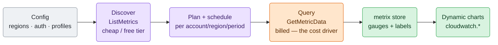
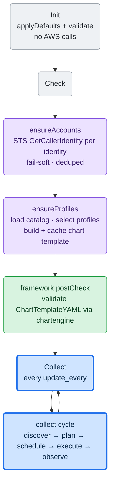
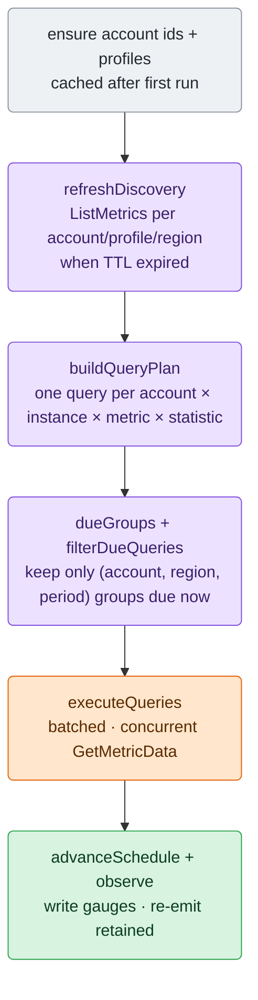

# AWS CloudWatch Collector Architecture

Maintainer-oriented map of `cloudwatch`, written to be read top to bottom as a
journey: the plain model and the big picture first, then the lifecycle and the
collection cycle, then each stage in detail, and finally the profile schema,
invariants, and where to change things. Per-service metric and chart details live
in the profile YAMLs (`config/go.d/cloudwatch.profiles/`) and the focused tests,
not here.

The one rule that shapes most of what follows:

> `GetMetricData` is billed per query, so the collector queries each metric only
> as often as its period and re-emits cached values in between — cost tracks the
> profiles you run, not how often Netdata collects.

## What It Does

`cloudwatch` is a framework-V2 go.d collector that pulls AWS CloudWatch metrics
for a curated set of AWS services and renders them as dynamic Netdata charts. It
is **profile-driven**: each service is a YAML profile (see Profiles) declaring its
CloudWatch namespace, the dimension set that identifies one instance, the
metrics/statistics to query, and a chart template — so adding or adjusting a
service is usually a YAML edit, not Go.

It runs as a **single Netdata node**: AWS resources are chart *instances* (keyed
by `by_labels`), not separate nodes — there are no vnodes/host scopes.

## Big Picture

Config picks the services; the collector discovers what actually exists, queries
it on a per-period schedule to keep the bill down, and renders the results as
charts under the `cloudwatch.` namespace.



Each collection cycle (`collect.go`), in order:

1. resolve one AWS account id per configured identity via STS (`identity.go`);
2. discover live instances per (account, profile, region) with `ListMetrics`
   (`discover.go`);
3. plan and schedule `GetMetricData`, grouped by (account, region, period)
   (`query_plan.go`);
4. execute the due queries in concurrent batches (`query_executor.go`);
5. write each value as a float gauge into `metrix`, stamped with
   `{account_id, region, <dimension labels>}`, and re-emit cached values for
   not-due series (`observe.go`);
6. serve a chart template built once from the selected profiles (`chart.go`).

## Lifecycle

Framework V2: `Init` → `Check` → repeated `Collect`; there is no background
`Run` (the collector does not implement `CollectorV2Runner`). `collector.go`
owns the `Collector` struct and lifecycle.



- **Init** does config only (`applyDefaults`, `validate`) — no network.
- **Check** resolves each identity's account id (STS) and builds the chart template. The
  template is built here, not lazily, because the framework's `postCheck`
  validates `ChartTemplateYAML()` through `chartengine.LoadYAML` before the
  first `Collect`; an unbuilt template would fail the job.
- **Collect** runs the whole cycle (below). `ensureAccounts` and
  `ensureProfiles` are called again but short-circuit once populated.
- **Cleanup** resets runtime state (accounts, profiles, cached template,
  discovery snapshot, client cache, observation schedule) so a framework
  re-Init after failed autodetection starts clean. The `metrix` store is created
  once in `New` and persists — it is not recreated.
- **ChartTemplateYAML** returns the cached string; no work at call time.

## Collection Cycle

`collect.go` ties the stages together, in order:



## Discovery

*Which* profiles to query is decided by config, not by discovery (see Profiles):
the selected profiles are the CloudWatch namespaces `ListMetrics` runs against.
Discovery then finds which *instances* of those profiles exist per account and region.

`discover.go`. `refreshDiscovery` re-runs only when the snapshot TTL
(`discovery.refresh_every`, default 300s) has expired.

- `discoverAll` fans out over every (account × profile × region) target
  concurrently (bounded by `apiConcurrency`), one CloudWatch client per
  (account, region).
- `discoverInstances` pages `ListMetrics` for the profile's namespace.
  `matchInstanceDimensions` keeps a returned metric only if its dimension-**name**
  set exactly equals the profile's set — same names, same cardinality. This
  collapses CloudWatch's multi-granularity fan-out to the chosen instance grain
  and dedups shared instances. A dimension pinned to a `constant` value is
  additionally kept only when the metric's value for it equals that constant
  (`constantDimensionsHold`, fail-closed), so a constant dimension can never merge
  distinct instances onto one unlabeled series.
- **Recently-active-only** is period-aware: the `ListMetrics RecentlyActive=PT3H`
  filter is applied only when every metric in the profile has a period ≤ 3h.
  PT3H is the only value CloudWatch accepts, so applying it to a daily profile
  (S3) would hide the metric most of the day. Configurable
  (`discovery.recently_active_only`, default true).
- **Snapshot + carry-forward**: `buildDiscoverySnapshot` stores instances for
  successful targets and **carries forward the previous instances for errored
  targets**, so a transient per-region/namespace failure never drops series.
  Only a first-ever pass with zero instances and errors is fatal; after any
  snapshot exists, discovery errors are warnings.
- A warning fires at ≥1000 discovered instances (a cost signal); collection is
  never truncated.

## Query Planning And Scheduling

`query_plan.go` + `observe.go`.

- `buildQueryPlan` emits one `plannedQuery` per `instance × metric × statistic`.
  Identity labels are `{account_id, region}` plus one label per identifying
  instance dimension (a `constant` dimension is sent in the query but not
  labeled). The exported series name is `<profile>.<metric_id>_<statistic>`.
- Queries are grouped by `queryGroupKey{account, region, period}` — the batch unit
  (shared client and time window) and the scheduling unit.
- The `observationStore` keeps a per-(account, region, period) `nextQueryAt`. `dueGroups`
  returns groups whose next time has arrived (or the first cycle);
  `filterDueQueries` drops the rest. So a period-86400 (S3 daily) group is
  queried far less often than the 60s collect cycle, while a 300s group runs
  every few cycles.
- The schedule advances **only for groups queried successfully**
  (`advanceSchedule`), so a failed region retries next cycle instead of skipping
  a whole period.

## Query Execution

`query_executor.go`. `executeQueries`:

- `indexPlan` groups the plan by (account, region, period); `resolveGroupClients`
  builds one client per (account, region) up front (errors recorded once per pass).
- `buildChunkJobs` computes the time window and splits each group into chunks of
  `metricsPerQuery` (500, the `GetMetricData` per-call hard maximum), one job
  per chunk. The chunk size is an explicit argument so tests can exercise the
  split without 500+ queries.
- `runChunkJobs` runs the chunk jobs concurrently (bounded by `apiConcurrency`,
  each under `timeout`).
- `runGetMetricData` calls `GetMetricData` with `ScanBy` descending (newest
  first), follows `NextToken`, and keeps the **first value per query id** (the
  newest). A per-result `InternalError` / `Forbidden` (or a missing result) marks
  the query id **unusable**, so its series gaps rather than zero-filling; a usable
  result with no datapoint (or `NaN` / `Inf`) is a clean no-data outcome that
  `observe` resolves per the metric's `nil_as_zero` policy (0 or gap). `PartialData`
  is normal pagination (followed via `NextToken`) and stays usable.
- The **query window** is `[end-period, end]` where
  `end = alignedNow - max(query_offset, period)`. Aligning to the period and
  offsetting by at least one period guarantees the queried bucket is already
  published and settled.
- If every chunk errors, the whole pass errors; otherwise partial failures are
  tolerated and their groups stay due.

## Observation And Metrics

`observe.go`. `observe` writes one snapshot frame per cycle:

- `meter := store.Write().SnapshotMeter("")`; each sample becomes
  `meter.WithLabels(labels...).Gauge(series, metrix.WithFloat(true)).Observe(v)`.
- **Always a gauge.** CloudWatch returns per-period aggregates (Sum, Average, …)
  as absolute points, so gauge last-write-wins maps directly. Every profile
  chart must declare `algorithm: absolute` (enforced by profile validation);
  there is no counter/delta tracking.
- **Float is a metric-level hint.** `metrix.WithFloat(true)` marks the metric
  family float-native; `chartengine` inherits that onto the chart dimension, so
  fractional values render at full precision without a per-dimension
  `options.float`. (Rate divisors, by contrast, *are* injected per dimension —
  see Charts.)
- **Retention re-emit (sample-and-hold).** This decouples two cadences: the
  **query cadence** is each metric's *period* (the paid `GetMetricData` calls,
  gated by the schedule), while the **write cadence** is the collect loop
  (`update_every`, free `metrix` writes). Netdata expects a value per dimension
  per collect cycle, so a series whose group was **not** queried this cycle (not
  due, or due-but-failed) is re-written from its last cached value — a long-period
  metric (e.g. daily S3) renders as a continuous step line instead of gaps, at no
  extra AWS cost. (Exception: a total-failure cycle — every due query fails —
  returns an error before `observe`, so nothing is written that cycle and the
  schedule stays due for retry.) A series in a *successfully queried* group that returned no
  datapoint is reconciled per the metric's no-data policy: `nil_as_zero` metrics
  (sum/count — "no activity") record **0**; the rest **drop** the cached value so
  the series gaps until fresh data, and a stale value is never re-emitted.
  `nil_as_zero` defaults to the metric's `rate` flag (rate/sum counts → 0, gauges
  → gap) and is overridable per metric. The cache otherwise persists until the
  instance leaves discovery and `pruneObserved` drops it.
- `pruneObserved` drops both cached series and per-(account, region, period) schedule entries
  absent from the current plan (a resource or metric went away), so removed resources
  stop being re-emitted and a group that later reappears is queried on its first cycle
  back rather than waiting for a stale schedule entry to expire.

## Dynamic Charts

`chart.go`, built once by `ensureProfiles` and cached in `chartTemplateYAML`.

```text
for each selected profile:
  group := profile.Template.Clone()          # typed deep copy; never mutate the catalog
  group.Metrics = sorted(visible series)     # collector-owned visible-series list
  injectDimensionOptions(group, series)      # sets options.divisor = period on rate dims; keeps authored options
assemble charttpl.Spec{Version, ContextNamespace: "cloudwatch", Groups}
return spec.MarshalTemplate()                # Validate + yaml.v2 marshal, then cached
```

- Uses the framework `charttpl` primitives: `Group.Clone()` (typed deep copy, so
  the shared profile catalog is never mutated) and `Spec.MarshalTemplate()`.
- `selectorSeriesName` extracts a dimension selector's target metric with the
  same `metrix/selector` library the chart engine matches with, so the injected
  divisor always agrees with the engine.
- `float` is not injected here (it is the metric-level hint above); only the
  rate `divisor` is.

## Profiles (`cwprofiles/`)

`profile.go` defines the schema; `catalog.go` loads and resolves; stock profiles
live under `config/go.d/cloudwatch.profiles/default/` (one YAML per service; a
user file with the same basename overrides its stock counterpart).

A `Profile` declares: `namespace` (e.g. `AWS/EC2`), `period`, `instance`
dimensions (the CloudWatch dimension names that identify one instance; each is
either mapped to a Netdata `label`, or pinned to a `constant` value — a
match-and-query-only dimension that is matched and queried but not emitted as a
label, for a constant CloudWatch dimension such as CloudFront's `Region=Global`),
`metrics` (with `statistics`, optional `rate`,
optional per-metric `period`, and optional `nil_as_zero` — record 0 vs gap on a
no-datapoint result, defaulting to `rate`), and a `charttpl.Group` `template`.

Load and resolution (`catalog.go`):

- Stock profiles ship under the stock dir; user profiles under the user dir. A
  user profile **overrides** a stock profile with the same basename.
- Invalid **stock** profiles are fatal; invalid **user** profiles are logged and
  skipped.
- Decode is **non-strict** (unknown keys ignored), so a profile that merely *adds*
  optional fields a newer collector understands still loads on an older binary —
  but only while old validation still passes. It is not a blanket guarantee: a
  profile that relies on a newer field to validate is rejected by an older binary
  (e.g. a dimension using `constant` omits `label`, which an older binary still
  requires).
- **Profile selection is config-driven** (`selectProfiles`), not discovery-driven.
  `profiles.mode: auto` (default) selects every default-enabled profile in the
  catalog; `combined` adds the default-disabled deep-grain profiles; `exact` selects
  only the profiles named by basename in `profiles.mode_exact.entries` (e.g. `ec2`,
  `alb_target`). Unlike `auto`, an `exact` entry selects a profile regardless of its
  default-disabled flag, so a deep-grain profile can be picked by name. The selected
  set is the *candidate* set — the namespaces of those profiles are what discovery
  `ListMetrics` runs against; a selected profile with no live instances simply
  produces no charts. `auto` is zero-config but lists every supported service each
  refresh (empties included, fail-soft); `exact` narrows collection to the services
  you use.

Profile validation invariants (`profile.go`) — these are load-bearing:

- Every chart's `instances.by_labels` must include `account_id`, `region`, and
  every identifying instance-dimension label (a `constant` match-and-query-only
  dimension has no label and is excluded). Chart-instance identity is built solely
  from `by_labels`; a missing label would silently merge distinct AWS resources
  onto one chart instance.
- Every chart must declare `algorithm: absolute` (CloudWatch aggregates are not
  cumulative counters; this also blocks incremental suffix inference).
- `template.metrics` must be empty — the collector owns the visible-series list
  and fills it at build time.
- `rate: true` requires a `sum` or `sample_count` statistic (the per-second value
  divides a per-period total — the summed value or the observation count — by the
  period).

## Auth And Account Identity

`internal/awsauth` (`awsauth.Config`), collector-local. Modes: `default` (SDK
credential chain — env, shared config, EC2 instance profile, EKS IRSA),
`access_key` (static keys), and `assume_role` (one or more roles, each with an
optional external id). `Config.Identities()` expands the config into the set of
credential sources to monitor: one per assume-role, plus the base identity when
`include_base_account` is set; `default`/`access_key` yield a single identity.
The collector builds an `aws.Config` per (identity, region).

Each identity's AWS account id is resolved via `sts:GetCallerIdentity`
(`identity.go`, `ensureAccounts`) and stamped on that identity's series, so one
job can monitor several accounts. Resolution is **fail-soft**: an identity that
cannot be assumed or whose STS call fails is skipped with a warning and the rest
proceed; only when no account resolves does Check fail. Two identities that
resolve to the **same** account id are de-duplicated (first kept) — with a shared
region list they would otherwise collide on the `{account_id, region,
dimensions}` series identity.

Because the account id and STS endpoint are partition-scoped, **all regions in a
job must share one AWS partition** (aws / aws-us-gov / aws-cn / aws-iso / aws-iso-b / aws-iso-e / aws-iso-f / aws-eusc) — validated in
`config.go`. A mixed-partition job would mislabel metrics.

## Concurrency

- `apiConcurrency` (5) bounds both the discovery fan-out and the GetMetricData
  chunk execution, via `conc/pool`. `metricsPerQuery` (500) is the GetMetricData
  batch size. Both are internal constants, not config.
- `clientCache` builds at most one CloudWatch client per (account, region), under
  a mutex, caching only successes (a transient credential error is retried next
  call).
- The top-level `collect` stages run sequentially, and the per-cycle `store`
  write is single-threaded. Only discovery and query execution fan out.

## Cost Model

The two CloudWatch APIs bill differently, and the design leans on that:

- **`ListMetrics` (discovery) is cheap** — it falls under CloudWatch's free API
  tier (~1M requests/month), then ~$0.01 per 1,000 requests, and returns only
  metric metadata (no per-datapoint charge). So `discovery.refresh_every`
  (default 300s) barely moves the bill; the recently-active filter further trims
  result pages. Raise it only to cut API load on very large accounts.
- **`GetMetricData` (query) is the cost driver** — it is always billed (~$0.01
  per 1,000 metrics requested) and scales with metric count × query frequency.
- **Per-`(account, region, period)` scheduling is the governor** — a metric is queried
  once per its own period (a 300s metric every 300s, a daily metric every ~24h),
  not every collect cycle, so cost tracks profile periods rather than
  `update_every`. Between queries, values are re-emitted from cache at zero AWS
  cost (see Observation And Metrics).

Narrow the bill with `profiles.mode: exact` (fewer services) or longer profile
periods; discovery frequency is a minor lever. (Rates are AWS's published model —
verify current per-region prices on the CloudWatch pricing page.)

## Key Invariants

- **Instance identity = exact dimension-name match** — a metric joins a profile
  only if its dimension-name set equals the profile's exactly.
- **Query window is a settled bucket** — offset by `max(query_offset, period)`
  with period alignment.
- **No-data policy is per-metric** — a successfully-queried empty result records
  0 (`nil_as_zero`, the default for `rate`/sum counts) or gaps (the default for
  gauges); not-due / failed series re-emit their last value so long-period metrics
  stay visible.
- **Schedule advances only on success**, per (account, region, period).
- **Fail-soft discovery** — carry forward on error; only a first-ever total
  failure is fatal.
- **Single node** — AWS resources are chart instances via `by_labels`, not
  vnodes.
- **Config minimalism** — only `regions`, `auth`, `profiles`, `discovery`
  (`refresh_every`, `recently_active_only`), `query_offset`, and `timeout` (plus
  the framework's `update_every` / `autodetection_retry`) are operator-facing.
  Concurrency, batch size, and the recently-active period bound are internal
  constants.

## Where To Change Things

- **Add or adjust a monitored AWS service**: add or edit a profile YAML under
  `config/go.d/cloudwatch.profiles/default/` (namespace, instance dimensions,
  metrics, chart template). A new service that fits the profile model needs no
  Go change. Add a matching `metadata.yaml` monitored-instance entry and
  regenerate the integration docs.
- **Change discovery** (matching, fan-out, snapshot/TTL, recently-active):
  `discover.go`.
- **Change query batching, windows, pagination, or gap handling**:
  `query_plan.go` (planning + window) and `query_executor.go` (execution).
- **Change per-period scheduling or retention/re-emit**: `observe.go`.
- **Change how samples become metrics** (labels, float hint, gauge): `observe.go`.
- **Change chart generation** (rate divisor, namespace, template assembly):
  `chart.go`, plus the profile `template`.
- **Change auth**: `internal/awsauth` (collector-local; extract to a shared package only when a second AWS consumer appears).
- **Add or change a config option**: `config.go` + `config_schema.json` +
  `metadata.yaml` + stock `cloudwatch.conf` + regenerated `integrations/` docs
  (collector consistency). Prefer internal constants over new options unless the
  option names a real operator decision.

## Validation Checklist

```text
cd src/go
go test -count=1 ./plugin/go.d/collector/cloudwatch/...
go vet ./plugin/go.d/collector/cloudwatch/...
gofmt -l plugin/go.d/collector/cloudwatch/
```

If `metadata.yaml` changed, regenerate and commit the integration docs
(collector consistency; see the `integrations-lifecycle` skill):

```text
python3 integrations/gen_integrations.py
python3 integrations/gen_docs_integrations.py -c go.d.plugin/cloudwatch
```
