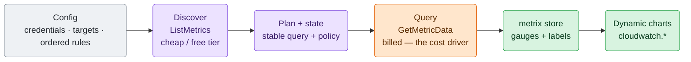
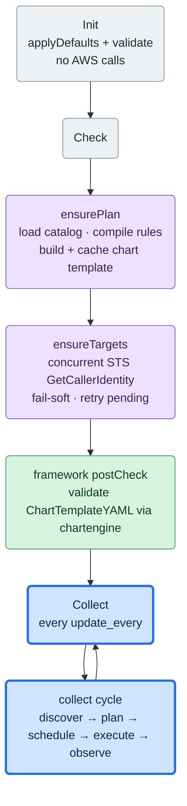
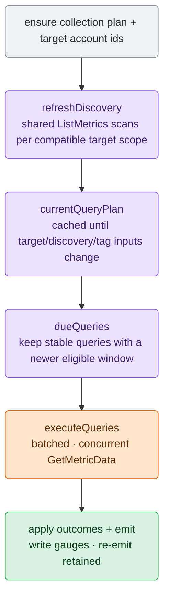

# AWS CloudWatch Collector Architecture

Maintainer-oriented map of `cloudwatch`, written to be read top to bottom as a
journey: the plain model and the big picture first, then the lifecycle and the
collection cycle, then each stage in detail, and finally the profile schema,
invariants, and where to change things. Per-service metric and chart details live
in the profile YAMLs (`config/go.d/cloudwatch.profiles/`) and the focused tests,
not here.

The one rule that shapes most of what follows:

> `GetMetricData` is billed by requested metrics, so the collector normally queries
> each series only when its next aligned effective-period window is eligible and re-emits cached values in between.
> Transient failures use bounded per-query backoff; `update_every` therefore affects failure-time retry cost, not the
> normal successful cadence.

## What It Does

`cloudwatch` is a framework-V2 go.d collector that pulls AWS CloudWatch metrics
for a curated set of AWS services and renders them as dynamic Netdata charts. It
is **profile-driven**: each service is a YAML profile (see Profiles) declaring its
CloudWatch namespace, the dimension set that identifies one instance, the
metrics/statistics to query, and a chart template — so adding or adjusting a
service is usually a YAML edit, not Go.

It does not generate per-account or per-resource nodes: AWS resources are chart
*instances* keyed by `by_labels`. All output follows the job's configured
`vnode`, when present, otherwise the Agent host; the collector creates no host
scopes of its own.

## Big Picture

Config picks the services; the collector discovers what actually exists, queries
it on a per-period schedule to keep the bill down, and renders the results as
charts under the `cloudwatch.` namespace.



Each collection cycle (`collect.go`), in order:

1. compile the raw configuration and resolve one AWS account id per target
   (`plan.go`, `identity.go`);
2. discover live instances per (target, profile, region) with `ListMetrics`
   (`discover.go`);
3. reuse or rebuild the stable per-series query blueprint
   (`query_plan.go`);
4. execute the due queries in concurrent batches (`query_executor.go`);
5. apply explicit per-query outcomes to completion, retry, and source-observation state (`observe.go`);
6. write retained observations or synthetic zero presentation as float gauges into `metrix`, stamped with
   `{account_id, region, <dimension labels>}`, and re-emit not-due series (`query_emit.go`);
7. serve a chart template built once from the selected profiles (`chart.go`).

## Lifecycle

Framework V2: `Init` → `Check` → repeated `Collect`; there is no background
`Run` (the collector does not implement `CollectorV2Runner`). `collector.go`
owns the `Collector` struct and lifecycle.



- **Init** does config only (`applyDefaults`, `validate`) — no network.
- **Check** compiles the configuration, builds the chart template, and resolves
  up to 64 target account IDs concurrently through STS. The template is built here because the
  framework's `postCheck`
  validates `ChartTemplateYAML()` through `chartengine.LoadYAML` before the
  first `Collect`; an unbuilt template would fail the job.
- **Collect** runs the whole cycle (below). `ensurePlan` short-circuits once
  compiled; `ensureTargets` retries only unresolved targets.
- **Cleanup** resets the collection plan, resolved targets, cached template,
  discovery/query snapshots, client caches, and per-query observation state so a framework
  re-Init after failed autodetection starts clean. The `metrix` store is created
  once in `New` and persists — it is not recreated.
- **ChartTemplateYAML** returns the cached string; no work at call time.

## Collection Cycle

`collect.go` ties the stages together, in order:



## Configuration Compilation

`config.go`, `config_validate.go`, `plan.go`, `plan_compiler.go`, and
`runtime.go` separate the raw operator contract,
compiler state, and installed execution plan:

- YAML and JSON use normal typed decoding; unknown keys are ignored. `Config.validate`
  decides whether the resulting configuration is valid during `Init` / `Check`.
- Named credential sources describe only credential acquisition. Named targets
  describe monitored identities and optional role assumption. Ordered rules bind
  targets to profile selectors, optional exact metric/statistic allowlists,
  regions, and effective resource-tag predicates. Omitting `metrics` selects every
  exported series from the selected profiles. When present, `metrics` contains one
  group per narrowed profile: group statistics are inherited by included exact
  MetricNames unless an entry supplies a replacement statistics list.
- `rule_defaults.filters.resource_tags` is inherited when a rule omits
  `filters.resource_tags`; a present list replaces the default and `[]` disables it.
  Predicates are canonicalized once: exact case-sensitive keys are ANDed and the
  exact values for one key are ORed.
- `compileConfig` coordinates a private staged compiler that resolves every reference, rejects unused credential/target
  definitions, applies profile defaults/include/exclude semantics, rejects duplicate
  profile groups/MetricNames/normalized statistics, resolves inherited and replaced
  statistics into canonical exact exported-series descriptors, intersects
  intrinsic supported regions, enforces target/role partition consistency, and
  emits immutable ordered scopes.
- Ordered policy scopes and tag-membership identities are separate. Scopes with the
  same target/profile/region/predicate share one membership identity, and already-owned
  exported series are removed statically with one bounded aggregate diagnostic per
  affected rule. A partially overlapping scope retains its unshadowed series.
  Same-account cross-target overlap remains until discovery, where final instance
  identity can be evaluated correctly. Scopes with different predicates remain
  ordered policy scopes even when they share one discovery scan.
- Fixed internal caps bound credentials, 64 targets, rules, list references,
  candidate-scope evaluation, and compiled scopes. Overflow fails compilation and never installs a partial plan;
  `limits.max_instances` and `limits.max_discovery_groups` are operator safeguards for final selected instances and
  intended discovery breadth.

## Discovery

*Which* profiles to query is decided by config, not by discovery (see Profiles):
the selected profiles are the CloudWatch namespaces `ListMetrics` runs against.
Discovery then finds which *instances* of those profiles exist per target and region.

`discover.go`. `refreshDiscovery` re-runs only when the snapshot TTL
(`discovery.refresh_every`, default 300s) has expired.

- `discoveryGroups` coalesces compiled scopes by target, region, and namespace.
  Each target/profile/region matcher first evaluates the full horizons of its selected series;
  the shared namespace scan then takes the least restrictive result, so
  one long-horizon participant disables PT3H instead of creating a redundant
  filtered ListMetrics stream beside the unfiltered superset.
  `discoverAll` fans out over those groups concurrently
  (bounded by `apiConcurrency`), with one CloudWatch client per (target, region).
- `discoverProfileGroup` pages `ListMetrics` once for the shared namespace and
  applies an index compiled from each profile's canonical exact dimension-name set.
  Each returned metric's dimensions are canonicalized once; profiles with a different
  shape are rejected by the index lookup, while same-shape profiles evaluate only
  their pinned constants. This collapses CloudWatch's multi-granularity fan-out to
  the chosen instance grain and dedups shared instances. Constant mismatches fail
  closed, so a constant dimension can never merge distinct instances onto one
  unlabeled series.
- **Recently-active-only** is horizon-aware: the `ListMetrics RecentlyActive=PT3H`
  filter is applied only when every selected series participating in the shared
  target/region/namespace scan has `publication_delay + lookback + period ≤ 3h`. PT3H is the only value CloudWatch
  accepts, so applying it to a daily profile (S3) would hide the metric most of
  the day. Configurable (`discovery.recently_active_only`, default true).
- `limits.max_discovery_groups` bounds unique `(target, region, namespace)` groups
  (default 64, valid 1..4,096). Compatible rules and profiles share one group.
  Raising the safeguard permits proportionally more ListMetrics work; larger valid
  installations may instead split across jobs. Each group is additionally bounded to 100 pages, 50,000 scanned metrics,
  1,000,000 residual same-shape profile matches, and 20,000 candidate profile instances;
  repeated pagination tokens fail the whole group rather than truncating it. The
  residual bound was measured after indexed routing and prevents adversarial
  metric-by-profile CPU expansion without limiting profile count directly.
- **Snapshot + carry-forward**: `buildDiscoverySnapshot` stores instances for
  successful targets and **carries forward the previous instances for errored
  targets**, so a transient per-region/namespace failure never drops series.
  Only a first-ever pass where every scope errors is fatal; after any
  snapshot exists, discovery errors are warnings.
- A warning fires at ≥1000 discovered instances as an early cost signal. The
  separate final-instance limit is applied later, after tag filtering and overlap.

## Query Planning And Scheduling

`query_plan.go` + `observe.go`.

- `currentQueryPlan` reuses an immutable blueprint until a target resolves or a
  discovery/tag snapshot changes. `buildQueryPlan` emits one `plannedQuery` per
  `instance × selected exported series` when that blueprint is invalidated.
  Identity labels are `{account_id, region}` plus one label per identifying
  instance dimension (a `constant` dimension is sent in the query but not
  labeled). The exported series name is `<profile>.<metric_id>_<statistic>`.
- Resource-tag membership is applied before selected-series expansion. Compiled
  scope order and `{final instance, exported series}` ownership enforce rule precedence:
  the first matching rule/target owns each overlapping series. Unknown tag membership
  reserves only the scope's selected series, so disjoint lower-rule selections remain
  eligible while failures stay fail-closed. This also catches dynamic overlap when
  distinct targets resolve to the same account and see the same resource.
- The first scope that emits any series for a final instance supplies one immutable
  identity/dimension/tag-label presentation reused by sibling series, even when later
  siblings are owned by another target. Chart-level mutable labels therefore remain
  deterministic.
- `limits.max_instances` counts final instances that emit at least one selected series,
  not planned metric
  queries. Overflow rejects the rebuilt plan atomically and leaves the previous
  immutable plan installed; there is no first-N truncation.
- Each `plannedQuery` contains a fully resolved `{period, lookback,
  publication_delay}` policy. Resolution is field-by-field: rule, rule defaults,
  profile metric/profile, then the built-in publication-delay fallback.
  Publication delay is collector scheduling policy, not an AWS SLA. In particular,
  the stock S3 storage profile's `1d` is a conservative choice; AWS documents that
  storage metrics are reported once per day but does not guarantee delivery within
  one day.
- Its stable key includes execution target, region, structural AWS query, final
  series identity, and effective policy. Rule name, scope order, request ID,
  batch membership, and mutable tag labels are excluded. Equivalent rule-only
  ownership transfers preserve state; target/query/identity/policy changes do not.
- Completion is per stable query. A query is due when the aligned eligible window
  end is newer than its last terminal completion. Adding a sibling query never
  makes completed siblings due, and clock jumps query only the current rolling
  window rather than backfilling missed buckets.
- A transient attempt leaves completion unchanged and starts retry state for that
  stable query and eligible window. The first retry waits one `update_every`; each
  later delay doubles and is capped at the effective period. A new eligible window
  is immediately due and resets the sequence. `Complete` and `Forbidden` clear it;
  parent-context cancellation advances neither retry nor completion state.
- Query-plan construction atomically rejects more than 20,000 queries, 600,000
  all-due datapoints, 40 all-due batches, or 1,440 buckets per query. A lightweight
  candidate/work preflight applies those bounds before constructing AWS query structs
  or stable keys, so raising `max_instances` cannot allocate an unbounded query plan
  before rejection.

## Query Execution

`query_batch.go` + `query_executor.go` + `query_response.go`:

- Due queries are grouped deterministically by target, region, and exact policy.
  The rolling window is `end = align_down(now - publication_delay, period)` and
  `start = end - lookback`.
- Batch width is `min(500, 30000 / bucket_count)`. Queries sharing one structural
  CloudWatch metric identity are divided into billing units of at most five statistics;
  deterministic packing keeps each unit whole while respecting width. Work preflight
  and execution use the same packer. Every request sets exact `MaxDatapoints =
  queries_in_batch × bucket_count`; concurrency remains bounded by `apiConcurrency`,
  with one configured timeout shared by the batch's pages.
- Request IDs (`q0`, `q1`, …) exist only inside one batch. Pagination is bounded
  to two calls. A page failure preserves siblings already marked `Complete`.
- Values are paired with their timestamps; response/page order is not trusted.
  The newest finite pair is eligible only when its full bucket lies inside the
  window. `PartialData` may contribute a candidate but remains transient unless
  a later result for that query is `Complete`.
- `Complete` is terminal success. `Forbidden` is terminal authorization failure.
  Client/request failure, `InternalError`, missing/unknown status, unresolved
  `PartialData`, and pagination overflow are transient for only the affected
  queries. Bounded warnings identify those unresolved results; successful siblings
  remain complete and are not reissued.

## Observation And Metrics

`observe.go` keeps per-query completion and retained raw CloudWatch values;
`query_emit.go` writes one snapshot frame per cycle:

- `meter := store.Write().SnapshotMeter("")`; each sample becomes
  `meter.WithLabels(labels...).Gauge(series, metrix.WithFloat(true)).Observe(v)`.
- **Always a gauge.** CloudWatch returns per-period aggregates (Sum, Average, …)
  as absolute points, so gauge last-write-wins maps directly. Every profile
  chart must declare `algorithm: absolute` (enforced by profile validation);
  there is no counter/delta tracking.
- **Float is a metric-level hint.** `metrix.WithFloat(true)` marks the metric
  family float-native; `chartengine` inherits that onto the chart dimension, so
  fractional values render at full precision without a per-dimension
  `options.float`.
- **Retention re-emit (sample-and-hold).** This decouples two cadences: the
  **query cadence** follows each series' aligned effective period, while the **write cadence** is the collect loop
  (`update_every`, free `metrix` writes). Netdata expects a value per dimension
  per collect cycle, so a series whose group was **not** queried this cycle (not
  due, or due-but-failed) is re-written from its last cached value — a long-period
  metric (e.g. daily S3) renders as a continuous step line instead of gaps, at no
  extra AWS cost. A successful rolling-window query keeps the newest eligible
  datapoint while it remains inside `lookback`; once expired, `nil_as_zero` records
  zero and other metrics gap.
  Synthetic zero is presentation state, not a timestamped source observation, so
  it cannot outrank a real older bucket that appears in a later rolling query.
  Without an explicit override, only `rate: true` metrics at `sum` or
  `sample_count` default to zero; every other statistic gaps. The cache otherwise
  persists until a terminal success expires/replaces it or `reconcilePlan` drops
  the stable key. Transient failures intentionally replay retained values beyond
  lookback and follow the per-query retry backoff. `Forbidden` clears the value and completes
  only the attempted window.
- Rate totals are cached raw and divided by the effective period during emission.
  A total transient first-cycle failure with no retained frame returns an error;
  the same failure with useful retained values replays them and returns success.
  Parent cancellation aborts before state is advanced.

## Resource Tag Filtering And Labels (`tags.go`, `tag_fetch.go`, `tagjoin.go`, `tagresolve.go`)

Resource-tag predicates select instances before query expansion. Separately,
`labels.resource_tags` copies selected AWS tags to **non-identity** chart labels.
Both use one resolution stage between discovery and query planning:

```text
refreshDiscovery → refreshTags → buildQueryPlan → … → observe
```

- **Focused fetches.** A Resource Groups Tagging API (RGTA) client is cached per
  `{target, region}`. Policy scopes sharing target, region, and canonical predicate
  share a fetch group. Each request supplies native `TagFilters` and the union of
  compatible `ResourceTypeFilters`; pages are streamed directly into membership and
  label indexes, locally rechecked, and intersected with discovered candidates.
  Fetch topology is rebuilt only when discovery changes, and predicate groups share
  one candidate index per target/region/profile. Cached results retain membership,
  labels, shared membership ids, and freshness—not fetch-time candidate maps.
- **Failure state.** A failed filtered group becomes `unknown`. On the first failure,
  its selected series are withheld for every candidate and reserved from lower-priority
  rules; disjoint series remain eligible. After a success, last-known matched members
  continue to query those series while the same series remain reserved for every other
  candidate. Freshness and retry state are fetch-group-local: failed groups retry next
  collect while successful groups keep their result until its discovery TTL expires.
  Optional label enrichment carries last-known labels and never controls identity.
- **Label resolution (`tagresolve.go`).** `resolveTagPlan` turns
  `labels.resource_tags` into a per-profile `awsKey → label` plan once. Global config
  validation rejects malformed or duplicate entries; profile-specific collisions with
  `account_id`, `region`, or dimension labels are skipped with one warning. The optional
  `label` resolves collisions; the default is the sanitized key (`Name` → `name`).
- **ARN↔dimension join (`tagjoin.go`).** RGTA returns ARN + tags; the cache is keyed by
  the profile's ARN-projectable `joinKey`. A namespace-bound per-profile mapper (a
  default single-component resource-id extractor plus overrides for ALB/NLB/target-group/ECS/OpenSearch/
  Step-Functions) derives the `joinKey` from the ARN, and the instance side projects its
  dimension values onto the same key. The compiler accepts a registered mapper only
  when an override retains its expected CloudWatch namespace and every join dimension
  remains identifying (not constant). Parent-resource profiles (S3,
  DynamoDB-operation, and ALB-target) key on the parent dimension so children
  inherit its tags.
  A default-selected profile without a safe association is skipped when filtering is
  effective; explicitly including one is a config error unless that rule disables or
  replaces the filter. Labels-only use remains best-effort for unsupported profiles.
- **Emission split.** Identity `labels` (`{account_id, region, <dims>}`) and `tagLabels`
  travel separately through `plannedQuery`. `writeSample`
  emits `labels + tagLabels` in a fresh slice; the stable query key uses identity
  labels but excludes tag labels, so a tag change never churns query state. `chartengine` `auto_intersection`
  then promotes the tag labels as non-identity chart labels — no template change.
  A changed effective label set invalidates the plan once; the current plan supplies
  the new labels and the normal numeric snapshot causes chartengine to
  emit a label-only chart-definition update for an existing chart.

## Dynamic Charts

`chart.go`, built once by `ensurePlan` and cached in `chartTemplateYAML`.

```text
for each selected profile:
  group := profile.Template.Clone()          # typed deep copy; never mutate the catalog
  group.Metrics = sorted(visible series)     # collector-owned visible-series list
assemble charttpl.Spec{Version, ContextNamespace: "cloudwatch", Groups}
return spec.MarshalTemplate()                # Validate + yaml.v2 marshal, then cached
```

- Uses the framework `charttpl` primitives: `Group.Clone()` (typed deep copy, so
  the shared profile catalog is never mutated) and `Spec.MarshalTemplate()`.
- Rate divisors are not part of the chart template because rules can override
  profile periods. Rate normalization happens on the emitted numeric value.

## Profiles (`cwprofiles/`)

`profile.go` defines the schema; `catalog.go` loads and resolves; stock profiles
live under `config/go.d/cloudwatch.profiles/default/` (one YAML per service; a
user file with the same basename overrides its stock counterpart). The public
authoring contract lives in [profile-format.md](profile-format.md); keep it in
lockstep with every profile-schema change.

A `Profile` declares: `namespace` (e.g. `AWS/EC2`), optional
`supported_regions` (an intrinsic restriction for services such as CloudFront),
`period`, `instance`
dimensions (the CloudWatch dimension names that identify one instance; each is
either mapped to a Netdata `label`, or pinned to a `constant` value — a
match-and-query-only dimension that is matched and queried but not emitted as a
label, for a constant CloudWatch dimension such as CloudFront's `Region=Global`),
`metrics` (with `statistics`, optional `rate`,
optional per-metric `period`, and optional `nil_as_zero` — record 0 vs gap on a
no-datapoint result, defaulting to `rate`), and a `charttpl.Group` `template`.

Load and resolution (`catalog.go`):

- Stock profiles ship under the stock dir; user profiles under the user dir. A
  user profile **overrides** a stock profile with the same basename.
- Invalid **stock** profiles are fatal; invalid **user** profiles are logged and
  skipped.
- Decode is **non-strict** (unknown keys ignored), matching collector job
  decoding. Validation remains authoritative for supported typed profile fields
  and their semantic invariants.
- **Profile selection is rule-driven**, not discovery-driven. Omitting
  `rules[].profiles` includes every default-enabled profile. `defaults: false`
  with `include` selects only named profiles; `defaults: true` with `include`
  adds disabled opt-in profiles; `exclude` removes names from the union. Explicit
  include/exclude overlap is invalid. The compiler intersects each rule's regions
  with `supported_regions`: an incompatible defaults-selected profile is skipped
  with a startup diagnostic, while an explicitly included incompatible profile
  fails configuration.

Profile validation invariants (`profile.go`) — these are load-bearing:

- Every chart's `instances.by_labels` must include `account_id`, `region`, and
  every identifying instance-dimension label (a `constant` match-and-query-only
  dimension has no label and is excluded). Chart-instance identity is built solely
  from `by_labels`; a missing label would silently merge distinct AWS resources
  onto one chart instance.
- Every chart must declare `algorithm: absolute` (CloudWatch aggregates are not
  cumulative counters; this also blocks incremental suffix inference).
- `template.metrics` must be empty — the collector owns the visible-series list
  and fills it at build time.
- `rate: true` requires a `sum` or `sample_count` statistic (the per-second value
  divides a per-period total — the summed value or the observation count — by the
  period).

## Credentials, Targets, And Account Identity

`internal/awsauth` is collector-local. A named credential source is either the
AWS SDK default chain (environment, shared config, EC2 instance profile, EKS
IRSA) or explicit static/session credentials. A target uses one source directly
or layers one `AssumeRole` provider over it, so static credentials can bootstrap
cross-account roles without environment indirection. The collector builds an
`aws.Config` per (target, region).

Credential sources are a list of named entries. Each entry uses a required
`type` selector. `type: default` has no branch-specific configuration;
`type: static` requires a `type_static` object containing `access_key_id`,
`secret_access_key`, and an optional `session_token`. Keeping branch-specific
fields nested makes the runtime model match the conditional DynCfg form. After
validation, the plan compiler builds a private name index for target reference
resolution; list order has no credential precedence semantics.

Each target's AWS account id is resolved through STS `GetCallerIdentity`
(`identity.go`, `ensureTargets`) and stamped on its series. Resolution is
fail-soft and retried: an unresolved target stays pending while healthy targets
continue; only a cycle with no resolved target fails. Named targets are never
deduplicated by account id because their permissions and visible resources may
differ. Dynamic final-instance overlap is deduplicated later by ordered
rule/target precedence. AWS does not require an explicit IAM permission grant for
`GetCallerIdentity`.

Partition consistency is enforced per target. A target cannot span AWS
partitions, and an assumed-role ARN partition must match the selected regions
(aws / aws-us-gov / aws-cn / aws-iso / aws-iso-b / aws-iso-e / aws-iso-f /
aws-eusc).

## Concurrency

- `apiConcurrency` (5) bounds ListMetrics discovery, RGTA fetch groups, and
  GetMetricData chunk execution via `conc/pool`. `metricsPerQuery` (500) is the
  GetMetricData batch size. Both are internal constants, not config.
- `clientCache` builds at most one CloudWatch client per (target, region), under
  a mutex, caching only successes (a transient credential error is retried next
  call).
- The top-level `collect` stages run sequentially, and the per-cycle `store`
  write is single-threaded. Discovery, resource-tag lookup, and query execution
  fan out within their respective stages.

## Cost Model

The two CloudWatch APIs bill differently, and the design leans on that:

- **`ListMetrics` (discovery) is cheap** — it falls under CloudWatch's free API
  tier (~1M requests/month), then ~$0.01 per 1,000 requests, and returns only
  metric metadata (no per-datapoint charge). So `discovery.refresh_every`
  (default 300s) barely moves the bill; the recently-active filter further trims
  result pages. Raise it only to cut API load on very large accounts.
- **`GetMetricData` (query) is the cost driver** — it is always billed (~$0.01
  per 1,000 metrics requested) and scales with metric count × query frequency.
  Point-aware batching keeps each AWS billing unit of up to five statistics for
  one structural metric in a single request, avoiding duplicate billing at a
  batch boundary.
- **Per-query aligned-window completion is the governor** — a metric is queried
  once per effective period (a 300s metric every aligned 300s window, a daily metric every ~24h),
  not every collect cycle, so cost tracks profile periods rather than
  `update_every`. Between queries, values are re-emitted from cache at zero AWS
  cost (see Observation And Metrics).

Narrow the bill with focused rule target/profile/region selections or longer
profile periods; discovery frequency is a minor lever. (Rates are AWS's published model —
verify current per-region prices on the CloudWatch pricing page.)

## Key Invariants

- **Instance identity = exact dimension-name match** — a metric joins a profile
  only if its dimension-name set equals the profile's exactly.
- **Query window is policy-driven** — `end = align_down(now - publication_delay,
  period)` and `start = end - lookback`; the newest fully eligible finite bucket wins.
- **No-data policy is per-metric** — a successfully-queried empty result records
  0 (`nil_as_zero`, defaulting on only for `rate: true` `sum`/`sample_count`) or
  gaps after a terminal successful window expires the retained datapoint.
  Transient client/request/result failures retain and replay state; `Forbidden`
  clears state and completes the attempted window.
- **Completion advances per stable query**, never per batch or group.
- **Fail-soft discovery** — carry forward on error; only a first-ever total
  failure is fatal.
- **Job-level placement** — AWS resources are chart instances via `by_labels`.
  They use the configured job `vnode` or the Agent host; no per-target/resource
  HostScope is generated.
- **Tag filters fail closed** — unknown membership never becomes unfiltered
  collection and never allows a lower-priority rule to claim the unknown higher
  rule's selected series; disjoint series remain eligible.
- **Tag labels are non-identity** — `labels.resource_tags` can update labels on an
  existing chart but cannot change its identity or overwrite an identity label.
- **Compiled configuration** — operator-facing credentials, targets, and ordered
  rules are validated and expanded once. Discovery, tag-label presentation,
  `limits.max_instances`, `limits.max_discovery_groups`, `timeout`, `vnode`, and the framework's
  common fields remain job-level settings.
  Concurrency and per-request/per-group AWS-work bounds are internal constants.
  Discovery breadth uses the explicit operator safeguard; compatible rules/profiles
  share a group, and larger valid installations can raise it or split across jobs.

## Where To Change Things

- **Add or adjust a monitored AWS service**: add or edit a profile YAML under
  `config/go.d/cloudwatch.profiles/default/` (namespace, instance dimensions,
  metrics, chart template). A new service that fits the profile model needs no
  Go change. Add a matching `metadata.yaml` monitored-instance entry and
  regenerate the integration docs.
- **Change discovery** (matching, fan-out, snapshot/TTL, recently-active):
  `discover.go`.
- **Change query identity or plan expansion**: `query_plan.go`.
- **Change timing-policy resolution or aligned windows**: `query_policy.go`.
- **Change request packing and AWS work limits**: `query_batch.go` and
  `limits.go`.
- **Change result pagination, status handling, or datapoint selection**:
  `query_response.go`.
- **Change execution orchestration**: `query_executor.go`.
- **Change scheduling, retention, correction, or gap state**: `observe.go`.
- **Change how retained observations become metrics** (rate normalization,
  labels, float hint): `query_emit.go`.
- **Change chart generation** (namespace or template assembly): `chart.go`, plus
  the profile `template`.
- **Change auth**: `internal/awsauth` (collector-local; extract to a shared package only when a second AWS consumer appears).
- **Add or change a config option**: `config.go` + `config_schema.json` +
  `metadata.yaml` + stock `cloudwatch.conf` + regenerated `integrations/` docs
  (collector consistency). Prefer internal constants over new options unless the
  option names a real operator decision.

## Validation Checklist

```text
cd src/go
go test -count=1 ./plugin/go.d/collector/cloudwatch/...
go vet ./plugin/go.d/collector/cloudwatch/...
gofmt -l plugin/go.d/collector/cloudwatch/
```

If `metadata.yaml` changed, regenerate and commit the integration docs
(collector consistency; see the `integrations-lifecycle` skill):

```text
python3 integrations/gen_integrations.py
python3 integrations/gen_docs_integrations.py -c go.d.plugin/cloudwatch
```
