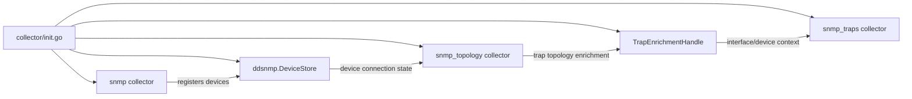
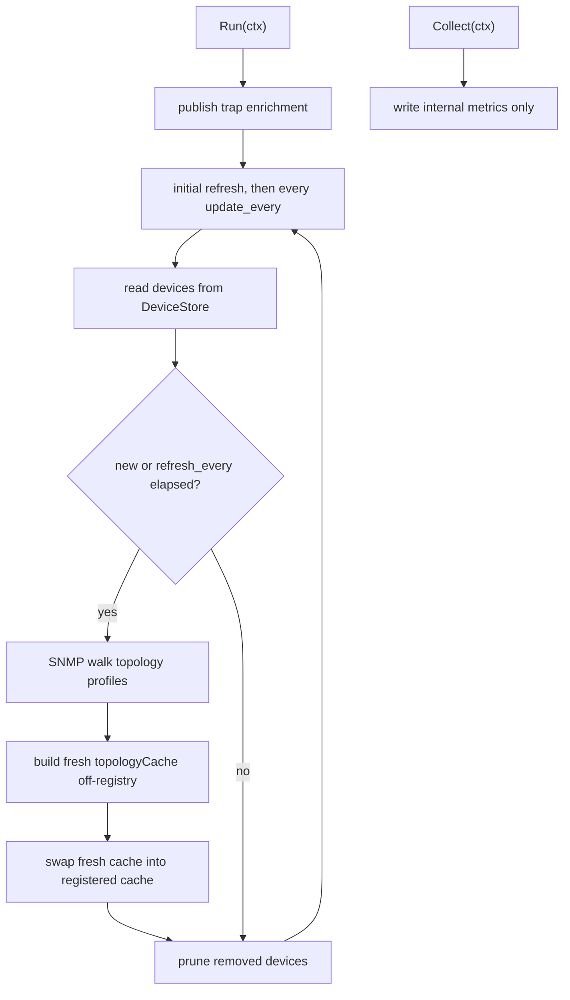
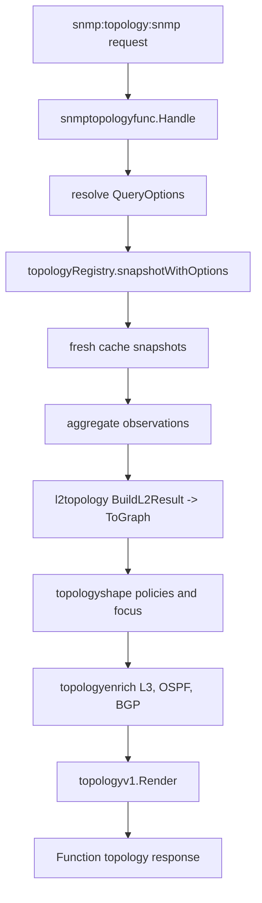

# SNMP Topology Architecture

This is a maintainer-oriented map of `snmp_topology`. It explains the main
runtime path and package boundaries. It intentionally avoids per-OID and
per-protocol details; those live in the profile definitions and focused tests.

## Short Version

`snmp_topology` is a single-instance go.d collector that periodically builds a
cached topology view from SNMP devices registered by the SNMP collector.

It has three independent entry points:

- `Run(ctx)` refreshes topology in the background.
- `Collect(ctx)` only publishes internal collector metrics.
- `snmp:topology:snmp` serves the latest cached topology through a Function.

Function calls do not walk SNMP. They snapshot already-collected cache state,
build a graph, shape/enrich it, and render `netdata.topology.v1`.

## Runtime Order



```text
collector/init.go
  creates shared SNMP-family state:
    ddsnmp.DeviceStore
    snmp_topology.TrapEnrichmentHandle

  registers:
    snmp          -> writes device connection state
    snmp_topology -> reads device state and publishes topology
    snmp_traps    -> reads topology enrichment for trap logs
```

`snmp_topology` is registered with `InstancePolicySingle`, so go.d runs one
collector instance for the whole agent.

## Refresh Loop

`collector.go` owns lifecycle and scheduling.



```text
Run(ctx)
  publish trap enrichment handle
  refreshTopologyRecovering(ctx)       # immediate first refresh
  every update_every:
    refreshTopologyRecovering(ctx)

refreshTopology(ctx)
  read registered SNMP devices from ddsnmp.DeviceStore
  for each new or stale device:
    refreshDeviceTopology(ctx, key, device)
  prune caches for devices no longer registered

refreshDeviceTopology(ctx, key, device)
  connect to the device with gosnmp
  select topology profiles
  collect topology ProfileMetrics with ddsnmpcollector
  query sysUpTime
  build a fresh per-device topologyCache off-registry
  ingest topology metrics into the fresh cache
  collect VTP VLAN contexts when needed
  finalize diagnostics
  swap the fresh cache into the registered cache
```

The refresh loop checks devices every `update_every` seconds, but a device is
fully refreshed only when it is new or older than `refresh_every`.

The important safety property is that a device refresh builds the next cache
off-registry and only swaps it into the registered cache after ingestion
finishes. Function readers keep seeing the previous complete snapshot while a
new SNMP walk is in progress.

## Per-Device Cache

`topology_cache.go` defines one mutable cache per SNMP device.

The cache stores normalized intermediate facts collected from topology profile
metrics:

- local device identity and metadata;
- interfaces, interface status, IP-to-interface mappings;
- LLDP and CDP neighbors;
- FDB, bridge-port, VLAN, STP, ARP/ND data;
- L3 interface addresses;
- OSPF neighbors;
- BGP peers.

Ingestion is split by source area:

- `topology_cache_lldp.go`
- `topology_cache_cdp.go`
- `topology_cache_fdb.go`
- `topology_cache_interfaces.go`
- `topology_cache_stp_arp.go`
- `topology_l3_interfaces.go`
- `topology_ospf_neighbors.go`
- `topology_bgp_peers.go`
- `topology_vlan_context_*.go`

`topology_cache_metric_dispatch.go` maps `ddsnmp.TopologyKind` values to the
right cache ingester. Profile tags and device metadata are applied separately
because they describe the device itself rather than one topology row.

## Registry And Snapshot

`topology_registry.go` owns the set of active per-device caches.

```text
topologyRegistry.snapshotWithOptions(options)
  normalize query options
  take active cache snapshots
  aggregate per-device observations
  build a topology graph
```

Each cache snapshot is converted into:

- an `l2topology.L2Observation`, used by the generic L2 engine;
- typed SNMP-side observation rows for L3 interfaces, OSPF neighbors, and BGP
  peers;
- local device detail used to enrich the selected local actor.

Only fresh caches contribute snapshots. Stale caches are ignored until refreshed
or pruned.

## Graph Build Order

`topology_registry_build.go` is the main graph pipeline.

For normal map types:

```text
aggregate observations
  -> l2topology.BuildL2ResultFromObservations
  -> l2topology.ToGraph
  -> convert generic graph to topologymodel.Data
  -> augment local actors with SNMP device/cache detail
  -> topologyshape.ApplyPolicies
  -> topologyenrich.ApplyL3Subnet
  -> topologyenrich.ApplyOSPFAdjacency
  -> topologyenrich.ApplyBGPAdjacency
  -> topologyshape.ApplyDepthFocusFilter
```

For the low-confidence map type, the builder creates a strict map and a
probable map, marks probable-only link deltas, then applies the same L3/OSPF/BGP
enrichment and depth/focus filtering to the probable map.

## Internal Packages

The root package owns collector lifecycle, cache ingestion, registry snapshots,
and adapters to shared SNMP-family state.

The internal packages are deliberately narrower:

- `internal/topologymodel`: typed internal graph model used by SNMP topology.
- `internal/topologyoptions`: Function/query option constants and
  normalization.
- `internal/topologyshape`: graph shaping and policy passes, such as collapse,
  map type filtering, probable-link marking, and depth/focus filtering.
- `internal/topologyenrich`: pure graph enrichment for L3 subnet, OSPF, and BGP
  logical links.
- `internal/topologyv1`: renderer from `topologymodel.Data` to
  `netdata.topology.v1`.
- `internal/topologyutil`: shared normalization helpers.

`snmptopologyfunc` owns the Function API surface:

- method/function IDs;
- accepted parameters;
- Function response handling;
- conversion of request params into `topologyoptions.QueryOptions`.

It does not own graph building or rendering.

### Dependency Direction

The internal packages form a one-way dependency DAG. `internal/topologyutil` is
the only leaf; the other packages point inward toward the model, and the root
package composes all of them.

```text
topologyutil       leaf (stdlib only)
topologymodel    -> topologyutil
topologyoptions  -> topologyutil
topologyshape    -> topologymodel, topologyoptions, topologyutil
topologyenrich   -> topologymodel, topologyutil
topologyv1       -> topologymodel, topologyoptions, topologyutil
snmptopologyfunc -> topologyoptions, topologyutil
root snmptopology-> all of the above
```

Invariants (enforced by `go list -deps` in the decomposition validation):

- No internal package imports the root `collector/snmp_topology` package. The
  root composes the internal packages; they never depend back on it.
- The sibling layers `topologyshape`, `topologyenrich`, and `topologyv1` do not
  import one another. Logic shared between them lives in `topologymodel` or
  `topologyutil`.
- `topologyutil` imports no sibling; `topologymodel` and `topologyoptions`
  import only `topologyutil`.
- `snmptopologyfunc` (Function transport) depends on `topologyoptions`;
  `topologyoptions` owns the canonical query-option vocabulary and never imports
  the Function package.

## Function Request Path



```text
snmp:topology:snmp request
  -> snmptopologyfunc.Handle
  -> funcDepsAdapter.Snapshot(options)
  -> topologyRegistry.snapshotWithOptions(options)
  -> topologyv1.Render(data)
  -> Function response with type "topology"
```

The Function returns `503` while no usable topology snapshot exists yet.

Reverse DNS is intentionally disabled in the Function adapter. Rendering must
not block on network I/O while serving a Function call.

## Trap Enrichment

`topology_trap_enrich.go` publishes a separate handle used by `snmp_traps`.

The topology collector publishes enrichment state when `Run(ctx)` starts and
unpublishes it on cleanup. Trap enrichment is not part of the topology Function
payload; it is a cross-collector lookup path for trap log rows.

## Metrics And Charts

The collector emits internal metrics only. These metrics describe refresh health
and cache state; they are not the topology payload.

- `Collect(ctx)` writes current internal metric values.
- `Run(ctx)` performs SNMP topology refresh.
- `charts.go` and `metrix.go` define this internal observability surface.

## Concurrency Rules

- `Collector.refreshMu` serializes topology refreshes and cleanup.
- Each `topologyCache` has its own `mu`.
- The registry has its own `mu` for the set of active cache pointers.
- Function requests snapshot caches under read locks; they do not mutate caches.
- Device refresh swaps a completed per-device cache into the already-registered
  cache instead of mutating the published cache step by step.

When adding new cache state, add it to:

- `topologyCache`;
- `newTopologyCache`;
- `replaceWith`;
- the relevant snapshot builder;
- tests that prove stale/partial data is not exposed.

## Where To Change Things

- Add or adjust SNMP topology profile rows:
  - profile YAML and `ddsnmp.TopologyKind`;
  - cache ingester in the root package;
  - snapshot conversion if the row contributes to graph facts.
- Add graph shaping policy:
  - `internal/topologyshape`.
- Add logical links from existing observations:
  - `internal/topologyenrich`.
- Add or change Function parameters:
  - `internal/topologyoptions`;
  - `snmptopologyfunc`;
  - Function tests.
- Add or change topology payload columns, tables, presentation, or legend:
  - `internal/topologyv1`;
  - normalized golden test;
  - topology schema validation tests.
- Add collector refresh or cache lifecycle behavior:
  - root package only.

## Validation Checklist

Useful focused checks after changes:

```text
cd src/go
env GOCACHE=/tmp/netdata-go-build-cache go test -count=1 ./plugin/go.d/collector/snmp_topology/... ./pkg/l2topology/... ./pkg/topology/...
env GOCACHE=/tmp/netdata-go-build-cache go test -tags=snmp_topology_fixtures -count=1 ./plugin/go.d/collector/snmp_topology/...
env GOCACHE=/tmp/netdata-go-build-cache go test -race -count=1 ./plugin/go.d/collector/snmp_topology/...
env GOCACHE=/tmp/netdata-go-build-cache go vet ./plugin/go.d/collector/snmp_topology/... ./pkg/l2topology/... ./pkg/topology/...
```

If topology output may have changed, also inspect:

```text
git diff -- src/go/plugin/go.d/collector/snmp_topology/testdata/topology_v1_normalized_golden.json
```

An unchanged golden is expected for internal refactors and cache-only cleanup.
