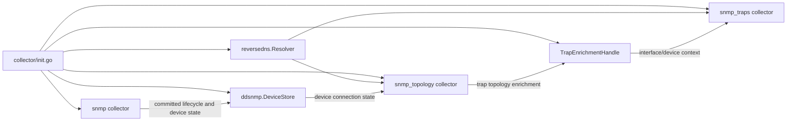
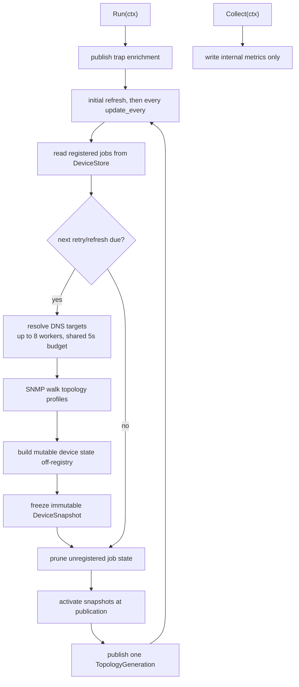
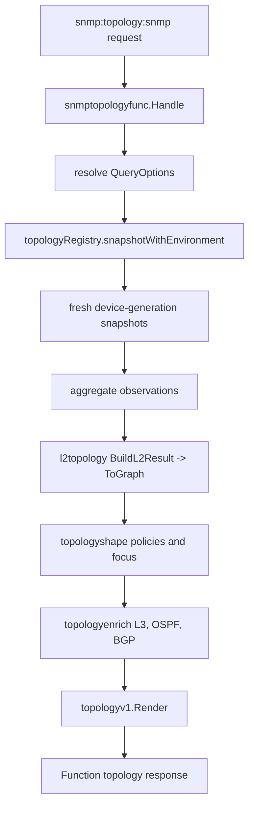

# SNMP Topology Architecture

This is a maintainer-oriented map of `snmp_topology`. It explains the main
runtime path and package boundaries. It intentionally avoids per-OID and
per-protocol details; those live in the profile definitions and focused tests.

**Place in the documentation set.** This document owns the collector's
internals: runtime order, package boundaries, the graph build, the diagnostic
tooling, and the validation commands. What the emitted payload means is owned
by `src/plugins.d/FUNCTION_TOPOLOGY_DEVELOPER_GUIDE.md` (its SNMP/L2 Shape
section); the SNMP profile `topology:` rows are owned by the SNMP profile format
and the `collectors-snmp-profiles` project skill. The project skills
`.agents/skills/topology-authoring/SKILL.md` and
`.agents/skills/triage-snmp-diagnostics/SKILL.md` cite sections of this document by
heading anchor, and `.agents/sow/audit.sh` fails when a cited heading no longer
exists, so renaming or removing a heading here updates the skill in the same
change.

## Short Version

`snmp_topology` is a single-instance go.d collector that periodically builds an
immutable topology generation from SNMP jobs registered by the SNMP collector.

It has three independent entry points:

- `Run(ctx)` refreshes topology in the background.
- `Collect(ctx)` only publishes internal collector metrics.
- `snmp:topology:snmp` serves the latest cached topology through a Function.

Function calls do not walk SNMP. They acquire one already-published generation,
build a graph, shape/enrich it, and render `netdata.topology.v1`.

## Runtime Order


```mermaid
flowchart LR
    Init["collector/init.go"]
    Store["ddsnmp.DeviceStore"]
    TrapHandle["TrapEnrichmentHandle"]
    ReverseDNS["reversedns.Resolver"]
    SNMP["snmp collector"]
    Topology["snmp_topology collector"]
    Traps["snmp_traps collector"]

    Init --> Store
    Init --> TrapHandle
    Init --> ReverseDNS
    Init --> SNMP
    Init --> Topology
    Init --> Traps
    ReverseDNS --> Topology
    ReverseDNS --> Traps
    SNMP -->|"committed lifecycle and device state"| Store
    Store -->|"device connection state"| Topology
    Topology -->|"trap topology enrichment"| TrapHandle
    TrapHandle -->|"interface/device context"| Traps
```

```text
collector/init.go
  creates shared SNMP-family state:
    ddsnmp.DeviceStore
    snmp_topology.TrapEnrichmentHandle
    pkg/reversedns.Resolver

  registers:
    snmp          -> writes device connection state
    snmp_topology -> reads device state and publishes topology
    snmp_traps    -> reads topology enrichment for trap logs
```

`snmp_topology` is registered with `InstancePolicySingle`, so go.d runs one
collector instance for the whole agent.

## Refresh Loop

`collector.go` owns lifecycle and scheduling.


```mermaid
flowchart TD
    Run["Run(ctx)"]
    TrapPublish["publish trap enrichment"]
    Tick["initial refresh, then every update_every"]
    Devices["read registered jobs from DeviceStore"]
    Fresh{"next retry/refresh due?"}
    Resolve["resolve DNS targets<br/>up to 8 workers, shared 5s budget"]
    Walk["SNMP walk topology profiles"]
    Next["build mutable device state off-registry"]
    Freeze["freeze immutable DeviceSnapshot"]
    Activate["activate snapshots at publication"]
    GenPublish["publish one TopologyGeneration"]
    Prune["prune unregistered job state"]
    Collect["Collect(ctx)"]
    Metrics["write internal metrics only"]

    Run --> TrapPublish --> Tick --> Devices --> Fresh
    Fresh -->|"yes"| Resolve --> Walk --> Next --> Freeze --> Prune --> Activate --> GenPublish --> Tick
    Fresh -->|"no"| Prune
    Collect --> Metrics
```

```text
Run(ctx)
  publish trap enrichment handle
  refreshTopologyRecovering(ctx)       # immediate first refresh
  every update_every:
    refreshTopologyRecovering(ctx)

refreshTopology(ctx)
  read SNMP job entries and store-owned registration IDs from ddsnmp.DeviceStore
  clone the current per-job refresh state for this sweep
  build a plan of jobs whose next retry/refresh is due
  resolve planned DNS targets with up to eight workers under one shared 5s budget
  for each planned job, in registration-ID order:
    assign the next per-incarnation attempt ordinal
    refreshDeviceTopology(ctx, attemptID, device, targetResolutionEvidence)
    update lastAttempt, lastSuccess, nextRetry, outcome, and failure count
  prune state for jobs no longer registered
  activate successful snapshots with one publication-based freshness deadline
  atomically publish one immutable TopologyGeneration for the complete sweep

refreshDeviceTopology(ctx, attemptID, device, targetResolutionEvidence)
  start one acquisition-attempt envelope and its main collection context
  connect to the device with gosnmp
  select topology profiles
  collect topology ProfileMetrics with ddsnmpcollector and receive one terminal acquisition report per selected profile
  query sysUpTime
  build a fresh mutable per-device builder with private target candidates
  ingest topology metrics into the builder
  collect VTP VLAN contexts into distinct acquisition contexts when needed
  filter target and observed addresses with collected masks, select one management IP, and finalize diagnostics
  freeze one immutable DeviceSnapshot with its exact acquisition time and successful attempt evidence
```

The refresh loop checks devices every `update_every` seconds, but a device is
fully refreshed only when its normal refresh or failure retry is due. A failed
attempt retries after `update_every`, doubles the delay after each consecutive
failure, and caps at `refresh_every`. Success resets the failure count and
restores the normal interval. Retry timing is internal and has no public tuning
option. Retryable client-construction, connection, and collection warnings use
the logger's built-in hourly limiter keyed by registration ID and
bounded failure class; warning suppression does not change retry timing.

`DeviceStore` keeps each caller-owned key private and assigns a typed, monotonic
registration ID to each uninterrupted registration lifetime. Updating a live
registration retains its ID; unregistering and registering the same owner key
again receives a new ID. Refresh ownership uses that ID, not the owner key or a
rebuilt `hostname:port` key. Two SNMP jobs targeting the same endpoint therefore
keep independent refresh state and device generations, and a replacement job
cannot inherit the removed job's retry or warning-limiter state.

Job Manager projects a credential-free normal-SNMP baseline from each committed
running/failed configuration. The baseline has an unknown phase when vnode,
secret, or configuration application fails before a runtime collector exists.
When construction succeeds, the collector records lifecycle phase/outcome
locally from `Init`, before system information or profile selection can succeed,
and Job Manager uses that detached value instead. Publication occurs only after
the matching DynCfg graph row commits, or after a successful transaction confirms
that its fallback row already matches. Failed candidate cleanup therefore cannot
erase the incumbent or publish the candidate. Graph reconciliation owns
connection demotion, incarnation replacement, and full removal; managed
collector cleanup does not mutate the shared `DeviceStore`.

`LifecycleCut` provides a separately sequenced and timestamped snapshot of every
committed job's credential-free configured identity, last completed lifecycle
phase/outcome, and topology-readiness state. Connection state collected before
graph commit is held once by the collector. A successfully accepted runtime is
consulted transiently during graph reconciliation so that state is flushed
atomically with the lifecycle row; the detached snapshot never retains the
collector, its configuration, or its SNMP client. Later updates retain the same
registration ID. `Entries` remains limited to topology-ready jobs. Lifecycle
reporting is diagnostic-only: failures or panics are rate-limited and cannot
change collector or graph results, while a panic in `Init` or `Check` is recorded
as a failed phase before the framework recovers it.

Only due DNS targets enter the lookup phase; IP literals bypass the resolver.
The workers are joined before SNMP collection begins, stop with the refresh
context, and use a lookup-only child context, so expiry of the shared lookup
budget does not cancel the parent refresh or the subsequent serial SNMP walks.
All normalized DNS answers remain private refresh evidence until collection has
provided interface masks. Finalization rejects mask-proven network and broadcast
addresses, then uses one selector across the surviving targets, LLDP/CDP
addresses, and IP-MIB addresses. Only the selected target enters public identity
or trap matching; alternate DNS answers are never published as aliases.

The important safety property is two-level immutability. A device refresh builds
and freezes its next collected snapshot off-registry. At the completed sweep
boundary, successful snapshots are activated with one shared publication time,
then the collector publishes the complete device vector with one atomic pointer
update. Function, focus-option, availability, reverse-DNS warming, and trap
readers each acquire one generation and cannot combine devices from different
sweeps. A failed attempt retains the last successful device generation and its
original freshness deadline; a canceled or panicking sweep does not publish a
partial vector.

Diagnostics preserve two intentionally independent inventory cuts:

- the current `DeviceStore` lifecycle cut, which can advance when a normal SNMP
  job initializes, checks, collects, becomes topology-ready, or exits;
- the topology sweep cut attached to the same immutable generation as the
  Function-visible device vector.

The topology cut's ordered device rows are the exact start-of-sweep registration inventory. Each row separates whether
the job was selected, its committed outcome/retry state, its retained successful acquisition, its latest completed
attempt, and whether the retained generation is renderable or expired. The two acquisition pointers alias when the
latest attempt succeeded; a later failure or no-profile attempt replaces only the latest-attempt pointer. Registrations
removed since the preceding cut are recorded separately. A canceled or panicking sweep leaves both the published
topology generation and its cut unchanged and replaces only one bounded last-aborted marker. That marker records the
sweep phase and, during device refresh, the active registration ID.

Completed captures retain evidence for the latest attempt and the retained successful generation. Aliased captures
share ownership. Record and logical-byte counters describe retained state; they do not impose arbitrary per-device or
global admission ceilings. Projection failures remain explicit and do not change collection or topology publication.
The publisher retains three meaningful topology checkpoints, not every scheduling tick.

## Topology Profile Composition

Topology profile selection uses the shared SNMP profile catalog. Matching is
additive: a device receives the combined topology rows from every matching
selector and each profile's `extends` graph. The topology projection then keeps
only topology-consumer fields and typed `topology:` rows.

`ddsnmpcollector` exposes synchronous acquisition reporting and an optional source recorder. A stable profile ordinal
and route digest identify logical acquisition units, with terminal outcomes for processed, not-observed, empty,
dependency-rejected, tag-rejected, partial, and failed acquisition. Routes cover metrics, topology, BGP, licensing,
profile tags, and metadata. Bindings associate each consuming route with its actual source operations; shared walks
remain shared while logical routes keep their own configured roots and processing outcomes.

Source operations preserve ordered returned OIDs and typed values from actual GET/WALK calls, including failed calls
that returned partial data. Structured failure classifications replace free-form error text. These are decoded Handler
results, not packets or a replayable SNMP server recording. Cached inputs retain references to their producing operations,
so a later poll does not misrepresent cached data as newly fetched. Connection credentials, full profile programs, and
raw error strings are excluded; arbitrary returned values remain sensitive.

Execution accounting records preparation elapsed/request/error counters and references to executed walks in the source
operation table. Shared consumers do not duplicate executions. Walk timing includes Handler processing, retries, and
pagination, but ends before local PDU-map/row processing; profile phase totals remain inclusive. Preparation is finalized
on all exits, and scalar timing includes failed and topology scalar work. Missing execution accounting means not recorded.
A successful Handler return does not prove table completeness; terminal gosnmp response reasons are not yet available.
See the [diagnostics tool](/src/go/tools/snmp-diagnostics/README.md#collection-cost) for interpretation and exclusions.

BGP evidence keeps one logical unit per configured BGP row definition. Its digest covers the main table name/root and
every configured identity, descriptor, signal, tag source, and cross-table dependency. `Missing` counts configured scalar
OIDs already classified unavailable by collector state. Table rows without required identity/signals are rejected.
Optional absent descriptors are not missing; cross-table failures that reject a row or tag use the dependency class.
Synthetic table-dependency units have no semantic rows, so they report zero rows and count only received varbinds below
their configured root as values. A dependency left dormant because its anchor had no eligible rows keeps source `none`
and outcome `not_observed`; it is not reported as an empty cache result.

The standard capabilities have separate owners:

- `generic-device.yaml` and `generic-ups.yaml` extend
  `_std-topology-ip-mib.yaml`. This baseline keeps the legacy `ipAddrTable` and
  also collects RFC 4293 `ipAddressTable` IPv4 rows. The modern anchor is the
  readable `ipAddressIfIndex` column constrained by the IPv4 address-type and
  four-octet-length indexes; its type, prefix pointer, address status, and row
  status columns are walked only when the anchor returns a descendant.
  Unsupported and IPv6-only agents therefore pay for one empty modern logical
  anchor walk, while a non-empty structurally scoped anchor activates five
  IPv4-scoped logical walks and returns at most five required varbinds per row.
  A malformed descendant under `.1.4` can activate those dependency walks, but
  the topology consumer rejects it unless its remaining suffix is exactly four
  decimal octets in `0..255`. A logical walk can require multiple SNMP
  request/response exchanges
  for pagination, termination, or transport fallback; the bound here is on
  selected roots and returned row data, not a claim of one wire packet. The
  address itself is derived from the not-accessible row index without using the
  general SNMP hex/IP parser, so malformed components cannot alias to another
  IPv4 identity.
- Both IP-MIB sources feed one canonical per-IP record. Valid legacy facts take
  precedence; a valid modern prefix may fill a missing legacy mask only when
  the interface index agrees. Modern rows must be active unicast addresses in
  preferred or deprecated state. A valid `ipAddressPrefix` RowPointer is decoded
  only when it targets the exact `ipAddressPrefixOrigin` row for the same
  interface and containing IPv4 prefix; a missing, `0.0`, or malformed pointer
  retains address/interface inventory without a netmask.
- `_std-topology-interface-mib.yaml` owns interface identity and state.
- `_std-topology-bridge-base-mib.yaml` owns bridge identity and bridge-port to
  ifIndex mapping.
- Classic FDB, Q-BRIDGE, STP, ARP, and Cisco VTP each have independent mixins.
  Product profiles inherit only the capabilities justified by their role and
  available MIB rows. Selector-only `topology-role-*.yaml` profiles fill exact
  or qualified capability gaps without attaching unrelated vendor metrics.

This separation is why an L3-only device can participate in logical subnet
topology without being polled as a bridge. Conversely, FDB and ARP are not
attempted on every generic SNMP device: their tables can be high-cardinality and
their graph semantics are role-specific.

When `sysObjectID` is unavailable, profile resolution uses only the configured
manual profiles. Such jobs must list `generic-device` explicitly when they need
the baseline IPv4 topology rows, for example
`manual_profiles: [vendor-profile, generic-device]`.

For a topology table, the configured symbol is a structural row-presence
anchor. An existing PDU emits the tagged observation with an internal value of
zero, including when the PDU is an OctetString. Cache ingestion consumes the
tags; scalar topology values retain normal value semantics.

## Per-Device Builder And Generation

`topology_cache.go` defines the mutable, collection-only builder for one SNMP
job. It is never published to runtime readers and needs no synchronization.

The builder stores normalized intermediate facts collected from topology profile
metrics:

- local device identity and metadata;
- interfaces, interface status, IP-to-interface mappings;
- LLDP and CDP neighbors;
- FDB, bridge-port, VLAN, STP, ARP/ND data;
- L3 interface addresses;
- OSPF neighbors;
- BGP peers.

Ingestion is split by source area:

- `topology_cache_lldp.go`
- `topology_cache_cdp.go`
- `topology_cache_fdb.go`
- `topology_cache_interfaces.go`
- `topology_ip_addresses.go`
- `topology_cache_stp_arp.go`
- `topology_l3_interfaces.go`
- `topology_ospf_neighbors.go`
- `topology_bgp_peers.go`
- `topology_vlan_context_*.go`

Every completed device attempt retains an acquisition envelope when projection succeeds. The envelope records its
registration/attempt identity, target-resolution outcome and safe addresses, closed outcomes for the outer collection
phases, and ordered main/VLAN collection contexts. Each context contains the collector's terminal per-profile route
report and, for replayable profiles, one immutable copy of the topology-consumer values needed for replay. The report's
child references preserve
the producing route and local row/value position for each retained topology or BGP value. Failed and no-profile attempts
remain diagnostic; a successful attempt is also owned by the published device generation.

The live builder and the replay path share one ordered event dispatcher for system uptime, profile tags, topology rows,
BGP rows, and successful VLAN-context rows. The retained values use positive per-event/per-topology-kind field
allowlists and are copied synchronously from the collector's borrowed result. They keep only metadata, tags, topology
rows, and BGP fallback tags consumed by those builder operations. The semantic replay projection excludes non-VLAN rows in VLAN events, credentials, profile
source paths, ordinary metric values, transform definitions, raw packets, and error text. Separate diagnostic source
operations preserve the original decoded Handler values, including evidence from failed operations.
Retained decoded strings are exact-sized copies so a small retained substring cannot keep a larger SNMP response buffer
alive unnecessarily. Stable schema/profile tag keys may remain shared because they are not decoded
response data and their owners outlive the capture.

Acquisition capture records its shape without per-device admission limits. Semantic values from failed profiles are not
retained because replay skips those profiles; their source operations remain diagnostic evidence. Projection errors or
projection panics mark the attempt unavailable and release partial evidence without changing collection, builder
ingestion, or topology publication. Replay validates the completed shape, reconstructs the allowlisted values once,
invokes the same event dispatcher, and ignores failed profiles and unsuccessful VLAN contexts.

The ddsnmp producer delivers reports synchronously to the topology recorder, which owns the immutable evidence retained
for that attempt. Topology refresh uses a fresh collector and performs its initial collection. Normal SNMP diagnostics
use recurring attempts and preserve source references for reused caches across polls. The old/new topology generation
overlap remains governed by the refresh lifecycle.

`topology_cache_metric_dispatch.go` maps `ddsnmp.TopologyKind` values to the
right builder ingester. Profile tags and device metadata are applied separately
because they describe the device itself rather than one topology row.

Finalization converts the builder into an immutable `topologyDeviceGeneration`:

- a prepared `ObservationSnapshot` for Function, focus, availability, and
  reverse-DNS readers;
- immutable trap-match, interface-name, and neighbor indexes;
- collection and expiry timestamps;
- the typed DeviceStore registration ID;
- a generation-local evidence reference and successful acquisition capture.

The collector separately owns `deviceRefreshState` per registration ID. It
tracks `lastAttempt`, `lastSuccess`, `nextRetry`, the latest outcome,
consecutive failures, the monotonic attempt ordinal, the latest completed
attempt capture, and the last successful device generation.

The published `topologyGeneration` also owns the producer scope captured at the
same commit boundary. Graph readers therefore cannot combine an observation
vector from one sweep with a later registry scope.

## Registry And Snapshot

`topology_registry.go` owns one atomic pointer to the latest immutable
`topologyGeneration`. The generation contains the complete, registration-ID
ordered vector and producer scope produced by one refresh sweep.

```text
topologyRegistry.snapshotWithEnvironment(options, environment)
  normalize query options
  acquire one topology generation
  read the generation's fixed renderable device membership and producer scope
  aggregate per-device observations
  build a topology graph
```

Each device generation contributes:

- an `l2topology.L2Observation`, used by the generic L2 engine;
- typed SNMP-side observation rows for L3 interfaces, OSPF neighbors, and BGP
  peers;
- local device detail used to enrich the selected local actor.

Each direct SNMP observation gives the generic L2 builder one selected
`ManagementIP` plus vetted `ManagementAliases`. Raw typed SNMP management rows
remain diagnostic evidence; valid IP-family rows also remain trap-matching
evidence. Public match, focus, and collapse identity consume the reconciled L2
result.

The generic L2 builder resolves address authority before neighbor matching:

- a selected primary owns its address over another device's alias;
- an alias claimed by multiple direct devices is removed from their public
  identity, while selected-primary collisions keep the existing IP-collapse
  behavior;
- every direct primary and alias claim seeds immutable ownership before
  neighbor resolution, including claims removed from public identity;
- actors retain the complete reconciled alias set for match, focus, and
  collapse, while each repeated link endpoint carries only the selected primary
  or one numerically deterministic canonical alias as its IP identity hint;
- FDB ownership and L3 correlation use complete actor matches, then precompute
  bounded link-only match views once per endpoint or actor;
- addresses from inferred observations and LLDP/CDP neighbors are accumulated
  as claims and enter device identity only after the complete claim set proves
  exclusive ownership;
- adjacency `remote_management_ip` and `remote_address_raw` labels remain
  internal evidence and never bypass the reconciled device when projecting
  public match or `RemoteIP` fields.

Consequently, remote-only observations with different hostname or chassis
identities do not merge solely because they advertise the same IP. They still
correlate through matching strong identity or a uniquely owned direct-device
address.

IP collapse preserves complete actor aliases. Within each collision group, the
generic projector unions every union-merged list field once and the SNMP shaping
pass unions its match lists once; scalar, map, optional, attachment, and ordered
protocol detail precedence remains representative-first and actor-index ordered.
This keeps alias-rich shared-primary groups linear in their input plus the final
deduplication sort instead of rebuilding the growing union after every actor.

Public actor IDs retain the complete reconciled identity and remain unchanged.
Internal graph traversal and link ownership use opaque, nonzero actor handles
instead of copying or hashing those IDs per link:

- handles are generation-local, nonserialized, and unrelated to public actor
  IDs or rendered actor row references;
- the generic projector assigns final actor and link handles at its centralized
  identity boundary, while later local and L3 actors receive fresh handles from
  the same generation high-water mark;
- shaping, collapse, focus, L3/OSPF/BGP enrichment, and rendering use handles
  for equality and lookup, while public actor-ID ordering remains the
  deterministic presentation order;
- strict and probable graphs never compare raw handles across generations;
  probable-link marking interns their public actor IDs once into request-local
  comparison tokens;
- the renderer validates unique actors and resolved link handles, then maps
  handles to final actor rows without serializing the handles.

The aggregate also carries the producer scope id captured in its immutable
generation from the parent Agent registry id. L3 subnet segment actor ids use
that scope so identical private subnets observed by different Agents do not
collide after Cloud aggregation. If the registry id is unavailable, L3 subnet
segment actors are omitted; direct L3 subnet links, OSPF, and BGP enrichment
still run.

Renderable membership is fixed when a complete topology generation publishes;
Function, focus, availability, and reverse-DNS readers therefore see one stable
view until the next completed sweep. Newly successful device snapshots start
their display-freshness window at that publication boundary while preserving
their exact acquisition timestamp. A retained generation from a failed refresh
keeps its original deadline and is removed from renderable membership when a
later completed sweep observes it expired. Trap enrichment preserves the prior
behavior of using the last successfully published device generation even after
topology display freshness expires; unregistering the SNMP job removes it on the
next completed sweep.

## Graph Build Order

`topology_registry_build.go` is the main graph pipeline.

For normal map types:

```text
aggregate observations
  -> l2topology.BuildL2ResultFromObservations
  -> l2topology.ToGraph
  -> convert generic graph to topologymodel.Data
  -> augment local actors with SNMP device-generation detail
  -> topologyshape.ApplyPolicies
  -> topologyenrich.ApplyLayer3 (L3 subnet, OSPF, BGP)
  -> topologyshape.ApplyDepthFocusFilter
```

For the low-confidence map type, the builder creates a strict map and a
probable map, marks probable-only link deltas, then applies the same L3/OSPF/BGP
enrichment and depth/focus filtering to the probable map.

The default `managed_fabric` map keeps every monitored SNMP device, the legacy
direct LLDP/CDP discovery surface, direct STP adjacencies between monitored
devices, and bridge/FDB legs for broadcast-domain segments adjacent to at least
two distinct monitored devices. Multiple legs from one device do not satisfy
that threshold. Endpoint actors, endpoint-only or sparse segments, direct FDB
shortcuts, and segment-to-segment paths are excluded. The selectable legacy
`lldp_cdp_managed`, `high_confidence_inferred`, and
`all_devices_low_confidence` policies retain their existing semantics.

Map-type shaping applies to the Layer 2 graph. Logical Layer 3 enrichment runs
after shaping and is preserved for every map type: `/24` through `/29` subnet
segments, `/30` and `/31` direct subnet links, OSPF adjacencies, and BGP
adjacencies. Their topology presentation uses distinct dashed logical/control
links, so Layer 2 acceptance and statistics must be checked by link type rather
than by treating any non-empty graph as Layer 2 success.

Local actor augmentation indexes the pre-policy actor generation once by its
local identity subset: chassis id, system name, and selected management IP.
Policy shaping can collapse, remove, and reorder actors, so that index is
discarded before `ApplyPolicies`. `ApplyLayer3` then builds one post-policy
resolver from copied managed-actor references and shares it across L3 subnet,
OSPF, and BGP enrichment. BGP runs last because it extends the resolver with
BGP-local identifiers and interface addresses. This keeps actor-alias work
linear in the indexed identities instead of repeating the complete alias scan
for every device snapshot and logical L3 enricher.

L3 subnet enrichment has two grains:

- `/30` and `/31` shared subnets emit direct managed-device
  `l3_subnet` links.
- `/24` through `/29` shared subnets emit an `l3_subnet_segment` actor plus
  `l3_subnet_membership` links from each resolved managed SNMP device to that
  segment.

L3 subnet segments are logical shared-subnet evidence, not physical links. They
include only managed SNMP network devices that can be resolved to topology
actors. Depth/focus filtering may show a focused device and the subnet segment
without fanning out to every other device on that subnet.

Current L3 subnet segments are single-routing-context. `L3Interface` has no
VRF/routing-context field, so segment identity is producer scope plus
subnet/prefix. Identical subnet/prefix values in multiple VRFs inside the same
producer scope are therefore one logical segment until collection adds routing
context and segment identity includes it. Nothing downstream may present these
segments as VRF-aware before that happens.

The producer scope in a segment id is a stable identifier of the emitting
Agent: its public registry id (`netdata.public.unique.id`, read through
`pluginconfig.RegistryUniqueID()`). When no stable scope id is available,
`applyTopologyL3SubnetSegments` drops every candidate segment
(`SuppressedNoProducerScope`) rather than falling back to a process-local or
random id, so identical private subnets seen by different Agents cannot collide
after Cloud aggregation.

## Internal Packages

The root package owns collector lifecycle, builder ingestion, immutable generations, registry snapshots,
and adapters to shared SNMP-family state.

The internal packages are deliberately narrower:

- `internal/topologymodel`: typed internal graph model used by SNMP topology.
- `internal/topologyoptions`: comparable scalar Function/query option constants
  and normalization.
- `internal/topologyshape`: graph shaping and policy passes, such as collapse,
  map type filtering, probable-link marking, and depth/focus filtering.
- `internal/topologyenrich`: pure graph enrichment for L3 subnet, OSPF, and BGP
  logical links.
- `internal/topologyv1`: renderer from `topologymodel.Data` to
  `netdata.topology.v1`.
- `internal/topologyutil`: shared normalization helpers.

`snmptopologyfunc` owns the Function API surface:

- method/function IDs;
- accepted parameters;
- Function response handling;
- conversion of request params into `topologyoptions.QueryOptions`.

It does not own graph building or rendering.

### Dependency Direction

The internal packages form a one-way dependency DAG. `internal/topologyutil` is
the only leaf; the other packages point inward toward the model, and the root
package composes all of them.

```text
topologyutil       leaf (stdlib only)
topologymodel    -> topologyutil
topologyoptions  -> topologyutil
topologyshape    -> topologymodel, topologyoptions, topologyutil
topologyenrich   -> topologymodel, topologyutil
topologyv1       -> topologymodel, topologyoptions, topologyutil
snmptopologyfunc -> topologyoptions, topologyutil
root snmptopology-> all of the above
```

Invariants (enforced by `go list -deps` in the decomposition validation):

- No internal package imports the root `collector/snmp_topology` package. The
  root composes the internal packages; they never depend back on it.
- The sibling layers `topologyshape`, `topologyenrich`, and `topologyv1` do not
  import one another. Logic shared between them lives in `topologymodel` or
  `topologyutil`.
- `topologyutil` imports no sibling; `topologymodel` and `topologyoptions`
  import only `topologyutil`.
- `snmptopologyfunc` (Function transport) depends on `topologyoptions`;
  `topologyoptions` owns the canonical query-option vocabulary and never imports
  the Function package.

## Function Request Path


```mermaid
flowchart TD
    Request["snmp:topology:snmp request"]
    Handler["snmptopologyfunc.Handle"]
    Options["resolve QueryOptions"]
    Registry["topologyRegistry.snapshotWithEnvironment"]
    Snapshot["fresh device-generation snapshots"]
    Aggregate["aggregate observations"]
    L2["l2topology BuildL2Result -> ToGraph"]
    Shape["topologyshape policies and focus"]
    Enrich["topologyenrich L3, OSPF, BGP"]
    Render["topologyv1.Render"]
    Response["Function topology response"]

    Request --> Handler --> Options --> Registry --> Snapshot --> Aggregate
    Aggregate --> L2 --> Shape --> Enrich --> Render --> Response
```

```text
snmp:topology:snmp request
  -> snmptopologyfunc.Handle
  -> funcDepsAdapter.Snapshot(options)
  -> topologyRegistry.snapshotWithEnvironment(options, cache-only DNS)
  -> topologyv1.Render(data)
  -> Function response with type "topology"
```

The Function returns `503` while no usable topology snapshot exists yet.

Reverse DNS is cache-backed and non-blocking on the Function path:

- `collector/init.go` owns one bounded resolver shared by `snmp_topology` and `snmp_traps`; neither collector closes or
  sweeps it.
- Function rendering uses only the shared resolver's cache-only `Lookup` path.
- The same display-name code records IPs it tried to resolve.
- A topology-owned warmer uses blocking, coalesced `Resolve` calls with at most four local workers and 1,024 candidates
  after refresh snapshots and after Function requests enqueue newly observed candidates.
- DNS failures, timeouts, and cache misses fall through to the existing
  sysName, hostname, IP, and MAC display-name order.

Function requests must not perform live DNS I/O while serving a response.

## Offline Graph Replay

`topology_graph_replay.go` rebuilds a typed `netdata.topology.v1` payload from
the committed diagnostic cut without retaining Function requests or rendered
payloads:

```text
committed topology diagnostic cut
  -> replay each renderable device's acquisition evidence
  -> sort and aggregate observation snapshots
  -> apply caller-supplied scalar query options
  -> run the shared graph, enrichment, shaping, and topology-v1 renderer
```

The replay contract is hermetic:

- query options contain only comparable scalar selectors; replay callers supply
  the desired option set instead of selecting retained query history;
- collection time comes from acquisition evidence, and replay rejects missing
  collection timestamps instead of allowing the renderer's current-time
  fallback;
- producer scope comes from the same immutable generation as the diagnostic
  cut;
- the offline build environment has no reverse-DNS resolver, so PTR-derived DNS
  names and display choices deterministically fall back to collected identity;
- OUI enrichment uses the compiled-in lookup table and needs no captured
  environment revision;
- a renderable device without available acquisition evidence makes complete
  replay fail rather than silently emitting a partial graph.

Live Function and offline replay use the same graph and renderer. Their typed
topology structure is identical for the same scalar options; only PTR-derived
presentation fields may differ. The live replay entry point consumes trusted,
owned in-memory diagnostics. The portable archive reader below owns
the external byte, format, enum, role, and reference boundary before it exposes
the same immutable diagnostic snapshot to replay or inspection.

## Offline Diagnostic Inspection

The `topology_inspection*.go` files add read-only, invocation-local inspection over the
same committed diagnostic cut. It does not add live observers, retained
reports, query history, or a second graph algorithm.

Device inspection starts with one exact `DeviceRegistrationID`. Lifecycle and
committed-sweep membership use that ID directly. The report carries both cut
sequence/timestamp identities, any matching removed-registration row, and the
existing last-aborted-sweep marker before keeping two independent branches:

- `latestAttempt` describes the last completed attempt, including an unavailable
  evidence marker;
- `retainedSuccess` identifies the older successful capture, when any, that can
  continue through semantic replay, graph construction, and typed rendering.

The branches explicitly record when they alias. A graph actor is reported as an
identity representation of the retained observation after shaping; it is not
claimed to be the registration itself or proof that one registration caused a
collapsed actor.

Link inspection has two selectors with distinct purposes. Exact inspection
selects one existing graph link by its zero-based replay index, derives its
ordinary subject and family-wide source context, and maps the same index to the
typed link row. The index belongs to one archive and query option set; it is not
a persistent link identity.

Candidate inspection resolves both endpoints through exact normalized actor
identity keys, then matches the existing link family, protocol, and direction.
These fields can describe a link that is absent but do not define a unique link
identity; the full matching graph rows retain interface, subnet, adjacency,
routing-instance, and other parallel-link details. Endpoint reversal is
accepted for bidirectional links and unordered direct L3/OSPF/BGP adjacencies;
ordered STP and subnet-membership roles remain exact. Zero matches is `absent`
only after the relevant stage completed, one is `present`, and multiple actor
or link matches is `undetermined` with every candidate returned.

Every link report also carries the committed diagnostic cut's capture state,
reason, sequence, and timestamps. A cut unavailable because of projection failure
therefore remains distinguishable from a successfully captured empty
cut before graph or source inspection begins.

Source facts are reported only as family-wide context across registrations.
Each registration exposes independent `latestAttempt` and `retainedSuccess`
branches and records whether they alias. Facts are attached once per distinct
capture, so an aliased capture is not duplicated. Capture availability remains
explicit. Source facts are not matched to the exact candidate subject, do not
produce a source membership result, and are not causal provenance.

One inspection invocation replays each selected retained capture at most once,
builds one graph, and renders once. Existing graph counters are returned as
graph-wide context and never determine a subject's state. Any renderable-device
replay failure makes graph and typed-output membership `undetermined` globally,
while an independently replayable device observation remains available.

## Diagnostic Files And Publication

The shared `snmp/diagnostics` package owns the document DTOs, zstd codec, directory layout, and process-wide publisher.
The topology-owned `internal/topologydiag` package owns immutable topology diagnostic cuts and replay reconstruction;
the root collector adapts its native state to the shared transport. Normal SNMP capture has its own per-device model.

```text
<var-lib>/snmp/diagnostics/
  lifecycle.zst
  topology/checkpoint-00000000000000000001.zst
  normal/runs.json
  normal/<run-uuid>/device-00000000000000000007.zst
```

Each `.zst` is one root-versioned JSON document in a checksummed zstd stream. The format is
`netdata.snmp.diagnostics`; version 1 supports the `lifecycle`, `topology`, and `normal` document kinds. Only this layout
is supported. Producer version and run ID qualify the evidence; registration IDs alone are not stable across runs.

- `lifecycle.zst` advances independently with the job lifecycle cut and topology activation state. It does not embed a
  topology sweep or per-device normal evidence.
- Topology checkpoints are self-contained historical samples, including their own lifecycle cut and aborted-sweep
  marker. A meaningful change to retained topology evidence produces a checkpoint; routine scheduling ticks do not.
  The last three completed checkpoints are retained. Never join a historical checkpoint to current lifecycle by ID.
- Normal files contain one device's latest attempt, retained last failure, initialization sources, profile context,
  emitted samples, metric decisions, BGP/licensing cache state, and referenced source operations. Captures advance in
  memory each poll. First evidence is eligible immediately; successful publication schedules the next write five minutes
  later. Pending polls replace the cut without postponing that deadline or adding scheduler entries.
- `normal/runs.json` names the current and optional previous evidence-bearing run. A new run activates only after its
  first file is written successfully; a restart that produces no evidence does not displace useful history. Current-run
  removed-device files are cleaned up; previous-run files remain until a later evidence-bearing run replaces them.

The publisher serializes writes asynchronously, reuses one zstd encoder, and atomically renames completed temporary
files. Retention cleanup follows successful publication; IO failure can temporarily leave extra retained files. Evidence
survives restart, but is never restored into live collection. Publication is best effort, without power-loss durability
or a transaction across all files. It is disabled when go.d has a terminal on any standard stream. Daemon capture has
no user-facing disable option. Publication failures do not stop metric collection or topology rendering.

The support-bundle scripts include original files only with `--include-snmp-diagnostics` or `-IncludeSnmpDiagnostics`.
They preserve compressed bytes and report incomplete copies. The files and decoded reports are sensitive: connection
credentials are excluded, but device-returned values and inventory are not sanitized or pseudonymized. See
[Collect SNMP troubleshooting data](/docs/npm/device-metrics/collect-snmp-troubleshooting-data.md)
for the operator workflow.

## Portable Archive Codec And Replay Boundary

The shared codec streams JSON through one zstd worker without imposing another producer byte ceiling. JSON v2 uses
explicit JSON v1 compatibility options and disables HTML escaping. Invalid in-memory strings receive replacement
behavior so the writer emits valid UTF-8.

Reading streams caller-bounded compressed bytes through one decoder into caller-bounded decoded JSON and an owned DTO.
Default limits are 128 MiB compressed and 512 MiB decoded; the source-only inspection tool can override them. These are
operational stop conditions, not exact heap/RSS guarantees. The reader does not buffer the whole compressed file,
perform a second decompression pass, or apply schema-coupled allocation predictions. Raw invalid UTF-8 is rejected.

Typed reconstruction validates the format, version, kind, enum, role, registration, address, and source/value-reference
invariants required for honest inspection and replay. Topology device captures have `latest_attempt`, `retained_success`,
or both roles: one entry with both roles reconstructs one shared capture. BGP peer state remains an open scalar.
Standard Go JSON unknown-field and duplicate-key behavior is intentional. Replay-affecting semantics belong to the
archive version contract, including graph, enrichment, shaping, rendering, and compiled OUI behavior.

Zstd integrity detects accidental corruption; it does not authenticate an attachment. A hostile document can still be
expensive within the selected decoded-byte limit. Sanitization, signing, and arbitrary semantic editing are not codec
features.

## Maintainer Diagnostic Tool

`src/go/tools/snmp-diagnostics` is the source-only, read-only maintainer command; it is not installed with the Agent.
The [tool README](/src/go/tools/snmp-diagnostics/README.md#usage) owns supported inputs, selectors, operations, and
output interpretation, including direct support-bundle access and lifecycle selection.

The command uses the shared diagnostic codec and topology facade, with no second replay engine, daemon, or network
service. Topology query defaults come from production. Reports remain sensitive; the command does not sanitize or
upload them.

## Trap Enrichment

`topology_trap_enrich.go` publishes a separate handle used by `snmp_traps`.

The topology collector publishes enrichment state when `Run(ctx)` starts and
unpublishes it on cleanup. Trap enrichment is not part of the topology Function
payload; it is a cross-collector lookup path for trap log rows.

## Metrics And Charts

The collector emits internal metrics only. These metrics describe refresh health
and retained device-generation state; they are not the topology payload.

- `Collect(ctx)` writes current internal metric values.
- `Run(ctx)` performs SNMP topology refresh.
- `charts.go` and `metrix.go` define this internal observability surface.

## Concurrency Rules

- `Collector.refreshMu` serializes topology refreshes and cleanup.
- Each due device is collected into a private `topologyBuilder`; builders have no
  locks because runtime readers never receive them.
- Finalization freezes the builder into one immutable
  `topologyDeviceSnapshot`. A completed sweep activates successful snapshots as
  `topologyDeviceGeneration` values at one shared publication time. A failed
  collection retains the prior successful device generation and deadline.
- A completed sweep fixes renderable membership and publishes one immutable
  `topologyGeneration` through an atomic pointer. Cancellation or panic leaves
  the previous generation visible.
- Function, focus, availability, reverse-DNS, diagnostics, and trap readers each
  load that pointer once and never block on collection or builder locks.
- The registry mutex only protects producer-scope discovery and the reverse-DNS
  warmer context; it does not protect topology generations.

When adding new collected state, add it to:

- `topologyBuilder` and `newTopologyBuilder`;
- the relevant ingestion and finalization path;
- the immutable observation or trap projection that owns the published value;
- tests proving the value is complete before publication and that a failed or
  canceled refresh cannot expose partial state.

## Where To Change Things

- Add or adjust SNMP topology profile rows:
  - profile YAML and `ddsnmp.TopologyKind`;
  - builder ingester in the root package;
  - snapshot conversion if the row contributes to graph facts.
- Add graph shaping policy:
  - `internal/topologyshape`.
- Add logical links from existing observations:
  - `internal/topologyenrich`.
- Add or change Function parameters:
  - `internal/topologyoptions`;
  - `snmptopologyfunc`;
  - Function tests.
- Add or change topology payload columns, tables, presentation, or legend:
  - `internal/topologyv1`;
  - normalized golden test;
  - topology schema validation tests.
- Add collector refresh or generation lifecycle behavior:
  - root package only.

## Validation Checklist

Useful focused checks after changes:

```text
cd src/go
env GOCACHE=/tmp/netdata-go-build-cache go test -count=1 ./plugin/go.d/collector/snmp_topology/... ./pkg/l2topology/... ./pkg/topology/...
env GOCACHE=/tmp/netdata-go-build-cache go test -tags=snmp_topology_fixtures -count=1 ./plugin/go.d/collector/snmp_topology/...
env GOCACHE=/tmp/netdata-go-build-cache go test -race -count=1 ./plugin/go.d/collector/snmp_topology/...
env GOCACHE=/tmp/netdata-go-build-cache go vet ./plugin/go.d/collector/snmp_topology/... ./pkg/l2topology/... ./pkg/topology/...
```

If topology output may have changed, also inspect:

```text
git diff -- src/go/plugin/go.d/collector/snmp_topology/testdata/topology_v1_normalized_golden.json
```

An unchanged golden is expected for internal ownership and generation refactors.

### Scenario Golden Suite

`TestSNMPTopologyScenarioGoldens` starts from synthetic SNMP-shaped `ddsnmp`
inputs, runs the real cache, registry, and Function rendering path, validates
the final `topology.v1` payload, and compares it with one full-payload oracle
per golden scenario (`topologyScenarioGoldenCases`, currently five of the
eighteen scenarios; all eighteen run `TestSNMPTopologyScenarioSemantics` with
assertions and a determinism check, and only the five also have an oracle). The
oracles are bulky
and live in the external `netdata/testdata` repository under
`snmp/topology-scenarios/`, checked out at `src/go/testdata/` (gitignored);
`NETDATA_SNMP_TOPOLOGY_SCENARIO_GOLDEN_DIR` overrides that location. When
neither is present the suite skips (it fails instead only under
`-update-snmp-topology-scenario-goldens`), so a green `go test` run without the
checkout says nothing about the golden payloads; check the test output for the
skip line before trusting it. The per-render normalized golden above stays
tracked in this repository.
