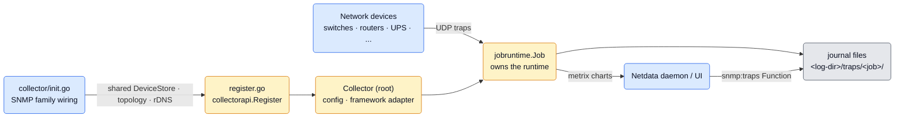
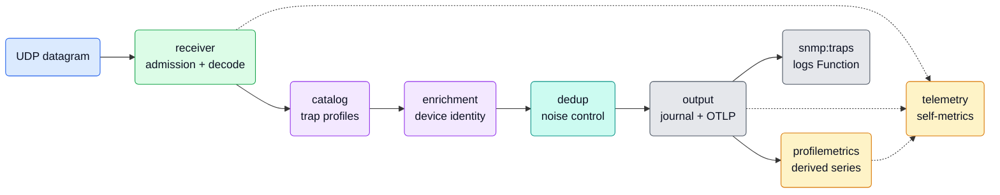
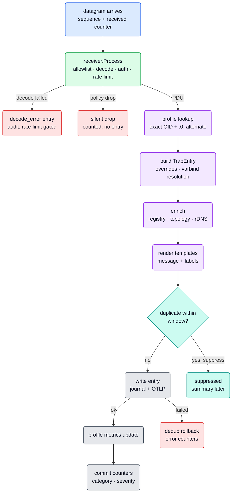
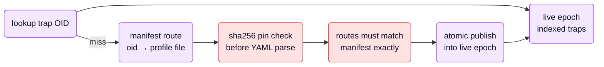
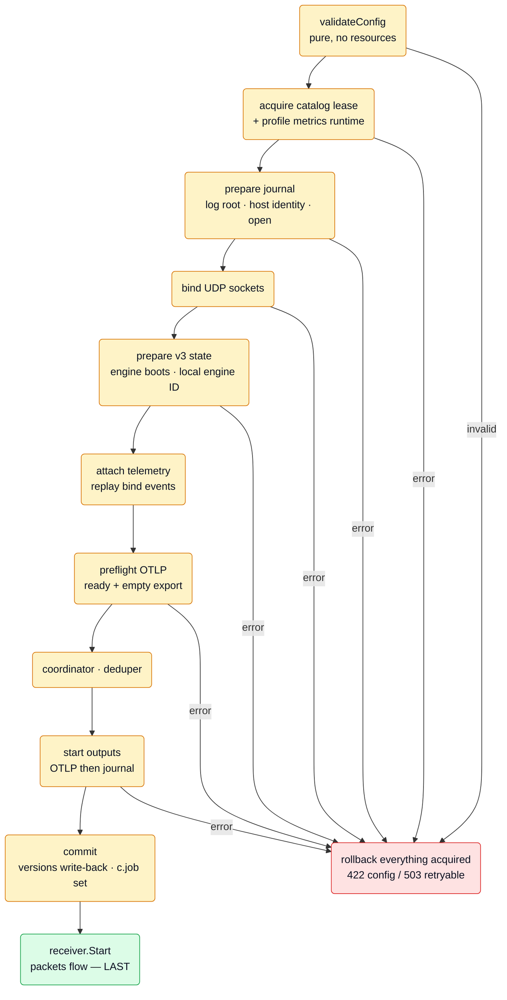

# SNMP Traps Collector Architecture

This is a maintainer-oriented guide to the `snmp_traps` collector, written to be read top to bottom. It starts with
what the collector is and where it sits, then follows one trap through every stage of the pipeline, then covers the
machinery around that pipeline (startup, shutdown, configuration, self-observability), and ends with reference tables
for coming back later.

It intentionally leaves two dependencies opaque: the journal file format (owned by `systemd-journal-sdk`) and SNMP
wire parsing internals (owned by the gosnmp fork). This document covers how the collector drives them, not how they
work inside.

**Place in the documentation set.** This is the one maintained record of the collector's design and internals: the
design invariants that are not visible in the code (why a limit has its value, which ownership rules the packages
obey, what a writer or resolver contract forbids) live here and nowhere else, so a change to collector behavior
updates this file in the same PR. The profile format is owned by the shipped
`src/go/plugin/go.d/config/go.d/snmp.trap-profiles/profile-format.md`; operator-facing behavior by
`docs/npm/snmp-traps/`; and the authoring rules for profiles, the generator, and stock-pack regeneration by the
project skill `.agents/skills/collectors-snmp-trap-profiles/SKILL.md`, which routes collector-code questions back
here. The pre-implementation design proposals and decision records that once accompanied that skill were retired;
rejected alternatives and phase history are in git history only.

**Path convention.** Code references are relative to `src/go/plugin/go.d/collector/snmp_traps/`, except those starting
with `src/go/`, which are repo-relative.

## Contents

**Orientation** — [Short Version](#short-version) | [Where The Collector Sits](#where-the-collector-sits) |
[The Big Picture](#the-big-picture)

**The life of a trap** — [Receive](#stage-1--receive) | [Decode and Admit](#stage-2--decode-and-admit) |
[Classify with Profiles](#stage-3--classify-with-profiles) | [Enrich](#stage-4--enrich) |
[Deduplicate](#stage-5--deduplicate) | [Write](#stage-6--write) |
[Derive Metrics](#stage-7--derive-metrics)

**The machine around it** — [Startup and Shutdown](#startup-and-shutdown) |
[Configuration Surface](#configuration-surface) | [Self-Observability](#self-observability) |
[The Logs Function](#the-logs-function)

**Reference** — [The Journal Field Contract](#the-journal-field-contract) | [Package Map](#package-map) |
[Where To Change Things](#where-to-change-things) | [Validation](#validation)

## Short Version

`snmp_traps` is a go.d framework V2 collector (module name `snmp_traps`), but it does not poll anything. One job is
one **SNMP trap listener**: it binds UDP endpoints (typically `0.0.0.0:162`), receives SNMP v1/v2c/v3 traps and
INFORMs, and turns each accepted packet into a **structured log entry**.

For every packet, synchronously on the listener goroutine:

1. **Admission** — source allowlist, version check, BER pre-validation, decode, community/USM authentication,
   engine-ID authorization, rate limiting.
2. **Meaning** — the trap OID is looked up in **trap profiles** (803 stock YAML files plus user overrides) that give
   the trap a name, category, severity, message template, and named varbinds.
3. **Identity** — enrichment attaches the device behind the trap: SNMP device registry, network topology, optional
   reverse DNS.
4. **Noise control** — optional dedup suppresses repeats within a window and emits periodic summary entries.
5. **Persistence** — the entry is written to a per-job **journal file tree** (pure Go, no journald required) and/or
   exported over **OTLP/gRPC**.
6. **Charts** — optional **profile metric rules** derive time-series from traps; self-telemetry counters feed the
   collector's own charts on every `Collect()` cycle.

The UI reads the trap log through one **`snmp:traps` Function** that queries the journal directory tree directly.

Three properties shape everything else:

- **The kernel socket buffer is the only queue.** The whole pipeline runs inline on the listener read goroutine; if
  it is slow, the OS drops packets. Every stage is built to be cheap and non-blocking.
- **Configuration is validated purely, then a job starts as a transaction.** No socket, file, or lease is touched
  until validation passes; any later failure rolls back everything acquired so far.
- **The receiver starts last and stops first.** Every other component is fully built before the first packet can
  arrive, and no packet can be in flight while components are torn down.

## Where The Collector Sits



**Framework contract.** `*Collector` implements `collectorapi.CollectorV2` (`collector.go`): `Init`, `Check`,
`Collect`, `Cleanup`, `Configuration`, `MetricStore`, `ChartTemplateYAML`. Points that differ from a typical poller:

| Aspect | This collector |
| --- | --- |
| Long-running work | Listener goroutines are started inside `Init()` and joined in `Cleanup()`; there is no `Run()` hook |
| `Check()` | Deliberate no-op — a successful bind in `Init` already proved everything checkable |
| `update_every` | Paces `Collect()` snapshots only; packet processing is instant and independent of it |
| Auto-detection | None. `name` is mandatory; the stock config ships with all jobs commented out |
| `Collect()` | A pure reader: snapshots atomic counters into `metrix` and sweeps the rate limiter |

**Registration and shared SNMP-family state.** The collector does not self-register in an `init()`. The parent
`src/go/plugin/go.d/collector/init.go` creates one shared `ddsnmp.DeviceStore`, one topology
`TrapEnrichmentHandle`, and one `reversedns.Resolver` per plugin process, and registers the `snmp`, `snmp_topology`,
and `snmp_traps` collectors against them. `snmp_traps.Register` panics if any of the three is nil — wiring errors
fail loudly at process start, not at trap time.

**Root is thin by construction.** The root `Collector` holds exactly three non-embedded fields: the metrix store, the
process-scoped `pluginServices`, and the `*jobruntime.Job`. It translates public config into immutable internal
policies and classifies errors for DynCfg; everything that runs lives in `internal/jobruntime.Job`, behind narrow
interfaces declared in `internal/jobruntime/dependencies.go`. The `jobruntime` package never imports the root.

## The Big Picture



A useful mental split for the rest of this document:

- **`internal/receiver`** decides *what is accepted* — allowlists, authentication, rate limits, decode. It imports
  only gosnmp, `internal/model`, and `pkg/snmputils`; it knows nothing about profiles or outputs.
- **`internal/catalog`** decides *what a trap means* — profiles, taxonomy, message templates, metric rule definitions.
- **`internal/enrichment`** + **`internal/attribution`** decide *which device it came from* and *which Netdata node
  gets it*.
- **`internal/dedup`** decides *what is noise*.
- **`internal/output`** owns *persistence* — the journal is the primary/authoritative sink, OTLP the secondary.
- **`internal/profilemetrics`** and **`internal/telemetry`** own *charts*.
- **`internal/jobruntime`** owns *one job's lifecycle* and sequences all of the above per packet
  (`pipeline.go:handleDatagram`).
- **`internal/model`** is the shared vocabulary: `TrapPDU` (receiver output), `TrapEntry` (the pipeline record),
  varbind lookup/redaction helpers, OID normalization.

## The Life Of A Trap

Everything below happens synchronously, per datagram, on the listener read goroutine (one goroutine per bound
endpoint — with N endpoints the pipeline runs N-way concurrent). The stage order in
`internal/jobruntime/pipeline.go` is contractual:



Accounting rule: `packetFinished` starts false, and a deferred guard books the packet as **dropped** unless a
terminal stage marked it finished (dedup-suppress, write-failure, or commit). The guard also catches panics. Any new
early-return that legitimately consumes a packet must set `packetFinished`, or the dropped counter lies.

### Stage 1 — Receive

`internal/receiver/listener.go`. Raw `net.ListenUDP` — gosnmp is used only as an unmarshaller, not as a listener.

| Property | Value |
| --- | --- |
| Endpoints | `listen.endpoints[]`, UDP only, default `0.0.0.0:162` (from stock config/schema) |
| Goroutines | Exactly one read goroutine per endpoint; it runs the entire pipeline inline |
| Read buffer | One reusable 8193-byte buffer per goroutine (8192 max datagram + 1 byte so oversize is *classified*, not truncated) |
| Socket buffer | `SO_RCVBUF` from `listen.receive_buffer` (default 4 MiB, max 256 MiB) — this is the only queue |
| Buffer degrade | If the OS grants less than the *default* request: warning + error counter, keep going. An explicitly configured value that fails is a fatal bind error |
| Read errors | Warn (rate-limited to one per hour per endpoint), count, sleep 100 ms, continue |

Two sharp edges:

- **`Datagram.Data` aliases the reusable read buffer.** Everything that retains bytes past the current packet must
  copy them (OctetString values are copied in `decode.go` for exactly this reason). Making any part of the pipeline
  asynchronous without copying first corrupts data.
- **Backpressure does not exist here.** A slow stage (catalog hydration, journal fsync, enrichment) translates
  directly into kernel-level packet loss. Keep the hot path allocation-light and never add blocking I/O to it.

### Stage 2 — Decode and Admit

`internal/receiver/receiver.go:Process` runs the ordered admission pipeline; `decode.go` does the wire work.

**Order of checks** (contractual — tests pin it):

1. Source-IP allowlist (`allowlist.source_cidrs`; default allows both `0.0.0.0/0` **and** `::/0` — the check is
   address-family-strict, so both are needed).
2. SNMP version sniff — a minimal, zero-allocation BER walk that rejects disallowed versions before real parsing.
3. **Home-grown BER pre-validation** before gosnmp ever sees the bytes (`validateBERLimits`): max nesting depth 8,
   max encoded OID 128 bytes, max OctetString 1024 bytes (relaxed for v3, whose encrypted ScopedPDU is one large
   OctetString), no indefinite lengths, no trailing data. This is the DoS budget for malformed input.
4. gosnmp decode (panic-guarded; the dependency is a fork: see the `replace` directive in `src/go/go.mod`).
5. Post-decode checks: version re-check, community allowlist (v1/v2c; empty list = accept any), v3 engine-ID
   authorization, dynamic engine-ID registration.
6. **INFORM acknowledgment** — sent *before* the rate-limit decision, so a rate-limited INFORM is still acked while
   its content is dropped.
7. Rate limit (last).

The decode budget is five fixed constants (`listener.go`, `decode.go`), enforced per job and deliberately not
configurable: 8192-byte datagram (RFC 3417 requires receivers to accept at least 484 bytes; 8 KiB covers verbose vendor
traps with margin), 256 varbinds (about three times the largest trap seen in the design-time survey of public fixture
corpora, around 80), nesting depth 8 (SNMPv3 messages need about 6 constructed levels), 128-byte encoded OID (a byte
cap independent of RFC 2578's 128 sub-identifier limit; real trap and varbind OIDs encode to a few dozen bytes), and
1024-byte OctetString (long enough for MIB strings, short enough to bound memory per packet; waived for SNMPv3, whose
encrypted ScopedPDU is one large OctetString, see check 3 above). Exceeding any of them drops the packet and counts a
`malformed_pdu` error.

**SNMPv1 normalization.** v1 traps carry no `snmpTrapOID.0`; decode synthesizes one plus up to four more varbinds,
prepended in fixed order, so downstream stages see one uniform shape:

| Synthetic varbind | Source |
| --- | --- |
| `sysUpTime.0` | v1 `Timestamp` |
| `snmpTrapOID.0` | generic traps 0–5 → the standard `1.3.6.1.6.3.1.1.5.{1..6}` OIDs; generic 6 → `<enterprise>.0.<specificTrap>` |
| `snmpTrapAddress.0` | v1 `AgentAddress` (if set) |
| `snmpTrapCommunity.0` | v1 community (if set; redacted everywhere downstream) |
| `snmpTrapEnterprise.0` | v1 `Enterprise` (if set) |

**Source identity is a security decision** (`decode.go:selectTrapSource`). The UDP peer always wins over the
`snmpTrapAddress.0` varbind — unless the peer is inside `source.trusted_relays`, in which case the varbind
(a relay/forwarder passing through the original agent address) wins. Every decision, including each rejected
candidate and its reason, is recorded in a `TrapSourceAudit` that travels with the entry into the journal. A
catch-all `0.0.0.0/0` trusted-relay prefix draws a startup warning, because any peer could then spoof its identity.

**SNMPv3** (`v3_state.go`, `v3_dynamic.go`, `v3_envelope.go`, `inform.go`):

- USM users are validated at config time (priv requires auth; keys ≥ 8 chars; engine IDs 5–32 hex bytes).
- Trap authorization: the sender's engine ID must be in `engine_id_whitelist` — **or** `dynamic_engine_id_discovery`
  hot-registers unseen `(engineID, username)` pairs, capped by `dynamic_engine_id_max_pairs`. The two options are
  mutually exclusive by validation.
- INFORM authorization is different by RFC 3414: the receiver is authoritative, so the message's engine ID must equal
  the job's **local engine ID** — whitelist membership is not enough. Discovery probes are answered with an
  unauthenticated Report carrying the local engine ID.
- Engine state persists per job in `<lib-dir>/snmp-trap/<job>/`: `engine-boots` (incremented on every
  construction — constructing the counter speculatively burns a boot count) and `local-engine-id` (configured value
  wins; a corrupt persisted file is a **hard startup error**, never silently regenerated, because peers cache it).
  Writes are atomic (`tmp` + fsync + rename); startup rollback removes only files this attempt created.
- The shared gosnmp security table needs an extra lock (`tableMu`) around decode because dynamic registration can
  mutate the per-username credential list that `UnmarshalTrap` iterates.

**Protection** (`allowlist.go`, `ratelimit.go`): rate limiting is a per-source-IP token bucket
(`rate = burst = per_source_pps`, default 1000), per job, capped at 10 000 tracked sources with idle sweep and
oldest-eviction. Two modes: `drop` discards over-limit packets; **`sample` does not sample — it counts and passes
everything**. Bucket GC runs from `Collect()` via `receiver.Sweep`, so the limiter's mutex is shared between listener
goroutines and the collect cycle. Bucket mechanics, none of them configurable: a new bucket starts full, so a new or
long-idle source may burst `per_source_pps` packets before limiting bites; a bucket idle for 10 minutes is swept, at
most once per 5 minutes; when the 10 000 cap is hit the sweep runs immediately and then the oldest bucket is evicted
before a new source is refused.

**Undecodable packets are not silent.** A decode failure is classified (`malformed_pdu`, `auth_failures`,
`usm_failures`, `unknown_engine_id`, `decode_failed` — by substring match on gosnmp error text, a deliberate coupling
until the fork exposes typed errors) and, if the rate limiter admits it, produces a `decode_error` journal entry with
the sanitized error, packet size, and SHA-256 — **never the raw bytes**, which may contain communities.

### Stage 3 — Classify with Profiles

`internal/catalog`. A trap profile is a YAML file that tells the collector what a trap OID means:

| Profile section | Content |
| --- | --- |
| `traps[]` | Per trap: `oid` (numeric), `name` (`MIB::symbol`), `category` + `severity` (closed sets), optional `description` (message template), `varbinds` (names into the file table or inline defs), `labels`, `dedup_key_varbinds` |
| `varbinds:` | File-scoped table: name → `{oid, type, enum, constraints}` |
| `metrics[]` / `charts[]` | Optional metric rules and their charts (consumed by Stage 7) |

**Closed taxonomy** — enforced at profile load, at job-override validation, and mapped to syslog `PRIORITY` at
serialization:

| Set | Values |
| --- | --- |
| Categories (8) | `state_change` `config_change` `security` `auth` `license` `mobility` `diagnostic` `unknown` |
| Severities (8) | `emerg` `alert` `crit` `err` `warning` `notice` `info` `debug` |

**Matching is exact** — the trap OID, plus one tolerance: the `.0.` alternate form (`model.AlternateTrapOID` toggles
the SNMPv1-style zero before the specific-trap arc, so `x.y.0.n` and `x.y.n` both resolve). There is no prefix
matching for trap OIDs. A trap with no profile still flows: `category=unknown`, `severity=notice`, raw varbind
names, synthetic message.

**The stock pack and lazy hydration.** 803 stock profiles live in
`src/go/plugin/go.d/config/go.d/snmp.trap-profiles/default/`, indexed by a `catalogue.json` manifest
(OID routes, MIB routes, metric-rule routes, per-file SHA-256):



- User profiles (from user config dirs) are parsed and validated **eagerly** at load; stock profiles are hydrated
  **lazily** on first lookup, `sync.Once`-guarded per file, published atomically under a staging epoch.
- Integrity is pinned in both directions: a stock file's SHA-256 must match the manifest *before* parsing, hydrated
  content must expose exactly the routes the manifest advertised, a manifest entry without a file is fatal, and a
  stock file missing from the manifest is fatal.
- A user profile with the same identity (extensionless basename) **replaces the whole stock file** — there is no
  field-level merge, and an `extends:` key is explicitly rejected.
- **There is no reload.** The `catalog.Manager` is reference-counted: the epoch is built on the first job's lease and
  dropped when the last lease closes. Editing profiles on disk takes effect only after every trap job restarts.

**Message templates** are a hard-restricted `text/template` subset, validated at load time by walking the parse
tree. Allowed: `{{ hostname }}`, `{{ source_ip }}`, `{{ trap_name }}`, `{{ vendor }}`, `{{ trap_interface }}`,
`{{ trap_neighbors }}`, `{{ value "vb" }}`, `{{ raw "vb" }}`, `{{ first ... }}`, `{{ with }}/{{ else }}/{{ end }}`.
Rejected: `{{ if }}`, pipelines, variables, unknown functions, unknown varbinds, and literal `{`/`}` anywhere.
Runtime failures are **never fatal and never silent**: the output becomes an `<unresolved:...>` marker, the entry is
still written, and a `template_unresolved` error counter increments. Messages are capped at 512 bytes, UTF-8-safe.

**Label cardinality is a load-time gate.** Labels may not reference hostname/source-IP/interface/neighbors, and
`value`/`raw` in a label is allowed only on a *bounded* varbind (enum ≤ 64 members, boolean/truthvalue, or a ≤ 64-wide
numeric constraint). A bad profile fails startup rather than exploding cardinality at runtime.

**Per-job `overrides[]`** replace a matched trap's category/severity/labels before the entry is built. Overriding a
label always produces a static string (the compiled template for it is deleted), and the shared epoch definition is
never mutated — overrides operate on a copy.

### Stage 4 — Enrich

`internal/enrichment/enricher.go`. The enricher is stateless and process-shared; its lookups are injected as narrow
function values (`netdataadapter` projects the concrete `ddsnmp.DeviceStore` and topology handle so the package
imports neither). Order and precedence:

1. **SNMP device registry** — lookup by source IP/hostname; only a *unique* match enriches (hostname, vendor, vnode
   GUID). Zero or multiple matches enrich nothing, and ambiguity is recorded as evidence.
2. **Interface from trap varbinds** — `ifName`/`ifDescr` in the trap itself wins over topology.
3. **Topology** — keyed by source IP + `ifIndex` varbind; fills only fields the registry left empty. If topology
   reports a *different* vnode than the registry matched, topology is distrusted wholesale (`vnode_mismatch`).
4. **Reverse DNS** — only if `reverse_dns.enabled`. Strictly non-blocking: a cached positive hit annotates
   `TRAP_REVERSE_DNS`; anything else schedules a background lookup and moves on. PTR results never overwrite a known
   hostname — the resolver is shared with the other SNMP collectors (one instance per plugin process, 24 h positive /
   5 min negative TTL, 10 000-entry cache). Trap jobs only borrow it: job init and cleanup must never create, close,
   sweep, or clear it. The packet path does a cache-only `Lookup` and a non-blocking `Schedule`; an entry written while
   the lookup is cold carries audit status `pending` and is never backfilled once the PTR answer arrives.

Every stage records a structured audit (`TrapEnrichmentAudit`: per-lookup status, method, match count, reason,
applied fields) that lands in the journal — enrichment is debuggable from the trap log itself, without reproducing.

Templates render **after** enrichment (they read `hostname`, `vendor`, `trap_interface`, `trap_neighbors`), and
enrichment output also drives Stage 7's node attribution.

### Stage 5 — Deduplicate

`internal/dedup`. Disabled by default; when disabled, `dedup.New` returns a **nil `*Deduper`** and every method is
nil-safe — nil is the disabled state, there is no flag to check.

| Aspect | Behavior |
| --- | --- |
| Fingerprint | SHA-256 over length-prefixed, type-tagged fields: source device (vnode → IP → peer → hostname), trap OID, and each selected key varbind (present/missing, OID, type, typed value). Sensitive varbinds contribute `<redacted>` |
| Key varbinds | A profile's `dedup_key_varbinds` **replaces** (not merges with) the job-level `dedup.key_varbinds` for that trap |
| Window | `window_sec` (default 5 s) — both the suppression window and the summary cadence |
| Duplicate | **Fully suppressed** — no journal entry, no OTLP record, no metric update; only counted |
| Summary | Every window with suppressions, a synthetic `deduplication_summary` entry is written with totals per trap OID (names resolved through a live catalog lookup) |
| Rollback | If the write of an admitted entry fails, its fingerprint is removed — a retransmission of a never-persisted trap must not be swallowed |
| Bounds | `cache_max_entries` (default 100 000), FIFO eviction; per-window summary state resets each tick |
| Shutdown | `Close()` synchronously emits the final summary **through the writer** and returns only after it completes — which is why cleanup closes the deduper strictly before the writer |

### Stage 6 — Write

`internal/output`. Exactly two possible sinks with fixed roles — journal is **primary**, OTLP is **secondary**; at
least one must be enabled (config error otherwise). With one sink there is no coordinator in the call path at all.

**Authority is asymmetric by design.** `Write` returns only the primary's error; a secondary failure is swallowed and
reported asynchronously as an outcome. Only the *authoritative* backend (journal, or OTLP when it is the sole sink)
moves the `pipeline_write_failed` funnel counter — a failing OTLP mirror shows up in its own error counter without
polluting the pipeline funnel. The `Writer` contract forbids touching an entry after `Write` returns, even on error,
because the other backend may still hold it.

**Journal sink** (`internal/output/journal/`):

| Aspect | Behavior |
| --- | --- |
| Format | Pure-Go systemd journal *files* via `systemd-journal-sdk` — no journald, no sockets, works on any platform; a missing log root is a startup error, not a silent fallback (the SDK is opened with `LogOpenEager` and `LogIdentityStrict`; both are required). Writing files directly is what lets the entry carry the *device* as `_HOSTNAME`: journald (`sd_journal_sendv`) would stamp the agent host instead |
| Location | `<log-dir>/traps/<job>/<machine-id>/*.journal` — the job name is a filesystem path segment (hence its strict charset) |
| Writing | Async: bounded queue (10 000), one worker owning the single reusable serializer (the only `AppendRaw` caller), per-entry append, **fsync batched on a 1 s ticker** — there is no flush-per-write and `Flush()` is unused in production |
| Failure | **Sticky and terminal**: the first write/sync error stops the worker, subsequent writes fail fast, and only a job restart recovers. The terminal outcome is reported once, without double-counting per-entry failures |
| Retention | `max_size` (default 10 GB), `max_duration`, `rotation_size`, `rotation_duration` — enforced by the SDK deleting archived files; no journald configuration is written |
| Injection defense | Values containing newlines/control bytes/invalid UTF-8 are stored as journald binary fields, so `MESSAGE=real\nFAKE_FIELD=x` cannot be queried as `FAKE_FIELD` (CWE-117); the count of such fields is a telemetry gauge |

**OTLP sink** (`internal/output/otlp/`): OTLP/gRPC logs only (URL paths are rejected — no OTLP/HTTP). The endpoint is
preflighted at job start (connectivity Ready + an empty export within `request_timeout`), so an unreachable collector
fails the job rather than dropping traps silently. The worker batches (`batch_size` 512 / `flush_interval` 200 ms);
a failed batch is **retained and retried** on the next trigger while the full queue exerts backpressure
(`ErrQueueFull`); entries are dropped only in the final close drain, always accounted. When OTLP is the only sink,
that queue is the only buffer: a full queue or a close drain loses traps, so OTLP alone is not durable storage. One
log record per trap:
`Body` = message, semconv-style attributes (`snmp.trap.*`, `network.peer.*`, `netdata.*` — deliberately *not* the
`TRAP_*` names), varbinds as one `snmp.varbinds` KVList reusing the same sensitive-varbind and duplicate-key rules as
the journal. Severity follows the OpenTelemetry Logs Data Model, Appendix B (syslog mapping), so ordering survives
but the eight slugs collapse into fewer ranges; the slug itself travels as `snmp.trap.severity` (`otlpSeverity`):

| Slug | `severity_number` | `severity_text` |
| --- | --- | --- |
| `emerg` | 21 | FATAL |
| `alert` | 19 | ERROR3 |
| `crit` | 18 | ERROR2 |
| `err` | 17 | ERROR |
| `warning` | 13 | WARN |
| `notice` (and unknown) | 10 | INFO2 |
| `info` | 9 | INFO |
| `debug` | 5 | DEBUG |

The full journal field schema — the collector's public data contract — is in
[The Journal Field Contract](#the-journal-field-contract).

### Stage 7 — Derive Metrics

Two independent chart producers run off the pipeline:

**Self-telemetry** (`internal/telemetry`) — always on. Forty atomic counters in four groups (pipeline funnel,
8 categories, 8 severities, 16 error kinds, plus dedup-suppressed when dedup is on), recorded lock-free from the
listener goroutine and snapshotted by `Collect()` into the five base charts of `charts.yaml` (`pipeline`, `events`,
`severity`, `errors`, `dedup_suppressed` — contexts `snmp.trap.*`, one instance per `job_name`). The registry only
manages handle lifecycle; the hot path never consults it, and detach is identity-aware so a restarted job's fresh
handle survives the old job's late cleanup.

**Profile metrics** (`internal/profilemetrics`) — opt-in (`profile_metrics.enabled` + a non-empty `include` list of
rule names). Rules come from the profiles (Stage 3) and turn traps into time-series:

| Rule type | Semantics |
| --- | --- |
| `counter` | Each matching trap increments a per-source counter series |
| `sample` | A numeric varbind value (scaled) becomes a gauge |
| `state` | Problem/clear semantics — either one trap OID with `set_when`/`clear_when` predicates, or separate `problem_trap`/`clear_trap` OIDs; a TTL publishes the clear value once, then expires the series |

- Rules are compiled once at job start into an OID → rules dispatch table (both OID spellings registered); `Update`
  reads it without a lock — the table is immutable after construction, and mutating it later is a data race.
- `Update` runs **only after a committed write** — suppressed duplicates and failed writes never move metrics.
- **Node attribution** (`internal/attribution`): a trap from an unambiguously registry-matched device becomes a
  series under that device's **vnode host scope** (its own node in the UI). Any ambiguity evidence (rejected source
  candidates, ambiguous registry match, vnode conflict) demotes the series to the job's node with an opaque
  `source_id` — a salted SHA-256 prefix, never a raw IP. Series labels are always
  `job_name`/`source_id`/`source_kind` (+ `resource_class`/`resource_id` for resource-scoped rules). The hash is
  SHA-256 over `<salt>:<job>:<selected source address>` (the raw UDP peer `ip:port` only as the last resort),
  truncated to 16 hex characters; the salt is the
  host's machine-id from `internal/hostidentity` (a fixed string when none is available) and is never emitted
  (`jobruntime.Job.sourceHashSalt`, `attribution.fallback`). It hides addresses, not identities: a small address
  space can be enumerated, and a machine-id change renames every fallback `source_id`.
- **Cardinality caps are fixed constants**, not config: 500 rules, 2000 sources, 512 resources per source, 50 000
  series per job, 2000 instances per chart (default). At a cap, only the *new* series is skipped
  (`overflow_dropped` counts it); existing series keep updating, and expiry releases cap slots. Overflow is
  deterministic because dispatch is sorted at compile time.
- `Collect` snapshots under the runtime lock, then writes to the metrix store **outside** it; the chart template is
  generated once by merging the base `charts.yaml` with per-rule charts plus a diagnostics chart
  (`rule_missed`, `extraction_failed`, `attribution_failed`, `overflow_dropped`, `source_transitions`), and
  `ChartTemplateYAML()` serves exactly that compiled template — never a debug dump or a hand-maintained copy.

## Startup and Shutdown

### Init: validate purely, then start as a transaction

`Collector.Init` does nothing fallible before validation completes:

1. **`validateConfig` is pure** — value receiver, zero mutation, no I/O. Every config rule (listener, versions, USM,
   CIDRs, dedup, OTLP, retention, overrides, profile-metric selection) fails here as a DynCfg **422 (non-retryable)**.
2. **`job.Start` acquires everything** in a fixed order, with hand-rolled rollback on every failure path. Failures
   here are DynCfg **503 (retryable)** — except v3 *preparation* errors that are really config errors, which are
   re-classified via `receiver.IsConfigPreparationError`. Misclassifying a transient failure as config permanently
   rejects a config that a retry would accept.



Details that matter:

- **The receiver starts last.** Nothing downstream can be half-built when the first packet arrives. `Bind()` returns
  its non-fatal events (e.g. a degraded receive buffer) *as values* so they can be replayed into telemetry after it
  attaches — routing them through the callback would lose them.
- **The only config write-back** happens inside the commit: normalized `versions` are copied back so DynCfg
  round-trips show them — but only after a successful start; a failed `Init` leaves the user's raw values intact.
- **The catalog manager commits on success** (`services.go:catalogCandidate`): a failed `Init` must not freeze bad
  profile paths into the shared process-wide slot.
- **`Init` is idempotent** (`c.job != nil` short-circuits); `Check()` is a no-op; `Cleanup` + `Init` is a full fresh
  start.
- **Two host-identity accessors are not interchangeable**: the journal writer uses `FreshJournal()` (reloaded every
  attempt, so a transient failure recovers on DynCfg retry), while timestamps and the metric hash salt use
  `CachedFallback()` (`sync.Once` — a first failure is sticky for the process and degrades gracefully).

### Cleanup: reverse the dependencies, in order

`Job.Cleanup` is `sync.Once`-guarded and ordered; each step justifies the next:

1. **`receiver.Close()`** — closes sockets and *joins* the read goroutines. After this, no packet is in flight, which
   is what makes the following unsynchronized teardown race-free.
2. **`deduper.Close()`** — synchronously writes the final dedup summary *through the still-open writer*.
3. **`writer.Close()`** — drains and closes journal, then OTLP.
4. **`profileLease.Close()`** — the last lease unloads the catalog epoch (writer closed first, so no in-flight
   serialization can touch a released epoch).
5. **`journalActivity.Close()`** — decrements the ref-count that keeps the logs Function published.
6. **`telemetry.Detach()`** — identity-aware, safe against a same-name successor job.

## Configuration Surface

`config_schema.json` is the authoritative source for defaults and user-facing grouping (its `uiSchema` tabs, listed
below). Highlights only — see `config.go` and the schema for the full surface:

| Tab | Options | Notes |
| --- | --- | --- |
| Base | `name` (required), `update_every`, `vnode` | `name` is a filesystem path segment: `^[a-zA-Z0-9][a-zA-Z0-9_-]*$`, ≤ 64 chars |
| Listener | `listen.endpoints[]`, `listen.receive_buffer` | UDP only; port 162 needs `CAP_NET_BIND_SERVICE` |
| SNMP | `versions`, `communities`, `usm_users[]`, `engine_id_whitelist`, `local_engine_id`, `dynamic_engine_id_discovery`, `dynamic_engine_id_max_pairs` | Default versions `[v1, v2c]`; empty communities = accept any; whitelist and dynamic discovery are mutually exclusive |
| Filtering | `allowlist.source_cidrs`, `source.trusted_relays`, `rate_limit.*`, `dedup.*` | Defaults: allow-all CIDRs, no relays, rate limit off, dedup off |
| Outputs | `journal.enabled`, `otlp.*` | Journal defaults **on** (`*bool`, nil = enabled); at least one backend must be enabled |
| Storage | `retention.*` | Journal only; tri-state strings (absent = default, `""`/`"null"` = unlimited) |
| Enrichment | `reverse_dns.enabled`, `overrides[]` | Both off/empty by default |
| Metrics | `profile_metrics.enabled`, `profile_metrics.include` | `include` must be non-empty when enabled |

Config discipline worth knowing:

- Everything user-provided is **deep-copied** into immutable internal policies (`jobruntime.Policy`,
  `receiver.Policy`, `dedup.Policy`, `otlp.Policy`) at start — later mutation of `c.Config` cannot reach a running
  job. A new map/slice policy field must be cloned too.
- `dedup.window_sec` is `int64` on purpose (architecture-independent DynCfg wire type), and every schema property
  must appear in exactly one `uiSchema` tab — both are pinned by tests in `init_test.go`.

## Self-Observability

`Collect()` per cycle: guard that the receiver is ready → `receiver.Sweep` (rate-limiter GC) → push the journal's
binary-encoded-field total into telemetry (an absolute value — `Store`, not `Add`) → snapshot the 40 telemetry
counters → snapshot profile-metric series. All metrics are cumulative counters labeled `job_name`; `metadata.yaml`
declares the integration surface, including 20 stock alerts over these charts (`src/health/health.d/snmp_traps.conf`).

The one trap in this area: `receiver.ErrorKind` values are converted to `telemetry.ErrorKind` by a **raw string
cast**, and the telemetry switch has no default — renaming an error-kind constant on either side silently stops a
counter without any compile error. The two vocabularies are a coupled contract.

## The Logs Function

One Function serves the whole module: name `snmp:traps`, single method `logs` (`functions.go` re-exports
`internal/snmptrapsfunc`). Properties:

- It is an **agent-level Function**, not per-job: the handler is rooted at `<log-dir>/traps` (the parent of all
  per-job trees) and a query can address all jobs at once; the UI narrows by source, where each job name is one
  `__logs_sources` value.
- **Availability is ref-counted**: each journal-enabled job takes a lease at start and releases it in cleanup. The
  Function is published while at least one journal-backed job runs; OTLP-only jobs never publish it.
- The backend is the journal SDK's directory query — no journalctl, no journald. Trap-specific defaults: facets
  (`TRAP_CATEGORY`, `TRAP_SEVERITY`, `TRAP_NAME`, `TRAP_SOURCE_IP`, `TRAP_DEVICE_VENDOR`, `TRAP_JOB`, `_HOSTNAME`),
  a 17-column default view, and a histogram bucketed by `TRAP_NAME`.
- Isolation is structural: `internal/snmptrapsfunc` imports only stdlib, the journal SDK, and `pkg/funcapi` — it
  cannot see the collector, the model, or the outputs.

## The Journal Field Contract

Every field name below is public API: the Logs UI, the `snmp:traps` Function defaults, the `query-snmp-traps` skill,
and users' `journalctl` queries all depend on them. Serialization order is fixed and pinned by tests
(`internal/output/journal/serialize.go`); `TRAP_JSON` is always the last field.

**Always present:**

| Field | Meaning |
| --- | --- |
| `MESSAGE` | Rendered human message (profile template, or `SNMP trap <oid> from <source>`) |
| `PRIORITY` | Syslog priority from severity (`emerg`→0 … `debug`→7; unknown → 5) |
| `SYSLOG_IDENTIFIER`, `TRAP_JOB` | Job name |
| `ND_LOG_SOURCE` | Constant `snmp-trap` |
| `TRAP_REPORT_TYPE` | `trap` \| `deduplication_summary` \| `decode_error` |
| `TRAP_JSON` | Machine-readable payload (varbinds / summary counts / decode-error detail), always last |

**Identity and context** (real traps and decode errors):

| Field | Meaning |
| --- | --- |
| `_HOSTNAME` | Device hostname → source IP → UDP peer (first non-empty) |
| `ND_NIDL_NODE` | Vnode GUID — routes the entry to that node in the UI |
| `TRAP_OID`, `TRAP_NAME` | Trap identity (`TRAP_NAME` only when a profile matched) |
| `TRAP_CATEGORY`, `TRAP_SEVERITY` | Closed-taxonomy classification (severity written verbatim) |
| `TRAP_PDU_TYPE`, `TRAP_VERSION` | `trap`/`inform`, `v1`/`v2c`/`v3` |
| `TRAP_SOURCE_IP`, `TRAP_SOURCE_UDP_PEER` | Selected source vs raw peer (`ip:port`) |
| `TRAP_REVERSE_DNS`, `TRAP_DEVICE_VENDOR`, `TRAP_INTERFACE`, `TRAP_NEIGHBORS` | Enrichment results; each is omitted when empty, never written as an empty string (the OTLP attributes mirror this) |
| `TRAP_ENRICHMENT` | JSON audit of every enrichment decision (statuses, reasons, applied fields) |

**Dynamic families:**

| Family | Rules |
| --- | --- |
| `TRAP_VAR_<NAME>` | One per varbind; enum-resolved value, with `TRAP_VAR_<NAME>_RAW` carrying the numeric when an enum applies. Names upcased, non-alphanumerics collapsed to `_`, duplicates suffixed `_2`…, capped at journald's 64 bytes via truncate + FNV-1a hash (full name recoverable in `TRAP_JSON`). Suppressed: the community varbind (sensitive) and the four plumbing varbinds (`sysUpTime`, `snmpTrapOID`, `snmpTrapAddress`, `snmpTrapEnterprise`) — the latter stay in `TRAP_JSON` |
| `TRAP_TAG_<KEY>` | One per profile label, keys sorted; an invalid key fails the whole entry (fail-closed) |

**Per report type:** dedup summaries add `TRAP_SUPPRESSED_COUNT`, `TRAP_SUPPRESSED_FINGERPRINTS`,
`TRAP_REPORT_PERIOD_SEC` (and skip identity fields); decode errors add `TRAP_DECODE_ERROR_KIND`, `TRAP_DECODE_ERROR`
(sanitized, ≤ 256 bytes), `TRAP_PACKET_SIZE`, `TRAP_PACKET_SHA256`, `TRAP_SOURCE_UDP_PORT`, `TRAP_LISTENER`,
`TRAP_ENGINE_ID`.

**Redaction invariant:** the SNMP community is suppressed in all four projections — `TRAP_VAR_*`, `TRAP_JSON`, the
OTLP varbind list, and the dedup fingerprint — all routed through the single `model.IsSensitiveVarbind` predicate.

**OTLP divergence:** OTLP attributes use semconv-style names (`snmp.trap.oid`, `network.peer.address`,
`netdata.nidl.node`, …), not `TRAP_*`; and while the journal stores an unknown severity verbatim (with
`PRIORITY=5`), OTLP normalizes it to `notice`/`INFO2`.

## Package Map

| Package | Responsibility |
| --- | --- |
| root (`snmp_traps`) | V2 framework adapter: config surface + pure validation, DynCfg error classes, path resolution, process-shared services, Function wiring, base `charts.yaml` |
| `internal/jobruntime` | One job's lifecycle: the ordered start transaction, the per-packet pipeline, output staging, event fan-in to telemetry, decode-error entries, ordered cleanup |
| `internal/receiver` | Admission: UDP listener, BER pre-validation, gosnmp decode, v1 normalization, source selection, SNMPv3 (USM, engine state, dynamic discovery, INFORM/discovery responses), allowlist, rate limiting |
| `internal/model` | Shared vocabulary: `TrapPDU`, `TrapEntry`, wire-stable enums, OID normalization and the `.0.` alternate, varbind lookup and the sensitive-varbind redaction predicate |
| `internal/catalog` | Trap profiles: loading (eager user / lazy sha256-pinned stock), the manifest route tables, closed taxonomy, restricted templates, metric-rule DSL parsing and validation, per-job overrides, ref-counted manager |
| `internal/enrichment` | Registry → varbind-interface → topology → reverse-DNS enrichment with full audit; `netdataadapter` isolates the concrete Netdata dependencies |
| `internal/attribution` | Metric source identity: vnode host scope vs salted-hash fallback, ambiguity demotion, route-transition tracking |
| `internal/hostidentity` | Journal host identity (machine-id, boot-id, monotonic clock): fresh-per-bind and cached-fallback accessors |
| `internal/dedup` | Fingerprinting, windowed suppression, periodic and final summaries, rollback, bounded cache |
| `internal/output` | Sink coordination (primary/secondary, authority), backend-neutral value/varbind projection |
| `internal/output/journal` | Pure-Go journal files: async worker, batched fsync, sticky terminal failure, retention, binary-field injection defense, the `TRAP_*` serializer |
| `internal/output/otlp` | OTLP/gRPC logs: preflight, batching with retry-by-retention, the semconv attribute mapping |
| `internal/profilemetrics` | Trap-derived time-series: rule compilation, predicates, runtime with fixed cardinality caps, per-cycle collection, chart-template generation |
| `internal/telemetry` | Self-metrics: 40 atomic counters, identity-aware job handle registry |
| `internal/snmptrapsfunc` | The `snmp:traps` logs Function over the journal directory tree |
| `internal/traptest`, `internal/profiletest`, `internal/journaltest` | Test infrastructure: synthetic SNMP packet builders + pcap fixtures, catalog fixtures with real manifest digests, journalctl-backed journal verification |

**Dependency rules.** `internal/model` is the only package everything may import. `internal/receiver` knows nothing
above it. `internal/jobruntime` composes the siblings and reaches the root only through the interfaces in its own
`dependencies.go`. `internal/snmptrapsfunc` sees none of the collector at all. The root imports everything and
implements the seams.

## Where To Change Things

| Goal | Start here |
| --- | --- |
| Add/change a public config option | `config.go` + `init.go` (pure validation) + `config_schema.json` (defaults, tab) + the owning package's policy `Normalize`/`Validate` |
| Change packet admission, rate limiting, allowlists | `internal/receiver/` (`receiver.go` order, `policy.go` rules) |
| Change SNMPv3 behavior | `internal/receiver/` (`v3_state.go`, `v3_dynamic.go`, `v3_envelope.go`, `inform.go`) |
| Change the profile format or taxonomy | `internal/catalog/` (`profile.go`, `template.go`) + the authoring docs at `src/go/plugin/go.d/config/go.d/snmp.trap-profiles/profile-format.md` + the trap-profile authoring skill |
| Change the pipeline stage order | `internal/jobruntime/pipeline.go` (mind the ordering contracts: enrich before render, metrics after commit, `packetFinished`) |
| Add a journal field | `internal/output/journal/serialize.go` (order is pinned; `TRAP_JSON` stays last) + the Function defaults in `internal/snmptrapsfunc` + the `query-snmp-traps` skill |
| Change OTLP mapping | `internal/output/otlp/writer.go` |
| Change dedup semantics | `internal/dedup/` (fingerprint in `dedup.go`, config in `policy.go`) |
| Add a metric rule capability | `internal/catalog/metric_{types,parse,validate}.go` (DSL) + `internal/profilemetrics/` (compile/evaluate) |
| Add a self-metric | `internal/telemetry/job.go` + `charts.yaml` + `metadata.yaml` (the exact set is test-pinned in both places) |
| Change startup/cleanup ordering | `internal/jobruntime/{job,outputs}.go` (every ordering above is pinned by tests) |

## Validation

```text
cd src/go
go test -count=1 ./plugin/go.d/collector/snmp_traps/...
go test -race -count=1 ./plugin/go.d/collector/snmp_traps/...
go vet ./plugin/go.d/collector/snmp_traps/...
```

The collector is concurrency-sensitive: listener goroutines, the dedup ticker, both output workers, and the collect
cycle all run in parallel, so the `-race` run is not optional for changes to the receiver, dedup, outputs, or the
pipeline.

Other checks worth knowing:

- **End-to-end**: `collector_e2e_test.go` needs a real `journalctl`; it binds a real UDP socket, replays a pcap-hex
  fixture through the full pipeline, and asserts the journal fields via `journalctl -D`. The `testdata/*.pcap.hex`
  fixtures are synthesized (documentation IPs, `public` community), never customer captures — see
  `testdata/README.md`.
- **Benchmarks**: several packages carry `benchmark_test.go` for the hot path (BER rejection, serialization, dedup
  fingerprinting, coordinator fan-out); decode-path changes should keep the zero-allocation guarantees pinned by the
  alloc-counting tests.
- **Stock pack**: catalog tests load all 803 shipped profiles and verify the manifest matches the files in both
  directions — regenerating the pack without regenerating `catalogue.json` fails tests by design.
- When touching charts, metrics, config, or metadata, follow the repository collector-consistency checklist
  (`.agents/skills/integrations-lifecycle/consistency.md`).
