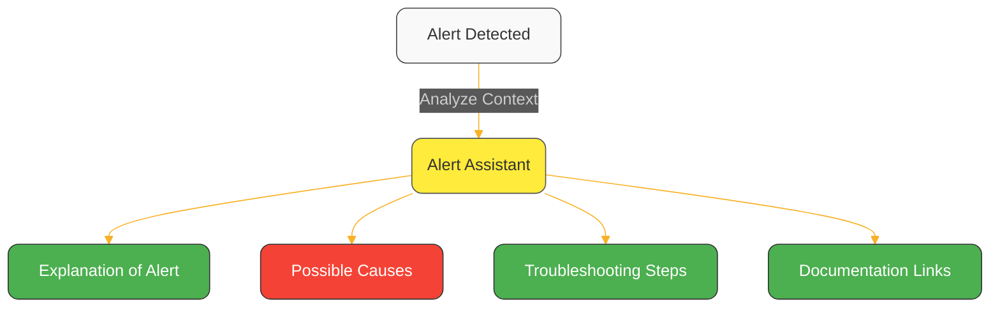
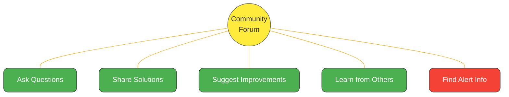

# Alerts and Notifications in Netdata

Netdata provides two ways to send alert notifications. You can use either one or both at the same time.

:::tip

Alerts are based on each node's health status. You can change thresholds, add new alerts, or silence specific ones using Netdata's alerting system.

[See how to configure alerts](/src/health/REFERENCE.md)

:::

## How Alert Notifications Work

| Method            | Where Alerts Are Sent From | Customization | Highlights                                                |
|-------------------|----------------------------|---------------|-----------------------------------------------------------|
| **Netdata Cloud** | Cloud UI                   | Medium        | Centralized alerting using connected nodes' health status |
| **Netdata Agent** | Local Netdata Agent        | High          | Node-level alerting with wide integration support         |

You can enable one or both methods depending on your needs.

## Quick Start

Use this table to choose and set up your preferred alerting method:

| Option            | Setup Location       | Setup Effort | Best For                      |
|-------------------|----------------------|--------------|-------------------------------|
| **Netdata Cloud** | In the Cloud UI      | Low          | Teams managing multiple nodes |
| **Netdata Agent** | On each Netdata node | Medium       | Full control and flexibility  |

## Set Up Alerts via Netdata Cloud

1. Connect your nodes to [Netdata Cloud](https://app.netdata.cloud/)
2. In the UI, go to: `Space → Notifications`
3. Choose an integration (e.g. Slack, Amazon SNS, Splunk)
4. Set alert severity filters as needed

[See all supported Cloud integrations](/docs/alerts-&-notifications/notifications/centralized-cloud-notifications)

## Set Up Alerts via Netdata Agent

1. Open the notification config:

```bash
sudo ./edit-config health_alarm_notify.conf
```

2. Enable your preferred method, for example email:

```ini
SEND_EMAIL="YES"
DEFAULT_RECIPIENT_EMAIL="you@example.com"
```

3. Ensure your system can send mail (via `sendmail`, SMTP relay, etc.)
4. Restart the agent:

```bash
sudo systemctl restart netdata
```

[See all Agent-based integrations](/docs/alerts-&-notifications/notifications/agent-dispatched-notifications)

## About the Agent's Health Monitoring

The Netdata Agent continuously monitors system health and performance. It offers:

- Hundreds of pre-configured alerts covering system, app, and service metrics
- No setup required works out of the box
- Dynamic customization you can fully control how, when, and what triggers an alert

[See which collectors support alerts](/src/collectors/COLLECTORS.md)

## Alert Philosophy and Design

### The Anatomy of Intelligent Alerts

| Component           | Description                                                                                                             |
|---------------------|-------------------------------------------------------------------------------------------------------------------------|
| **Metrics Data**    | Collected every second (and at "event frequency" for eBPF metrics), giving you the most precise foundation for alerting |
| **Filtering**       | Alerts run against specific metrics series, with support for pattern matching, labels, hostnames, and operating systems |
| **Frequency**       | Configurable check intervals based on how quickly you need to know about issues                                         |
| **Templates**       | Write once, apply everywhere with dimension templates and the ability to apply logic to multiple charts                 |
| **Calculation**     | Convert raw metrics into human-readable formats, like percentages, for easier understanding                             |
| **Thresholds**      | Pre-configured values that determine when metrics are outside acceptable ranges                                         |
| **Hysteresis**      | Prevention of "flapping" alerts for metrics that hover around thresholds                                                |
| **Severity Levels** | CLEAR, WARNING, and CRITICAL states to indicate the urgency of action needed                                            |

### Preventing False Positives and Alert Fatigue

| Feature                   | Benefit                                                                    |
|---------------------------|----------------------------------------------------------------------------|
| **Intelligent Defaults**  | Thresholds are carefully selected based on real-world experience           |
| **Dynamic Thresholds**    | Some alerts adapt to your system's baseline performance                    |
| **Hysteresis Protection** | Prevents floods of notifications when metrics fluctuate around a threshold |
| **Notification Delays**   | Configurable delays ensure transient issues don't trigger alerts           |
| **Severity Separation**   | Different notification channels for different alert severities             |
| **Role-Based Routing**    | Ensures alerts reach only the appropriate stakeholders                     |

## Troubleshooting Alerts

Netdata provides several tools to help you understand and resolve alert notifications:

<details>
<summary><strong>Netdata Assistant</strong></summary><br/>

The [Netdata Assistant](https://learn.netdata.cloud/docs/machine-learning-and-anomaly-detection/ai-powered-troubleshooting-assistant) is an AI-powered feature that guides you through troubleshooting alerts. When an alert triggers, you can:

1. Click on the alert in your Netdata Cloud dashboard
2. Press the Assistant button to open a floating window
3. Receive customized information and troubleshooting tips specific to that alert



The Assistant window follows you as you navigate through Netdata dashboards, making it easy to reference while investigating the issue.
</details>

<details>
<summary><strong>Community Resources</strong></summary><br/>

For more complex alert troubleshooting, Netdata maintains a dedicated [Alerts Troubleshooting space](https://community.netdata.cloud/c/alerts/28) in our community forum.



You can also get help through our [GitHub repository](https://github.com/netdata/netdata) or [Discord channel](https://discord.gg/kUk3nCmbtx) if you prefer those platforms. After resolving an issue, consider sharing your experience in the forum to help other users.
</details>

<details>
<summary><strong>Customizing Alerts</strong></summary><br/>

You can tune alerts to match your environment by adjusting thresholds, writing custom alert conditions, silencing alerts temporarily or permanently, and using statistical functions for smarter alerting.

[Customize alerts](/src/health/REFERENCE.md)
[Silence or disable alerts](/src/health/REFERENCE.md#disable-or-silence-alerts)
</details>

## Related Documentation

- [All alert notification methods](/docs/alerts-and-notifications/notifications/README.md)
- [Supported collectors](/src/collectors/COLLECTORS.md)
- [Full alert reference](/src/health/REFERENCE.md)
