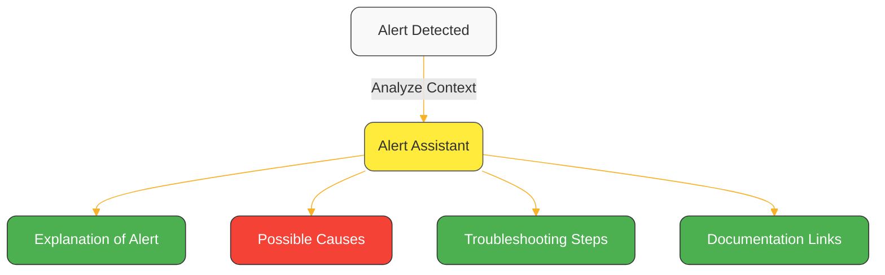
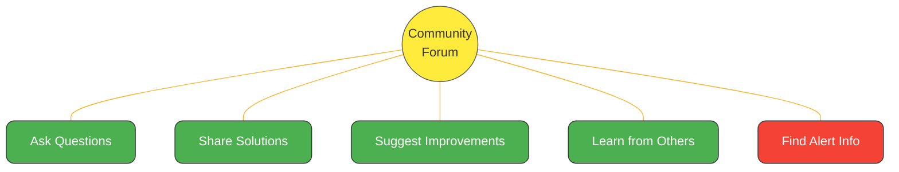

# Alerts and Notifications in Netdata

## Introduction to Alerting

Netdata's alerting system is a **distributed, real-time health monitoring framework** that evaluates conditions against metrics and executes actions on state transitions. Notifications is one of the actions supported.

Unlike traditional monitoring systems, Netdata evaluates alerts at multiple levels simultaneously, on the edge (Agents), at aggregation points (Parents), and deduplicates in Netdata Cloud, allowing teams to have different levels of alerting at different levels of the infrastructure.

### What is an Alert in Netdata

Alerts in Netdata are designed to be **component level watchdogs**. They get attached to specific components/instances (e.g., a network interface, a database instance, a web server, a container, a process, etc.) and are evaluated against metrics, at configurable intervals.

To simplify configuration, Netdata supports alert templates, which are defined once and are applied to all matching components/instances (e.g., all network interfaces, all database instances, all web servers, all containers, all processes, etc). The system supports matching instances by host and instance labels and names, allowing alerts to be defined multiple times under the same name, with different matching criteria.

Netdata alerts have a name, value, unit, and status. This allows them to be easily displayed in the dashboard and sent as notifications, while remaining meaningful and scalable, independently of how complex the infrastructure is.

### Where Alerts Run

Alerts in Netdata are evaluated at the edge. All Netdata Agents and Parents run alerts on the metrics they process and store (by default this is enabled, users may disable alerting at any level). When metrics are streamed to a Parent, the Parent evaluates its own alerts on those metrics, independently of the child that streams these metrics and the alerts configured on the child. Each Netdata Agent (child, parent, or standalone) has its own alerts configuration and evaluates alerts autonomously and independently of all other Agents. Metrics streaming does not propagate alert configurations or alert transitions to the Parent.

```
┌─────────┐     Metrics      ┌──────────┐     Metrics      ┌──────────┐
│  Child  │ ───────────────> │ Parent 1 │ ───────────────> │ Parent 2 │
│  Agent  │     of child     │  Agent   │    of child +    │  Agent   │
└────┬────┘                  └────┬─────┘      Parent 1    └────┬─────┘
     │                            │                             │
     │ Evaluates alerts on        │ Evaluates alerts on         │ Evaluates alerts on
     │ local metrics              │ child + local metrics       │ all streamed + local
     │                            │                             │
     ▼                            ▼                             ▼
  Alerts                        Alerts                        Alerts
```

### Alert Actions and Notifications

Notifications in Netdata Agents are **actions** associated with alert status transitions. Netdata Agents can dispatch notifications, or perform other automation actions, such as scaling out a service, restarting a process, rotating logs, etc. Actions are simple shell scripts or executable programs that receive from Netdata all the metadata related to the alert transition and can perform any action required.

When Netdata Agents are claimed to Netdata Cloud, they send all their alert configurations and transitions to Netdata Cloud, where they are deduplicated (multiple alert transitions from different Agents for the same host, are merged across the infrastructure). Netdata Cloud triggers notifications centrally via its own integrations (Slack, Microsoft Teams, Amazon SNS, PagerDuty, OpsGenie, etc).

Netdata Cloud intelligent alert state deduplication:

- **Netdata Cloud deduplicates**: Multiple Agents reporting the same alert are consolidated
- **Highest severity wins**: CRITICAL > WARNING > CLEAR
- **Unique key**: Alert name + Instance + Node

Netdata Agents (standalone, children, parents) and Netdata Cloud trigger actions independently, using their own configuration and integrations.

The design of alerts in Netdata, allows:

1. **Team Independence**: Different teams can run their own Parents with custom alerts
2. **Edge Intelligence**: Critical alerts can trigger automations directly on nodes
3. **Scalability**: Alert evaluation distributes naturally with your infrastructure
4. **Flexibility**: Mix edge, regional, and central alerting strategies

### Quick Example

```yaml
Web Server (Child):
  - Alert: system CPU > 80% triggers scale out
  - Alert: process X memory > 90% restarts process X

DevOps Parent:
  - Alert: Response time > 500ms across all web servers
  - Alert: Error rate > 1% for any service

SRE Parent:
  - Alert: Anomaly detection on traffic patterns
  - Alert: Capacity planning thresholds

Netdata Cloud:
  - Receives all alert transitions
  - Deduplicates all overlapping alerts
  - Shows CRITICAL if any instance reports CRITICAL
  - Provides unified view for incident response
```

Each level operates independently and autonomously, yet Netdata Cloud provides a coherent, deduplicated view of the entire infrastructure's health, provided that all agents are directly claimed to Netdata Cloud.

## Alerts & Notifications Configuration Management

Netdata alerts are configured in 3 layers:

1. **Stock Alerts**: Alert definitions provided by Netdata, usually stored in `/usr/lib/netdata/conf.d/health.d`. These alerts should not be edited directly, as they will be overwritten on Netdata updates. Netdata ships hundreds of alerts to detect common issues and problems for systems and applications, providing an out-of-the-box solution for many use cases.
2. **User Configured Alerts**: Alert definitions created by users, stored in `/etc/netdata/health.d`.
3. **Dynamically Configured Alerts, via the UI**: Netdata dashboards allow logged in users with the proper permissions, to edit, add, enable, disable alert configurations. Dynamic configuration allows users to create alerts on any node, via the streaming transport (e.g., the dashboard of the a Parent allows manipulating alerts on any connected Child Agent).

## Actions & Notifications Configuration Management

For any given node in the infrastructure, notifications can be configured at 3 levels:


| Level              | Evaluates                   | Notifications From | Customization                     | Notifications                                                                                    |
|--------------------|-----------------------------|--------------------|-----------------------------------|--------------------------------------------------------------------------------------------------|
| **Netdata Agent**  | Local Metrics               | Netdata Agent      | Edge automation                   | [Agent integrations](/docs/alerts-&-notifications/notifications/agent-dispatched-notifications)  |
| **Netdata Parent** | Local and Children Metrics  | Netdata Parent     | Edge automation                   | [Agent integrations](/docs/alerts-&-notifications/notifications/agent-dispatched-notifications)  |
| **Netdata Cloud**  | None - Receives Transitions | Netdata Cloud      | Web-hooks, role based, room based | [Cloud integrations](/docs/alerts-&-notifications/notifications/centralized-cloud-notifications) |

:::note

When using Netdata Parents and Netdata Cloud, with default settings, you may be receiving multiple email notifications for the same alert transition. The reason is that Netdata Agents are configured to send email notifications by default when an MTA is configured on the systems they run. We recommend disabling email notifications on Netdata Agents and Parents when using Netdata Cloud. To disable email notifications, set `SEND_EMAIL="NO"` in `/etc/netdata/health_alarm_notify.conf` [using `edit-config`](/docs/netdata-agent/configuration/README.md).

:::

### Best Practices For Managing Large Deployments

Netdata has been designed to provide maximum flexibility and control over alerting. However, some common use cases have emerged:

#### Central Alerting

When:

- No edge automation is required (there is no need for running scripts to react on alert transitions), and
- Highly available Netdata Parents are used for all nodes, and
- Netdata Cloud is used (at least for all parents)

We recommend:

1. Disable health monitoring on all child nodes.
2. Make sure all parents share the same alert configuration (use a shared git repo, or CI/CD for provisioning)
3. Disable notifications on Netdata Parents (set `SEND_EMAIL="NO"` in `/etc/netdata/health_alarm_notify.conf`)
4. Keep notifications only from Netdata Cloud

This strategy emulates what most users are accustomed to from other monitoring tools, where alerts are configured centrally and notifications are also dispatched centrally:

- Netdata child nodes just collect and dispatch metrics
- All alerts are evaluated only on Netdata Parents
- Notifications are sent only from Netdata Cloud

#### Edge Flexible Alerting

When:

- Edge automation is required (e.g., scale out, restart processes, etc), and
- Netdata Parents are used, and
- Netdata Cloud is used for all nodes

We recommend:

- Disable stock alerts on Netdata child nodes (set `enable stock health configuration` to `no` in `/etc/netdata/netdata.conf` in `[health]` section)
- Configure in child nodes only the alerts required for edge automation
- Keep stock alerts on Netdata Parents but disable their notifications (set `SEND_EMAIL="NO"` in `/etc/netdata/health_alarm_notify.conf`)
- Keep notifications only from Netdata Cloud

This will allow edge automation to be triggered on child nodes, while still having central control over alerting and deduplicated notifications from Netdata Cloud.

## Set Up Alerts via Netdata Cloud

1. Connect your nodes to [Netdata Cloud](https://app.netdata.cloud/)
2. In the UI, go to: `Space → Notifications`
3. Choose an integration (e.g. Slack, Amazon SNS, Splunk)
4. Set alert severity filters as needed

[See all supported Cloud integrations](/docs/alerts-&-notifications/notifications/centralized-cloud-notifications)

## Set Up Alerts via Netdata Agent

1. Open the notification config:

   ```bash
   sudo ./edit-config health_alarm_notify.conf
   ```

2. Enable your preferred method, for example, email:

   ```ini
   SEND_EMAIL="YES"
   DEFAULT_RECIPIENT_EMAIL="you@example.com"
   ```

3. Ensure your system can send mail (via `sendmail`, SMTP relay, etc.)
4. Restart the agent:

   ```bash
   sudo systemctl restart netdata
   ```

[See all Agent-based integrations](/docs/alerts-&-notifications/notifications/agent-dispatched-notifications)

## Alerting Core Concepts

To configure alerts, Netdata supports:

- **Alarms**: Attached to specific instances (e.g., a specific network interface, a specific database instance, a specific web server)
- **Templates**: Applied to all instances matching a context (e.g., all network interfaces, all database instances, all web servers)

### Alert Lifecycle and State Transitions

Netdata alerts are more than simple threshold checks. Each alert produces:

- **A value**: Can combine multiple metrics, or other alerts, using time-seris lookups and expressions
- **A unit**: Makes the alert meaningful (e.g., "seconds", "%", "requests/s")
- **A name**: Identifies the alert

This design enables sophisticated alerts like:
- `out of disk space time: 450 seconds` - Predicts when disk will be full based on current fill rate
- `3xx redirects: 12.5 percent` - Calculates redirects as percentage of total responses
- `response time vs yesterday: 150 %` - Compares current performance to historical baseline

### Alert States

Every alert exists in one of these states:

| State             | Description                                       | Trigger                                                                  |
|-------------------|---------------------------------------------------|--------------------------------------------------------------------------|
| **CLEAR**         | Normal state - conditions exist but not triggered | Warning and critical conditions evaluate to zero                         |
| **WARNING**       | Warning threshold exceeded                        | Warning condition evaluates to non-zero                                  |
| **CRITICAL**      | Critical threshold exceeded                       | Critical condition evaluates to non-zero                                 |
| **UNDEFINED**     | Cannot evaluate                                   | No conditions defined, or value is NaN/Inf (data gaps, division by zero) |
| **UNINITIALIZED** | Never evaluated                                   | Alert just created, no evaluation yet performed                          |
| **REMOVED**       | Alert deleted                                     | Child disconnected, agent exit, or health reload                         |

### State Transitions

Alert states transition based on the evaluation results. There are no restrictions on transitions, an alert can move from any state to any other state based on:

- **The calculated value** (including NaN, Inf, or valid numbers)
- **The warning and critical conditions** (their evaluation results)
- **External events** (disconnections, reloads, agent exits)

Key behaviors:
- **Direct transitions**: Alerts can jump directly from CLEAR to CRITICAL (no need to pass through WARNING)
- **Independent thresholds**: WARNING and CRITICAL conditions are evaluated independently
- **Recovery from UNDEFINED**: When data becomes available again, alerts return to appropriate state
- **Severity precedence**: If both WARNING and CRITICAL conditions are true, CRITICAL wins

### Alert Evaluation Process

#### 1. Value Calculation

Alerts can perform complex calculations:

1. Perform a time-series lookup (e.g., average, sum, min, max, etc)
2. Apply a calculation, using complex arithmetic expressions and variables

- `lookup` (optional) → Query database for metrics → Result stored in `$this`
- `calc` (optional) → Calculate using `$this` and other variables → Result overwrites `$this`
- `warn` condition → Evaluate using final `$this` → Determines WARNING state
- `crit` condition → Evaluate using final `$this` → Determines CRITICAL state

Although both `lookup` and `calc` are optional, at least one must be defined.

```
     lookup              calc             warn,crit           status
   ┌──────────┐       ┌──────────┐       ┌──────────┐      ┌───────────┐
   │ Database │       │Expression│       │ Warning  │      │  Execute  │
   │  Query   │──────>│Processor │──────>│ Critical │ ───> │ Action on │
   │(optional)│ $this │(optional)│ $this │  Checks  │      │Transition │
   └──────────┘       └──────────┘       └──────────┘      └───────────┘
```

Examples of value assignments to `$this`:

```yaml
# Simple threshold: 'used' is a dimension name and it is resolved to its latest stored value
calc: $used
# in other words: $this = the latest value of the dimension 'used'

# Time-series lookup: 'used' is a dimension name and we find its average over the last hour
lookup: average -1h of used
# in other words: $this = the average of the dimension 'used' over the last hour

# Combined calculation: 'used' is a dimension name and it is resolved to its latest stored value
lookup: average -1h of used
calc: $this * 100 / $total
# in other words: $this = the average of the dimension 'used' over the last hour multiplied by 100 divided by the latest value of the dimension 'total'

# Comparison to baseline: 'used' is a dimension and '$average_yesterday' is another alert name 
lookup: average -1h of used
calc: $this * 100 / $average_yesterday
# in other words: $this = the percentage of the average used over the last hour, vs yesterday's average for the same time period
```

#### 2. Condition Evaluation
After calculating the value, conditions are checked:
```yaml
# Simple conditions; 'this' is the calculated value of this alert
warn: $this > 80
crit: $this > 90

# Flapping prevention (different thresholds for raising/clearing)
warn: ($status >= $WARNING) ? ($this > 50) : ($this > 80)
crit: ($status == $CRITICAL) ? ($this > 70) : ($this > 90)

# Complex conditions
warn: $this > 80 AND $rate > 10
crit: $this > 90 OR $failures > 5
```

#### 3. State Determination
Warning and critical conditions are evaluated independently, with each result mapped as:
- NaN or Inf → UNDEFINED for that condition
- Non-zero → RAISED for that condition
- Zero → CLEAR for that condition

Final status is determined by:
- If critical is RAISED → **CRITICAL** (takes precedence)
- Else if warning is RAISED → **WARNING**
- Else if either condition is CLEAR → **CLEAR**
- Else → **UNDEFINED** (both conditions missing or UNDEFINED)

Note: If `calc` or `lookup` returns NaN/Inf, only conditions that depend on that value become UNDEFINED.

### Evaluation Timing and Independence

Alert evaluation is **independent** from data collection to avoid impacting performance:

```
Data Collection         Alert Evaluation
     │                        │
     ▼ every 1s               ▼ configurable interval
  [Metrics] ──────────> [Alert Engine]
                              │
                              ▼
                        Query metrics,
                        Calculate values,
                        Check conditions
```

**Default interval**: if the alert has a `lookup`, it defaults to the query window duration, otherwise it must be set manually
**Configurable**: Use `every` to set custom evaluation intervals
**Constrained**: Alerts evaluation frequency cannot be lower (more frequent) than the data collection frequency

### Anti-Flapping Mechanisms

Netdata implements multiple strategies to prevent alert flapping:

#### 1. Hysteresis in Conditions
```yaml
# Different thresholds for raising vs clearing
warn: ($status < $WARNING) ? ($this > 80) : ($this > 50)
```
This means: trigger WARNING when value exceeds 80, but only clear when it drops below 50, preventing flapping between 50-80.

#### 2. Dynamic Notification Delays

While alerts **transition immediately** in the dashboard, notifications may be delayed with exponential backoff:

- First notification: immediate
- Subsequent notifications: progressively delayed
- Prevents notification spam while maintaining real-time visibility

#### 3. Minimum Duration Requirements

Some alerts require conditions to persist:

```yaml
# Trigger only if condition true for 10 minutes
lookup: average -10m of used
warn: $this > 80
```

### Multi-Stage Alert Example

Netdata allows creating dependent alerts:

```yaml
# Stage 1: Calculate baseline (no triggers)
template: requests_average_yesterday
      on: web_log.requests
  lookup: average -1h at -1d
   every: 10s
    # No warn/crit - just calculate

# Stage 2: Calculate current (no triggers)  
template: requests_average_now
      on: web_log.requests
  lookup: average -1h
   every: 10s
    # No warn/crit - just calculate

# Stage 3: Compare and trigger
template: web_requests_vs_yesterday
      on: web_log.requests
    calc: $requests_average_now * 100 / $requests_average_yesterday
   units: %
    warn: $this > 150 || $this < 75  # 50% increase or 25% decrease
    crit: $this > 200 || $this < 50  # 100% increase or 50% decrease
```

This creates a sophisticated alert that compares current traffic to historical patterns, triggering only on significant deviations.

### Available Variables

Variables are resolved in the following order (first match wins):

#### 1. Built-in Variables
Available in all expressions (calc, warn, crit):

| Variable            | Description                       | Value/Type              |
|---------------------|-----------------------------------|-------------------------|
| `$this`             | Current calculated value          | Result from lookup/calc |
| `$after`            | Query start timestamp             | Unix timestamp          |
| `$before`           | Query end timestamp               | Unix timestamp          |
| `$now`              | Current wall-clock time           | Unix timestamp          |
| `$last_collected_t` | Last data collection time         | Unix timestamp          |
| `$update_every`     | Data collection frequency         | Seconds                 |
| `$status`           | Current alert status code         | -2 to 3                 |
| `$REMOVED`          | Status constant                   | -2                      |
| `$UNINITIALIZED`    | Status constant                   | -1                      |
| `$UNDEFINED`        | Status constant                   | 0                       |
| `$CLEAR`            | Status constant                   | 1                       |
| `$WARNING`          | Status constant                   | 2                       |
| `$CRITICAL`         | Status constant                   | 3                       |

#### 2. Dimension Values from Current Chart
Reference dimensions directly by name:

| Syntax                             | Description                                  | Example                  |
|------------------------------------|----------------------------------------------|--------------------------|
| `$dimension_name`                  | Last stored value (normalized, interpolated) | `$used`, `$system`       |
| `$dimension_name_raw`              | Last collected value (raw value collected)   | `$used_raw`              |
| `$dimension_name_last_collected_t` | When dimension was collected                 | `$used_last_collected_t` |

```yaml
# On disk.space chart with dimensions 'used' and 'available'
template: disk_usage_percent
      on: disk.space
    calc: $used * 100 / ($used + $available)
   units: %
```

#### 3. Chart Variables
Custom variables defined at the chart level:
```yaml
# If a chart has custom variable 'threshold'
calc: $used > $threshold
```

#### 4. Host Variables
Custom variables defined at the host level:
```yaml
# If host has variable 'max_connections'
warn: $connections > $max_connections * 0.8
```

#### 5. Other Alert Values
Reference other alerts by name:
```yaml
# Alert 1: Calculate baseline
template: cpu_baseline
    calc: $system + $user
   units: %

# Alert 2: Compare to baseline
template: cpu_check
    calc: $system
    warn: $this > $cpu_baseline * 1.5
```

#### 6. Cross-Context References
Use dot notation to reference dimensions from other contexts or charts:
```yaml
# Format: ${context.dimension} or ${chart.dimension}
template: disk_io_vs_iops
      on: disk.io
    calc: $reads / ${disk.iops.reads}
   units: bytes per operation

# Can also reference specific instances IDs
template: compare_to_other_disk
      on: disk.io
    calc: $reads / ${disk_sdb.io.reads}
```

**Note**: The variable resolution attempts both chart ID and context matching, finding all possible matches and using label scoring to select the best one.

### Variable Resolution and Label Scoring

When an alert references a variable that could match multiple instances (e.g., multiple disks, network interfaces), Netdata uses **label similarity scoring** to find the best match:

1. **Collect Candidates**: Find all variables with matching names
2. **Score by Labels**: Count common labels between the alert's instance and each candidate
3. **Select Best Match**: Choose the candidate with the highest label overlap

Example:

Assume the alert on `disk.io` of the instance with labels `device=sda`, `mount=/data`, references `${disk.iops.reads}`.
Netdata finds the following candidates:

- `disk.iops` instance for sda (labels: `device=sda`, `mount=/data`) → Score: 2
- `disk.iops` instance for sdb (labels: `device=sdb`, `mount=/backup`) → Score: 0

Result: Uses sda's iops value.

### Missing Data and NULL Handling

When evaluating lookups with missing data:
- If **all values are NULL**: `$this` becomes `NaN`
- If **some values exist**: NULL values are ignored, calculation proceeds
- If **dimension doesn't exist**: `$this` becomes `NaN`

This ensures alerts can handle:
- Intermittent data collection
- Dynamic dimensions (appearing/disappearing)
- Partial outages

### Evaluation Frequency

Alert evaluation frequency is determined by:

1. **With lookup**: Defaults to the lookup window duration
   ```yaml
   lookup: average -5m  # Evaluates every 5 minutes by default
   ```

2. **Without lookup**: Must be explicitly set
   ```yaml
   every: 10s
   calc: $system + $user
   ```

3. **Custom interval**: Override the default
   ```yaml
   lookup: average -1m
   every: 10s  # Check every 10s despite 1m window
   ```

**Important constraints**:
- Cannot evaluate more frequently than data collection
- High frequency evaluation impacts performance
- Consider using larger intervals with `unaligned` for efficiency

## Troubleshooting Alerts

Netdata provides several tools to help you understand and resolve alert notifications:

<details>
<summary><strong>Netdata Assistant</strong></summary><br/>

The [Netdata Assistant](https://learn.netdata.cloud/docs/machine-learning-and-anomaly-detection/ai-powered-troubleshooting-assistant) is an AI-powered feature that guides you through troubleshooting alerts. When an alert triggers, you can:

1. Click on the alert in your Netdata Cloud dashboard
2. Press the Assistant button to open a floating window
3. Receive customized information and troubleshooting tips specific to that alert



The Assistant window follows you as you navigate through Netdata dashboards, making it easy to reference while investigating the issue.
</details>

<details>
<summary><strong>Community Resources</strong></summary><br/>

For more complex alert troubleshooting, Netdata maintains a dedicated [Alerts Troubleshooting space](https://community.netdata.cloud/c/alerts/28) in our community forum.



You can also get help through our [GitHub repository](https://github.com/netdata/netdata) or [Discord channel](https://discord.gg/kUk3nCmbtx) if you prefer those platforms. After resolving an issue, consider sharing your experience in the forum to help other users.
</details>

<details>
<summary><strong>Customizing Alerts</strong></summary><br/>

You can tune alerts to match your environment by adjusting thresholds, writing custom alert conditions, silencing alerts temporarily or permanently, and using statistical functions for smarter alerting.

[Customize alerts](/src/health/REFERENCE.md)
[Silence or disable alerts](/src/health/REFERENCE.md#disable-or-silence-alerts)
</details>

## Related Documentation

- [All alert notification methods](/docs/alerts-and-notifications/notifications/README.md)
- [Supported collectors](/src/collectors/COLLECTORS.md)
- [Full alert reference](/src/health/REFERENCE.md)
