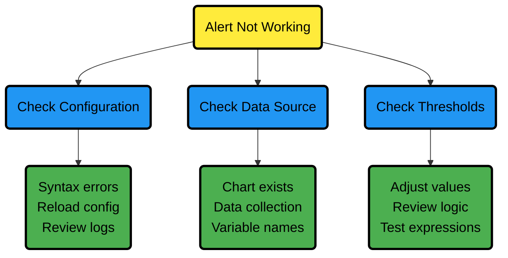
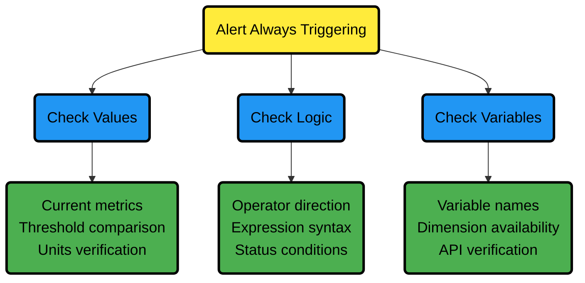
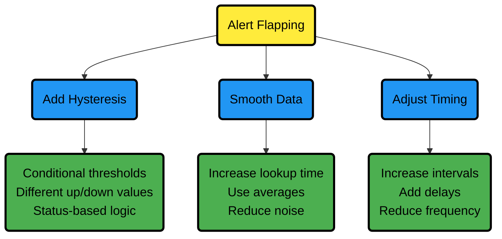

# Configure Health Alerts

## Quick Start Guide

:::tip

**What You'll Learn**

In 5 minutes, you'll know how to edit existing alerts, create new ones, and reload your configuration without downtime.

:::

### Get Started in 3 Steps

**Step 1: Find Your Config Directory**

Navigate to your [Netdata config directory](/docs/netdata-agent/configuration/README.md)

**Step 2: Edit an Alert**

```bash
sudo ./edit-config health.d/cpu.conf
```

**Step 3: Apply Changes**

```bash
sudo netdatacli reload-health
```

:::note

**Key Concept**

You can highly configure Netdata's health watchdog with support for dynamic thresholds, hysteresis, alert templates, and more. You can customize any existing alerts based on your infrastructure's topology or specific monitoring needs or create entirely new entities.

You can use health alerts with any of Netdata's [collectors](/src/collectors/README.md) (see the [supported collector list](/src/collectors/COLLECTORS.md)) to monitor your systems, containers, and applications in real time.

While you can view active alerts on both the local dashboard and Netdata Cloud, you configure all health alerts _per node_ via individual Netdata Agents. If you want to deploy a new alert across your [infrastructure](/docs/netdata-cloud/organize-your-infrastructure-invite-your-team.md), you must configure each node with the same health configuration files.

:::

**Next Steps:** Jump to [Common Tasks](#common-tasks) for specific workflows or continue reading for comprehensive guidance.

## Common Tasks

:::tip

**What You'll Learn**

Step-by-step workflows for the most frequent alert configuration tasks.

:::

### Task 1: Modify Alert Thresholds

**Why This Matters:** Default thresholds may not fit your specific environment or requirements.

**Quick Example:**

```text
# Change CPU warning from 85% to 75%
warn: $this > (($status >= $WARNING) ? (60) : (75))
crit: $this > (($status == $CRITICAL) ? (75) : (85))
```

**Step-by-Step:**

1. Find the alert file: `sudo ./edit-config health.d/cpu.conf`
2. Locate the alert (e.g., `10min_cpu_usage`)
3. Modify `warn` and `crit` lines
4. Save and reload: `sudo netdatacli reload-health`

### Task 2: Disable Unwanted Alerts

| Method                  | Use Case                            | Configuration File | How To                                   |
|-------------------------|-------------------------------------|--------------------|------------------------------------------|
| Disable all alerts      | Testing/maintenance                 | netdata.conf       | Set `enabled = no` in `[health]` section |
| Disable specific alerts | Remove noisy alerts                 | netdata.conf       | Set `enabled alarms = !alert_name *`     |
| Silence notifications   | Keep monitoring, stop notifications | Alert config file  | Change `to: silent`                      |

### Task 3: Create a Simple Alert

**Real-World Example:** Monitor RAM usage above 80%

```text
alarm: ram_usage
   on: system.ram
lookup: average -1m percentage of used
units: %
every: 1m
 warn: $this > 80
 crit: $this > 90
 info: RAM usage monitoring
```

**Next Steps:** See [How-To Guides](#how-to-guides) for detailed explanations.

## How-To Guides

:::tip

**What You'll Learn**

Detailed instructions for configuring, managing, and troubleshooting health alerts.

:::

### How to Reload Health Configuration

**Why This Matters:** You don't need to restart your Netdata Agent when making changes, preventing gaps in monitoring.

You don't need to restart your Netdata Agent when making changes to health configuration files, such as specific health entities. Instead, you can use `netdatacli` with the `reload-health` option to prevent gaps in metrics collection.

```bash
sudo netdatacli reload-health
```

**Alternative Method:**
If `netdatacli` doesn't work on your system, you can send a `SIGUSR2` signal to the daemon, which reloads health configuration without restarting the entire process.

```bash
sudo killall -USR2 netdata
```

### How to Edit Health Configuration Files

**Configuration Locations:**

**Configuration Locations:**

| Location                          | Purpose                      | Common Tasks                                                                                             | How to Edit                              |
|-----------------------------------|------------------------------|----------------------------------------------------------------------------------------------------------|------------------------------------------|
| `netdata.conf` `[health]` section | Global health settings       | • Disable all monitoring (`enabled = no`)<br />• Disable specific alerts<br />• Change check frequencies | Edit directly or use `edit-config`       |
| `health.d/*.conf` files           | Individual alert definitions | • Modify thresholds<br />• Change notification recipients<br />• Silence alerts (`to: silent`)           | Use `edit-config health.d/filename.conf` |

Navigate to your [Netdata config directory](/docs/netdata-agent/configuration/README.md) and use `edit-config` to make changes to any of these files.

**Edit Individual Alerts:**

For example, to edit the `cpu.conf` health configuration file, run:

```bash
sudo ./edit-config health.d/cpu.conf
```

**Understanding Alert Structure:**

Each health configuration file contains one or more health [_entities_](#complete-configuration-reference), which always begin with `alarm:` or `template:`. Here's the first health entity in `health.d/cpu.conf`:

```text
 template: 10min_cpu_usage
       on: system.cpu
    class: Utilization
     type: System
component: CPU
   lookup: average -10m unaligned of user,system,softirq,irq,guest
    units: %
    every: 1m
     warn: $this > (($status >= $WARNING)  ? (75) : (85))
     crit: $this > (($status == $CRITICAL) ? (85) : (95))
    delay: down 15m multiplier 1.5 max 1h
  summary: CPU utilization
     info: Average cpu utilization for the last 10 minutes (excluding iowait, nice and steal)
       to: sysadmin
```

To customize this alert to trigger warning and critical alerts at lower CPU utilization levels, you can change the `warn` and `crit` lines to values of your choosing. For example:

```text
    warn: $this > (($status >= $WARNING)  ? (60) : (75))
    crit: $this > (($status == $CRITICAL) ? (75) : (85))
```

Save the file and [reload Netdata's health configuration](#how-to-reload-health-configuration) to apply your changes.

### How to Disable or Silence Alerts

**Why This Matters:** Different situations require different approaches to managing alerts - permanent removal, temporary silencing, or selective filtering.

You can disable alerts and notifications permanently via configuration changes, or temporarily via the [health management API](/src/web/api/health/README.md).

#### Disable All Alerts

**Use Case:** System maintenance or testing

In the `netdata.conf` `[health]` section, set `enabled` to `no`, and restart your Agent.

#### Disable Specific Alerts

**Use Case:** Remove known noisy or irrelevant alerts

In the `netdata.conf` `[health]` section, use [pattern](/src/libnetdata/simple_pattern/README.md) exclusion with `enabled alarms = !oom_kill *` to load all alerts except `oom_kill`.

You can also [edit the file where the alert is defined](#how-to-edit-health-configuration-files), comment out its definition, and [reload Netdata's health configuration](#how-to-reload-health-configuration).

#### Silence Individual Alert Notifications

**Use Case:** Keep monitoring active but stop notifications

You can stop receiving notifications for an individual alert by [changing](#how-to-edit-health-configuration-files) the `to:` line to `silent` in the alert's configuration file.

```text
      to: silent
```

:::tip

This action requires that you [reload Netdata's health configuration](#how-to-reload-health-configuration).

:::

#### Temporary Runtime Control

**Use Case:** Scheduled maintenance or dynamic control

| Scenario                           | Solution                                   | Method                             |
|------------------------------------|--------------------------------------------|------------------------------------|
| Disable alerts during backups      | Use health management API                  | API calls without config changes   |
| Suppress notifications temporarily | Keep checks running, silence notifications | API control of notification system |

:::tip

You can use the [health management API](/src/web/api/health/README.md) to temporarily control alert behavior without changing configuration or restarting your Agent. The API allows you to:

- **Disable all or some alerts** from triggering during certain times (for instance, when running backups)
- **Suppress notifications temporarily** while keeping health checks running and alerts triggering

:::

### How to Write a New Health Entity

**Why This Matters:** While tuning existing alerts may work in some cases, you may need to write entirely new health entities based on how your systems, containers, and applications work.

**Prerequisites:** Read the [Alert Configuration Reference](#alert-configuration-reference) for a complete listing of the format, syntax, and functionality of health entities.

**Step-by-Step Process:**

**Step 1: Create the Configuration File**

Navigate to your [Netdata config directory](/docs/netdata-agent/configuration/README.md), then use `touch` to create a new file in the `health.d/` directory. Use `edit-config` to start editing the file.

As an example, let's create a `ram-usage.conf` file:

```bash
sudo touch health.d/ram-usage.conf
sudo ./edit-config health.d/ram-usage.conf
```

**Step 2: Write Your Alert**

Here's a health entity that triggers a warning alert when your node's RAM usage rises above 80%, and a critical alert above 90%:

```text
 alarm: ram_usage
    on: system.ram
lookup: average -1m percentage of used
 units: %
 every: 1m
  warn: $this > 80
  crit: $this > 90
  info: The percentage of RAM being used by the system.
```

**Step 3: Understand Each Component**

| Line        | Purpose                                   | This Example                                          |
|-------------|-------------------------------------------|-------------------------------------------------------|
| `alarm`     | Entity name (alphanumeric, `.`, `_` only) | `ram_usage`                                           |
| `on`        | Chart to monitor                          | `system.ram`                                          |
| `lookup`    | How to process metrics                    | Average last 1 minute, percentage of `used` dimension |
| `units`     | Display units                             | Percentages (`%`)                                     |
| `every`     | Check frequency                           | Every 1 minute                                        |
| `warn/crit` | Trigger conditions                        | Warning > 80%, Critical > 90%                         |
| `info`      | Alert description                         | Appears in dashboard and notifications                |

:::note

**Understanding This Example**

This health entity, named **ram_usage**, watches the **system.ram** chart. It looks up the last **1 minute** of metrics from the **used** dimension and calculates the **average** of all those metrics in a **percentage** format, using **% units**. The entity performs this lookup **every minute**.

If the average RAM usage percentage over the last 1 minute is **more than 80%**, the entity triggers a warning alert. If the usage is **more than 90%**, the entity triggers a critical alert.

:::

**Step 4: Activate Your Alert**

When you finish writing this new health entity, [reload Netdata's health configuration](#how-to-reload-health-configuration) to see it live on your local dashboard or Netdata Cloud.

**Next Steps:** Explore [Alert Examples](#alert-examples) for more complex scenarios, or dive into the [Alert Configuration Reference](#alert-configuration-reference) for complete syntax details.

## Alert Configuration Reference

:::tip

**What You'll Learn**

Complete syntax reference for all alert configuration options. Use this section when you need specific technical details.

:::

### Entity Types Overview

| Type          | Label       | Purpose                          | Example Use Case               |
|---------------|-------------|----------------------------------|--------------------------------|
| **Alerts**    | `alarm:`    | Attached to specific charts      | Monitor specific server's CPU  |
| **Templates** | `template:` | Apply to all charts of a context | Monitor all network interfaces |

**Alerts** are attached to specific charts and use the `alarm` label.

**Templates** define rules that apply to all charts of a specific context, and use the `template` label. Templates help you apply one entity to all disks, all network interfaces, all MySQL databases, and so on.

:::note

**Precedence**

Alerts have higher precedence and will override templates. If you have `alarm` and `template` entities with the same name attached to the same chart, Netdata will use `alarm`.

:::

### Required vs Optional Configuration

:::note

**Configuration Requirements**

- The `alarm` or `template` line must be the first line of any entity
- The `on` line is **always required**
- The `every` line is **required** if not using `lookup`
- Each entity **must** have at least one of the following lines: `lookup`, `calc`, `warn`, or `crit`

:::

**Special Syntax Rules:**

- A few lines use space-separated lists to define how the entity behaves. You can use `*` as a wildcard or prefix with `!` for a negative match. Order is important! See our [simple patterns docs](/src/libnetdata/simple_pattern/README.md) for more examples
- Lines terminated by a `\` are spliced together with the next line. The backslash is removed, and the following line is joined with the current one. No space is inserted, so you can split a line anywhere, even in the middle of a word. This is handy if your `info` line consists of several sentences

### Complete Configuration Reference

| line                                                | required        | functionality                                                                        |
|-----------------------------------------------------|-----------------|--------------------------------------------------------------------------------------|
| [`alarm`/`template`](#alert-line-alarm-or-template) | yes             | Name of the alert/template                                                           |
| [`on`](#alert-line-on)                              | yes             | The chart this alert should attach to                                                |
| [`class`](#alert-line-class)                        | no              | The general alert classification                                                     |
| [`type`](#alert-line-type)                          | no              | What area of the system the alert monitors                                           |
| [`component`](#alert-line-component)                | no              | Specific component of the type of the alert                                          |
| [`lookup`](#alert-line-lookup)                      | yes             | The database lookup to find and process metrics for the chart specified through `on` |
| [`calc`](#alert-line-calc)                          | yes (see above) | A calculation to apply to the value found via `lookup` or another variable           |
| [`every`](#alert-line-every)                        | no              | The frequency of the alert                                                           |
| [`green`/`red`](#alert-lines-green-and-red)         | no              | Set the green and red thresholds of a chart                                          |
| [`warn`/`crit`](#alert-lines-warn-and-crit)         | yes (see above) | Expressions evaluating to true or false, and when true, will trigger the alert       |
| [`to`](#alert-line-to)                              | no              | A list of roles to send notifications to                                             |
| [`exec`](#alert-line-exec)                          | no              | The script to execute when the alert changes status                                  |
| [`delay`](#alert-line-delay)                        | no              | Optional hysteresis settings to prevent floods of notifications                      |
| [`repeat`](#alert-line-repeat)                      | no              | The interval for sending notifications when an alert is in WARNING or CRITICAL mode  |
| [`options`](#alert-line-options)                    | no              | Add an option to not clear alerts                                                    |
| [`host labels`](#alert-line-host-labels)            | no              | Restrict an alert or template to a list of matching labels present on a host         |
| [`chart labels`](#alert-line-chart-labels)          | no              | Restrict an alert or template to a list of matching labels present on a chart        |
| [`summary`](#alert-line-summary)                    | no              | A brief description of the alert                                                     |
| [`info`](#alert-line-info)                          | no              | A longer text field that provides more information about this alert                  |

### Configuration Line Details

#### Alert Line `alarm` or `template`

**Purpose:** This line starts an alert or template based on the [entity type](#entity-types-overview) you want to create.

**Alert Syntax:**

```text
alarm: NAME
```

**Template Syntax:**

```text
template: NAME
```

**Naming Rules:**

- `NAME` can be any alphanumeric character
- Only `.` (period) and `_` (underscore) symbols allowed
- Can’t be `chart name`, `dimension name`, `family name`, or `chart variable names`

#### Alert Line `on`

**Purpose:** This line defines the chart this alert should attach to.

**For Alerts:**

```text
on: CHART
```

The value `CHART` should be the unique ID or name of the chart you're interested in, as shown on the dashboard. In the image below, the unique ID is `system.cpu`.


**For Templates:**

```text
on: CONTEXT
```

The value `CONTEXT` should be the context you want this template to attach to.

:::tip

**Finding the Context**

Need to find the context? Hover over the date on any given chart and look at the tooltip. In the image below, which shows a disk I/O chart, the tooltip reads: `proc:/proc/diskstats, disk.io`.


You're interested in what comes after the comma: `disk.io`. That's the name of the chart's context.

If you create a template using the `disk.io` context, it will apply an alert to every disk available on your system.

:::

#### Alert Line `class`

**Purpose:** This indicates the type of error (or general problem area) that the alert or template applies to.

**Example Use:** `Latency` can be used for alerts that trigger on latency issues on network interfaces, web servers, or database systems.

```text
class: Latency
```

**Available Classes:**

| Class       | Use Case                       |
|-------------|--------------------------------|
| Errors      | Error rate monitoring          |
| Latency     | Response time issues           |
| Utilization | Resource usage monitoring      |
| Workload    | Load and throughput monitoring |

:::note

`class` will default to `Unknown` if the line is missing from the alert configuration.

:::

#### Alert Line `type`

**Purpose:** You can use `type` to indicate the broader area of the system that the alert applies to.

**Example:** Under the general `Database` type, you can group together alerts that operate on various database systems, like `MySQL`, `CockroachDB`, `CouchDB`, etc.

```text
type: Database
```

**Available Types:**

| Type            | Description                                                                                    |
|-----------------|------------------------------------------------------------------------------------------------|
| Ad Filtering    | Services related to Ad Filtering (like pi-hole)                                                |
| Certificates    | Certificate monitoring related                                                                 |
| Cgroups         | Alerts for CPU and memory usage of control groups                                              |
| Computing       | Alerts for shared computing applications (e.g. boinc)                                          |
| Containers      | Container related alerts (e.g. docker instances)                                               |
| Database        | Database systems (e.g. MySQL, PostgreSQL, etc)                                                 |
| Data Sharing    | Used to group together alerts for data sharing applications                                    |
| DHCP            | Alerts for DHCP related services                                                               |
| DNS             | Alerts for DNS related services                                                                |
| Kubernetes      | Alerts for kubernetes nodes monitoring                                                         |
| KV Storage      | Key-Value pairs services alerts (e.g. memcached)                                               |
| Linux           | Services specific to Linux (e.g. systemd)                                                      |
| Messaging       | Alerts for message passing services (e.g. vernemq)                                             |
| Netdata         | Internal Netdata components monitoring                                                         |
| Other           | When an alert doesn't fit in other types                                                       |
| Power Supply    | Alerts from power supply related services (e.g. apcupsd)                                       |
| Search engine   | Alerts for search services (e.g. elasticsearch)                                                |
| Storage         | Class for alerts dealing with storage services (storage devices typically live under `System`) |
| System          | General system alerts (e.g. CPU, network, etc.)                                                |
| Virtual Machine | Virtual Machine software                                                                       |
| Web Proxy       | Web proxy software (e.g. squid)                                                                |
| Web Server      | Web server software (e.g. Apache, nginx, etc.)                                                 |
| Windows         | Alerts for monitoring Windows services                                                         |

:::note

If an alert configuration is missing the `type` line, its value will default to `Unknown`.

:::

#### Alert Line `component`

**Purpose:** You can use `component` to narrow down what the previous `type` value specifies for each alert or template.

**Example:** Continuing from the previous example, `component` might include `MySQL`, `CockroachDB`, `MongoDB`, all under the same `Database` type.

```text
component: MySQL
```

:::note

As with the `class` and `type` lines, if `component` is missing from the configuration, its value will default to `Unknown`.

:::

#### Alert Line `lookup`

**Purpose:** This line makes a database lookup to find a value. The result of this lookup is available as `$this`.

**Full Syntax:**

```text
lookup: METHOD(GROUPING OPTIONS) AFTER [at BEFORE] [every DURATION] [OPTIONS] [of DIMENSIONS]
```

**Required Parameters:**

| Parameter | Description                                                        | Example                 |
|-----------|--------------------------------------------------------------------|-------------------------|
| `METHOD`  | [Grouping method](/src/web/api/queries/README.md#grouping-methods) | `average`, `min`, `max` |
| `AFTER`   | How far back to look (negative number)                             | `-1m`, `-1h`, `-1d`     |

**Optional Parameters:**

| Parameter          | Purpose                     | Details                                                              |
|--------------------|-----------------------------|----------------------------------------------------------------------|
| `GROUPING OPTIONS` | Conditional processing      | `CONDITION VALUE` where condition is `!=`, `=`, `<=`, `<`, `>`, `>=` |
| `at BEFORE`        | End of lookup timeframe     | Default is 0 (now)                                                   |
| `every DURATION`   | Update frequency            | Supports `s`, `m`, `h`, `d` units                                    |
| `OPTIONS`          | Processing modifiers        | See options table below                                              |
| `of DIMENSIONS`    | Which dimensions to include | Space-separated list, supports patterns                              |

**Processing Options:**

| Option        | Effect                                                  |
|---------------|---------------------------------------------------------|
| `percentage`  | Calculate percentage of selected dimensions over total  |
| `absolute`    | Turn all sample values positive                         |
| `min`         | Return minimum of all dimensions after time-aggregation |
| `max`         | Return maximum of all dimensions after time-aggregation |
| `average`     | Return average of all dimensions after time-aggregation |
| `sum`         | Return sum of all dimensions (default)                  |
| `min2max`     | Return delta between min and max of dimensions          |
| `unaligned`   | Prevent shifting query window to multiples of duration  |
| `match-ids`   | Match dimensions by IDs (default)                       |
| `match-names` | Match dimensions by names                               |

**Example:**

```text
lookup: average -10m unaligned of user,system,softirq,irq,guest
```

This looks back 10 minutes, calculates the average of the specified CPU dimensions, without aligning to time boundaries.

The result of the lookup will be available as `$this` and `$NAME` in expressions. The timestamps of the timeframe evaluated by the database lookup are available as variables `$after` and `$before` (both are unix timestamps).

#### Alert Line `calc`

**Purpose:** You can design a `calc` to apply some calculation to the values or variables available to the entity.

**Key Points:**

- The result becomes available as `$this` variable
- Overwrites the value from your `lookup`
- Can be used without `lookup` if using [other available variables](#variables-reference)
- Uses [expressions](#expressions-overview) for syntax

```text
calc: EXPRESSION
```

**When to Use:**

- **With `lookup`:** Perform calculation after database retrieval
- **Without `lookup`:** When using other available variables
- **For complex logic:** Mathematical operations, conditions, transformations

#### Alert Line `every`

**Purpose:** Sets the update frequency of this alert.

```text
every: DURATION
```

**Supported Units:**

- `s` for seconds
- `m` for minutes
- `h` for hours
- `d` for days

**Example:** `every: 30s` checks the alert every 30 seconds.

#### Alert Lines `green` and `red`

**Purpose:** Set the green and red thresholds of a chart for visualization.

```text
green: NUMBER
red: NUMBER
```

**Important Notes:**

- Both values are available as `$green` and `$red` in expressions
- If multiple alerts define different thresholds, the first alert's values are used
- For multiple threshold sets, use absolute numbers instead of variables

#### Alert Lines `warn` and `crit`

**Purpose:** Define the expressions that trigger warning or critical alerts.

```text
warn: EXPRESSION
crit: EXPRESSION
```

**Key Points:**

- Optional (but you need at least one)
- Should evaluate to true/false (or zero/non-zero)
- Uses Netdata's [expression syntax](#expressions-overview)
- Can reference variables like `$this`, `$green`, `$red`

**Examples:**

```text
warn: $this > 80
crit: $this > 95
```

#### Alert Line `to`

**Purpose:** Specifies who receives notifications when the alert changes status.

```text
to: ROLE1 ROLE2 ROLE3 ...
```

**How It Works:**

- First parameter passed to the `exec` script
- Default script (`alarm-notify.sh`) treats this as a space-separated list of roles
- Roles are consulted to find exact recipients per notification method

#### Alert Line `exec`

**Purpose:** Script to execute when the alert status changes.

```text
exec: SCRIPT
```

**Default Behavior:**

- Default script is Netdata's `alarm-notify.sh`
- Supports all notification methods Netdata supports
- Includes custom hooks

#### Alert Line `delay`

**Purpose:** Provide optional hysteresis settings to prevent notification floods.

:::important

These settings don't affect the actual alert - only when the `exec` script is executed.

:::

**Full Syntax:**

```text
delay: [[[up U] [down D] multiplier M] max X]
```

**Parameters:**

| Parameter      | Purpose                                                      | Default       |
|----------------|--------------------------------------------------------------|---------------|
| `up U`         | Delay for status increases (CLEAR→WARNING, WARNING→CRITICAL) | 0             |
| `down D`       | Delay for status decreases (CRITICAL→WARNING, WARNING→CLEAR) | 0             |
| `multiplier M` | Multiplies U and D when alert changes state during delay     | 1.0           |
| `max X`        | Maximum absolute notification delay                          | max(U×M, D×M) |

**Example with Timeline:**

```text
delay: up 10s down 15m multiplier 2 max 1h
```

Starting at `00:00:00` with CLEAR status:

| Time     | New Status | Delay Applied  | Notification At | Reason                                    |
|----------|------------|----------------|-----------------|-------------------------------------------|
| 00:00:01 | WARNING    | `up 10s`       | 00:00:11        | First state switch                        |
| 00:00:05 | CLEAR      | `down 15m x2`  | 00:30:05        | Alert changed during delay, so multiplied |
| 00:00:06 | WARNING    | `up 10s x2 x2` | 00:00:26        | Multiplied twice                          |

#### Alert Line `repeat`

**Purpose:** Defines the interval between repeating notifications for alerts in CRITICAL or WARNING mode.

```text
repeat: [off] [warning DURATION] [critical DURATION]
```

**Options:**

| Option              | Effect                                                   |
|---------------------|----------------------------------------------------------|
| `off`               | Turns off repeating for this alert                       |
| `warning DURATION`  | Repeat interval for WARNING state (use `0s` to disable)  |
| `critical DURATION` | Repeat interval for CRITICAL state (use `0s` to disable) |

**Why Use This:** Overrides default repeat settings from `netdata.conf` health configuration.

#### Alert Line `options`

**Purpose:** Special alert behavior options.

```text
options: no-clear-notification
```

**Available Options:**

- `no-clear-notification` - Prevents clearing the alert notification

**When to Use `no-clear-notification`:**

- Alerts comparing two time frames (e.g., last 3 minutes vs last hour)
- When newer data might "pollute" the baseline comparison
- When clearing conditions are unreliable due to data characteristics

**Example Use Case:** HTTP response time alert comparing recent average to historical average - as time passes, the recent slow responses become part of the historical data, making the alert appear "cleared" even though the underlying issue wasn't resolved.

#### Alert Line `host labels`

**Purpose:** Restricts alerts to hosts with matching labels.

**Prerequisites:** See our [host labels guide](/docs/netdata-agent/configuration/organize-systems-metrics-and-alerts.md) for setup instructions.

**Example Configuration:**

```text
[host labels]
    installed = 20191211
    room = server
```

**Usage in Alerts:**

```text
host labels: room = server
```

**Pattern Support:**

```text
host labels: installed = 201*  # Matches all hosts installed in 2010s
```

**How It Works:**

- Space-separated list
- Accepts [simple patterns](/src/libnetdata/simple_pattern/README.md)
- Alert only loads on matching hosts

#### Alert Line `chart labels`

**Purpose:** Filters alerts based on chart labels.

**How to Find Chart Labels:** Check `http://localhost:19999/api/v1/charts?all`

**Example Use Case:**
Each `disk_space` chart has a `mount_point` label. To exclude external disk alerts:

```text
chart labels: mount_point=!/mnt/disk1 *
```

**Multiple Label Logic:**

```text
chart labels: mount_point=/mnt/disk1 device=sda
```

This requires BOTH conditions to be true (AND logic).

**Important Notes:**

- Space-separated list with [simple patterns](/src/libnetdata/simple_pattern/README.md) support
- If a specified label doesn't exist on the chart, the chart won't match
- Multiple labels use AND logic

#### Alert Line `summary`

**Purpose:** Brief title of the alert used in notifications and dashboard.

```text
summary: Available Ram
```

**Variable Support:**

| Variable              | Replaced With                |
|-----------------------|------------------------------|
| `${family}`           | Family instance (e.g., eth0) |
| `${label:LABEL_NAME}` | Chart label value            |

**Example with Variables:**

```text
summary: 1 minute received traffic overflow for ${label:device}
```

Renders as: `1 minute received traffic overflow for eth0`

:::note

Variable names are case-sensitive.

:::

#### Alert Line `info`

**Purpose:** Detailed description of the alert for notifications and UI elements.

```text
info: Percentage of estimated amount of RAM available for userspace processes, without causing swapping
```

**Variable Support:**

| Variable              | Replaced With                |
|-----------------------|------------------------------|
| `${family}`           | Family instance (e.g., eth0) |
| `${label:LABEL_NAME}` | Chart label value            |

**Examples with Variables:**

**Family Variable:**

```text
info: average inbound utilization for the network interface ${family} over the last minute
```

Renders as: `average inbound utilization for the network interface eth0 over the last minute`

**Label Variable:**

```text
info: average ratio of HTTP responses with unexpected status over the last 5 minutes for the site ${label:target}
```

Renders as: `average ratio of HTTP responses with unexpected status over the last 5 minutes for the site https://netdata.cloud/`

**Next Steps:** Continue to [Expressions and Variables](#expressions-and-variables) to understand the calculation syntax, or jump to [Alert Examples](#alert-examples) for practical implementations.

## Expressions and Variables

:::tip

**What You'll Learn**

How to write calculations and use variables in your alert definitions. Essential for creating custom logic and accessing chart data.

:::

### Expressions Overview

**Why This Matters:** Netdata has an internal infix expression parser that allows you to create complex alert logic using mathematical operations, comparisons, and conditional statements.

**Supported Operators:**

| Type       | Operators                              | Result                    |
|------------|----------------------------------------|---------------------------|
| Arithmetic | `+`, `-`, `*`, `/`                     | Numeric values            |
| Comparison | `<`, `==`, `<=`, `<>`, `!=`, `>`, `>=` | `1` (true) or `0` (false) |
| Logical    | `&&`, `||`, `!`, `AND`, `OR`, `NOT`    | `1` (true) or `0` (false) |

**Special Functions:**

- `abs()` - Absolute value
- `(condition) ? (true_expr) : (false_expr)` - Conditional operator

**Special Values:**

| Value | Purpose                               | Example Use    |
|-------|---------------------------------------|----------------|
| `nan` | Not a number (database lookup failed) | `$this != nan` |
| `inf` | Infinite (division by zero)           | `$this != inf` |

### Conditional Operator for Hysteresis

**Why This Matters:** The conditional operator (`? :`) can create "sticky" alert thresholds that prevent alert spam when values fluctuate around a threshold. This is called [hysteresis](https://en.wikipedia.org/wiki/Hysteresis).

**Basic Pattern:**

```text
warn: $this > (($status >= $WARNING) ? (lower_threshold) : (higher_threshold))
```

**Real Example - CPU Usage Alert:**

```text
warn: $this > (($status >= $WARNING)  ? (75) : (85))
crit: $this > (($status == $CRITICAL) ? (85) : (95))
```

**How This Works:**

| Alert State | Triggers At | Clears At | Explanation                                                       |
|-------------|-------------|-----------|-------------------------------------------------------------------|
| Warning     | 85% CPU     | 75% CPU   | Creates 10% buffer - CPU must drop below 75% to clear warning     |
| Critical    | 95% CPU     | 85% CPU   | Creates 10% buffer - CPU must drop below 85% to return to warning |

**Benefits:**

- **Quick alerting** when issues arise
- **Protection against spam** when values hover near thresholds
- **Single initial notification** instead of constant alerts during fluctuation

**Example Scenario:** If CPU usage fluctuates between 80–90%, you'll receive just one initial warning, rather than constant notifications.

### Variables Reference

**How to Find Available Variables:**
You can find all variables for a given chart using: `http://NODE:19999/api/v1/alarm_variables?chart=CHART_NAME`

**Example:** [Variables for the `system.cpu` chart](https://registry.my-netdata.io/api/v1/alarm_variables?chart=system.cpu)

:::note

**Chart vs Template Variables**

Although the `alarm_variables` link shows variables for a particular chart, the same variables can also be used in templates for charts belonging to a given context. All charts of a given context are essentially identical, with the only difference being the family that identifies a particular hardware or software instance.

:::

### Variable Categories

#### Chart Local Variables

**What's Available:**

- All chart dimensions as variables (e.g., `$user`, `$system` for CPU chart)
- Values from other configured alerts on the same chart
- Special chart variables (see table below)

**Special Chart Variables:**

| Variable               | Contains                                      |
|------------------------|-----------------------------------------------|
| `$last_collected_t`    | Unix timestamp of last data collection        |
| `$collected_total_raw` | Sum of all dimensions (last collected values) |
| `$update_every`        | Update frequency of the chart                 |
| `$green`, `$red`       | Thresholds defined in alerts                  |

**Dimension Value Types:**

- **Default:** Last calculated (interpolated) value as shown on charts
- **Raw suffix:** `$dimension_raw` - Last collected value
- **Timestamp suffix:** `$dimension_last_collected_t` - Unix timestamp when dimension was last collected

#### Host Variables

**What's Available:** All dimensions of all charts, including all alerts, in fullname format.

**Format:** `CHART.VARIABLE`

- `CHART` can be either chart ID or chart name
- Both formats are supported

**Examples:**

- `$system.cpu.user` - User CPU from system.cpu chart
- `$disk.sda.reads` - Read operations from sda disk chart

#### Special Variables

| Variable  | Contains               | Usage                                  |
|-----------|------------------------|----------------------------------------|
| `$this`   | Current alert value    | Result of `calc` line or current alert |
| `$status` | Current alert status   | Compare with status constants          |
| `$now`    | Current unix timestamp | Time-based calculations                |

**Alert Status Constants:**

| Constant         | Numeric Value | Usage                          |
|------------------|---------------|--------------------------------|
| `$REMOVED`       | -2            | Alert deleted (SIGUSR2 reload) |
| `$UNINITIALIZED` | -1            | Alert not initialized          |
| `$UNDEFINED`     | 0             | Calculation failed             |
| `$CLEAR`         | 1             | Alert OK/not triggered         |
| `$WARNING`       | 2             | Warning condition met          |
| `$CRITICAL`      | 3             | Critical condition met         |

**Status Comparison Examples:**

```text
# Check if alert is in warning or higher
warn: $status >= $WARNING

# Check if alert is specifically critical
crit: $status == $CRITICAL
```

:::note

Status values increase with severity, so `$status > $CLEAR` will match both WARNING and CRITICAL states.

:::

### Alert Status Lifecycle

**Status Flow:** `UNINITIALIZED` → `UNDEFINED`/`CLEAR` → `WARNING` → `CRITICAL`

**When Status Changes:**

- **`REMOVED`** - Alert deleted during configuration reload
- **`UNINITIALIZED`** - Alert created but not yet calculated
- **`UNDEFINED`** - Database lookup failed, division by zero, etc.
- **`CLEAR`** - Alert conditions aren’t met (normal state)
- **`WARNING`** - Warning expression returned true/non-zero
- **`CRITICAL`** - Critical expression returned true/non-zero

**Script Execution:** The external script (`exec` line) is called for ALL status changes.

**Next Steps:** Ready to see these concepts in action? Continue to [Alert Examples](#alert-examples) for practical implementations.

## Alert Examples

:::tip

**What You'll Learn**

Real-world alert configurations that demonstrate different monitoring scenarios. Use these as templates for your own alerts.

:::

<details>
<summary><strong>Example 1: Server Alive Check</strong></summary><br/>

**Scenario:** Monitor if the Apache server is collecting data properly.

**Why This Matters:** Detect when data collection stops, indicating potential server or network issues.

```text
template: apache_last_collected_secs
      on: apache.requests
    calc: $now - $last_collected_t
   every: 10s
    warn: $this > ( 5 * $update_every)
    crit: $this > (10 * $update_every)
```

**How It Works:**

| Component  | Purpose                         | This Example                 |
|------------|---------------------------------|------------------------------|
| `template` | Applies to all Apache servers   | `apache_last_collected_secs` |
| `on`       | Chart context to monitor        | `apache.requests`            |
| `calc`     | Time since last data collection | `$now - $last_collected_t`   |
| `every`    | Check frequency                 | Every 10 seconds             |
| `warn`     | Warning threshold               | 5 missed collection cycles   |
| `crit`     | Critical threshold              | 10 missed collection cycles  |

**Variables Used:**

- `$now` - Current timestamp
- `$last_collected_t` - Last data collection timestamp
- `$update_every` - Chart update frequency
- `$this` - Result of calculation (seconds since last collection)

<br/>
</details>

<details>
<summary><strong>Example 2: Disk Space Monitoring</strong></summary><br/>

**Scenario:** Alert when any disk is running low on space.

**Why This Matters:** Prevent system failures due to full disks.

```text
template: disk_full_percent
      on: disk.space
    calc: $used * 100 / ($avail + $used)
   every: 1m
    warn: $this > 80
    crit: $this > 95
  repeat: warning 120s critical 10s
```

**How It Works:**

| Component   | Purpose                    | This Example                           |
|-------------|----------------------------|----------------------------------------|
| `template`  | Applies to all disks       | `disk_full_percent`                    |
| `on`        | Chart context              | `disk.space`                           |
| `calc`      | Calculate usage percentage | `$used * 100 / ($avail + $used)`       |
| `warn/crit` | Simple thresholds          | 80% warning, 95% critical              |
| `repeat`    | Notification frequency     | Every 2min (warning), 10sec (critical) |

**Variables Used:**

- `$used` - Used disk space dimension
- `$avail` - Available disk space dimension

<br/>
</details>

<details>
<summary><strong>Example 3: Predictive Disk Full Alert</strong></summary><br/>

**Scenario:** Predict when disks will run out of space based on the current fill rate.

**Why This Matters:** Get warning before disk space becomes critical.

**Step 1: Calculate Disk Fill Rate**

```text
    template: disk_fill_rate
          on: disk.space
      lookup: max -1s at -30m unaligned of avail
        calc: ($this - $avail) / (30 * 60)
       every: 15s
```

**Step 2: Predict Hours Until Full**

```text
    template: disk_full_after_hours
          on: disk.space
        calc: $avail / $disk_fill_rate / 3600
       every: 10s
        warn: $this > 0 and $this < 48
        crit: $this > 0 and $this < 24
```

**How It Works:**

| Step | Purpose              | Calculation                                        |
|------|----------------------|----------------------------------------------------|
| 1    | Calculate fill rate  | `(space_30min_ago - current_space) / 1800_seconds` |
| 2    | Predict time to full | `current_available / fill_rate / 3600`             |

**Logic:**

- Only positive predictions matter (disk filling up)
- Warning: Less than 48 hours of space remaining
- Critical: Less than 24 hours of space remaining

<br/>
</details>

<details>
<summary><strong>Example 4: Network Packet Drops</strong></summary><br/>

**Scenario:** Alert on any network packet drops.

**Why This Matters:** Packet drops indicate network issues that could affect performance.

```text
template: 30min_packet_drops
      on: net.drops
  lookup: sum -30m unaligned absolute
   every: 10s
    crit: $this > 0
```

**How It Works:**

| Component  | Purpose                           | This Example                  |
|------------|-----------------------------------|-------------------------------|
| `template` | Applies to all network interfaces | `30min_packet_drops`          |
| `lookup`   | Sum drops over 30 minutes         | `sum -30m unaligned absolute` |
| `crit`     | Any drops trigger critical        | `$this > 0`                   |

**Key Points:**

- The drops chart only exists when packets are dropped
- The alert automatically attaches when the first drop is detected
- Zero tolerance for packet loss

<br/>
</details>

<details>
<summary><strong>Example 5: Z-Score Based Alert</strong></summary><br/>

**Scenario:** Detect CPU usage anomalies using statistical analysis.

**Why This Matters:** Identify unusual patterns that fixed thresholds might miss.

```text
 alarm: cpu_user_mean
    on: system.cpu
lookup: mean -60s of user
 every: 10s

 alarm: cpu_user_stddev
    on: system.cpu
lookup: stddev -60s of user
 every: 10s

 alarm: cpu_user_zscore
    on: system.cpu
lookup: mean -10s of user
  calc: ($this - $cpu_user_mean) / $cpu_user_stddev
 every: 10s
  warn: $this < -2 or $this > 2
  crit: $this < -3 or $this > 3
```

**How It Works:**

| Alert             | Purpose                     | Calculation                        |
|-------------------|-----------------------------|------------------------------------|
| `cpu_user_mean`   | Calculate average CPU usage | Mean over 60 seconds               |
| `cpu_user_stddev` | Calculate variability       | Standard deviation over 60 seconds |
| `cpu_user_zscore` | Detect anomalies            | `(current - mean) / stddev`        |

**Z-Score Interpretation:**

- **±2**: Moderately unusual (warning)
- **±3**: Highly unusual (critical)
- **Negative**: Below normal
- **Positive**: Above normal

<br/>
</details>

<details>
<summary><strong>Example 6: Machine Learning Anomaly Detection</strong></summary><br/>

**Scenario:** Use Netdata's built-in ML for chart-level anomaly detection.

**Why This Matters:** Detect complex patterns across multiple metrics without manual threshold tuning.

```text
template: ml_5min_cpu_chart
      on: system.cpu
  lookup: average -5m anomaly-bit of *
    calc: $this
   units: %
   every: 30s
    warn: $this > (($status >= $WARNING)  ? (5) : (20))
    crit: $this > (($status == $CRITICAL) ? (20) : (100))
    info: rolling 5min anomaly rate for system.cpu chart
```

**How It Works:**

| Component     | Purpose                                    | This Example                        |
|---------------|--------------------------------------------|-------------------------------------|
| `lookup`      | Average anomaly rate across CPU dimensions | 5-minute rolling window             |
| Hysteresis    | Prevent alert flapping                     | Warning: 20%→5%, Critical: 100%→20% |
| `anomaly-bit` | ML-generated anomaly indicators            | 0 (normal) or 1 (anomalous)         |

<br/>
</details>

<details>
<summary><strong>Example 7: Node-Level ML Monitoring</strong></summary><br/>

**Scenario:** Monitor overall system health using ML across all metrics.

**Why This Matters:** Get a holistic view of system anomalies beyond individual charts.

```text
template: ml_5min_node
      on: anomaly_detection.anomaly_rate
  lookup: average -5m of anomaly_rate
    calc: $this
   units: %
   every: 30s
    warn: $this > (($status >= $WARNING)  ? (5) : (20))
    crit: $this > (($status == $CRITICAL) ? (20) : (100))
    info: rolling 5min anomaly rate for all ML enabled dims
```

**Key Differences from Chart-Level:**

- Uses `anomaly_detection.anomaly_rate` chart
- Monitors `anomaly_rate` dimension
- Covers all ML-enabled dimensions across the node

<br/>
</details><br/>

**Next Steps:** Having trouble with your alerts? Continue to [Troubleshooting](#troubleshooting) for debugging techniques.

## Troubleshooting

:::tip

**What You'll Learn**

How to debug alert issues, understand why alerts aren't working, and get detailed information about alert processing.

:::

### Find Chart and Context Information

**Finding Chart Names:**
You can find chart information in two places:

| Method        | URL                               | Contains          |
|---------------|-----------------------------------|-------------------|
| Configuration | `http://NODE:19999/netdata.conf`  | All chart details |
| API           | `http://NODE:19999/api/v1/charts` | JSON chart data   |

Replace `NODE` with your server's IP address or hostname.

### Analyze Alert Expressions

**Why This Matters:** Understand how Netdata interprets your expressions and what values are being calculated.

**Check Alert Processing:**
Visit `http://NODE:19999/api/v1/alarms?all` to see:

- Original expression as written in config
- Parsed expression with added parentheses showing evaluation flow
- Current alert status and values
- Available variables and their values

**Expression Evaluation Flow:**
Netdata adds parentheses to show how it evaluates your expressions:

**Your Expression:**

```text
warn: $this > 80 and $status >= $WARNING
```

**Netdata's Interpretation:**

```text
warn: (($this > 80) and ($status >= $WARNING))
```

### Troubleshooting Decision Trees

:::note

**How to Use These Decision Trees**

Follow the flowcharts below to systematically diagnose and resolve alert issues. Each path leads to specific solutions with step-by-step instructions.

:::

#### Decision Tree: Alert Not Working



#### Decision Tree: Alert Always Triggering



#### Decision Tree: Alert Flapping



### Common Issues and Solutions

#### Issue: Alert Not Triggering

**Possible Causes:**

| Problem              | Check This                      | Solution                      |
|----------------------|---------------------------------|-------------------------------|
| Wrong chart name     | `on:` line matches actual chart | Use chart ID from dashboard   |
| Incorrect dimensions | Dimension names in `lookup`     | Check available dimensions    |
| Missing data         | Chart has recent data           | Verify data collection        |
| Expression errors    | Variables resolve correctly     | Use `/api/v1/alarm_variables` |

#### Issue: Alert Always Triggering

**Possible Causes:**

| Problem                   | Check This                               | Solution                |
|---------------------------|------------------------------------------|-------------------------|
| Wrong threshold direction | `>` vs `<` in expressions                | Review logic            |
| Units mismatch            | Comparing percentages to absolute values | Check calculation units |
| Variable name errors      | `$this` vs `$chart.dimension`            | Verify variable names   |

#### Issue: Alert Flapping

**Possible Causes:**

| Problem               | Solution                                                     |
|-----------------------|--------------------------------------------------------------|
| Values near threshold | Implement [hysteresis](#conditional-operator-for-hysteresis) |
| Noisy data            | Increase lookup time window                                  |
| Too frequent checks   | Increase `every:` interval                                   |

**Hysteresis Example:**

```text
# Instead of simple threshold
warn: $this > 80

# Use hysteresis
warn: $this > (($status >= $WARNING) ? (75) : (80))
```

#### Issue: Variables Not Found

**Debug Steps:**

1. **Check Available Variables:**
   ```
   http://NODE:19999/api/v1/alarm_variables?chart=CHART_NAME
   ```

2. **Verify Chart Context:**
    - For `alarm:` use chart name
    - For `template:` use chart context

3. **Check Variable Syntax:**
    - Chart local: `$dimension_name`
    - Host variables: `$chart_name.dimension_name`
    - Special variables: `$this`, `$now`, `$status`

### Testing Alert Changes

**Safe Testing Process:**

1. **Create Test File:**
   ```bash
   sudo touch health.d/test-alert.conf
   sudo ./edit-config health.d/test-alert.conf
   ```

2. **Write Simple Alert:**
   ```text
   alarm: test_ram
      on: system.ram
   lookup: average -1m percentage of used
    every: 10s
     war: $this > 50  # Low threshold for testing
     info: Test alert - safe to ignore
   ```

3. **Reload and Monitor:**
   ```bash
   sudo netdatacli reload-health
   # Watch dashboard for test alert appearance
   ```

4. **Remove When Done:**
   ```bash
   sudo rm health.d/test-alert.conf
   sudo netdatacli reload-health
   ```

### Performance Considerations

**Alert Impact on System:**

| Factor                     | Impact              | Optimization                       |
|----------------------------|---------------------|------------------------------------|
| Check frequency (`every:`) | CPU usage           | Use appropriate intervals          |
| Lookup timeframe           | Memory/CPU          | Don't use excessively long periods |
| Number of alerts           | Overall performance | Disable unused alerts              |
| Complex expressions        | CPU per check       | Simplify where possible            |

**Recommended Frequencies:**

| Alert Type              | Suggested Frequency | Reason                                 |
|-------------------------|---------------------|----------------------------------------|
| Critical system metrics | 10-30s              | Quick response needed                  |
| Resource usage          | 1-5m                | Trends matter more than instant values |
| Predictive alerts       | 15m-1h              | Based on longer-term patterns          |

### Getting Help

**Information to Provide:**

When seeking help, include:

1. **Alert Configuration:**
   ```text
   # Your complete alert definition
   ```

2. **Chart Information:**
   ```
   http://your-server:19999/api/v1/alarm_variables?chart=chart_name
   ```

3. **Current Status:**
   ```
   http://your-server:19999/api/v1/alarms?all
   ```

**Community Resources:**

- [Netdata GitHub Issues](https://github.com/netdata/netdata/issues)
- [Netdata Community Forum](https://community.netdata.cloud)
- [Netdata Discord](https://discord.gg/mPZ6WZKKG2)

**Next Steps:** You now have comprehensive knowledge of Netdata health configuration. Start with the [Quick Start Guide](#quick-start-guide) for immediate needs or dive into [Common Tasks](#common-tasks) for specific workflows.
