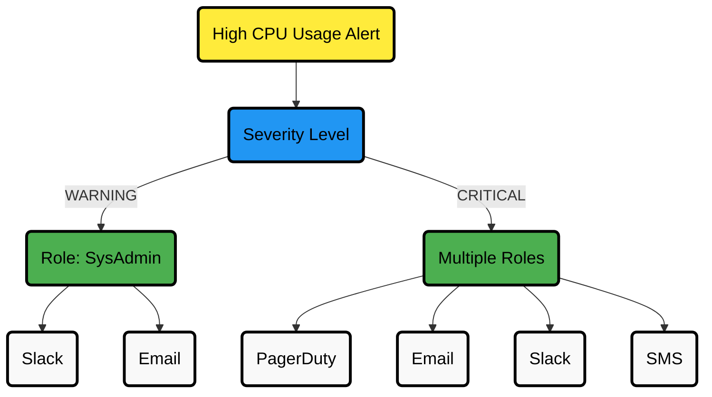
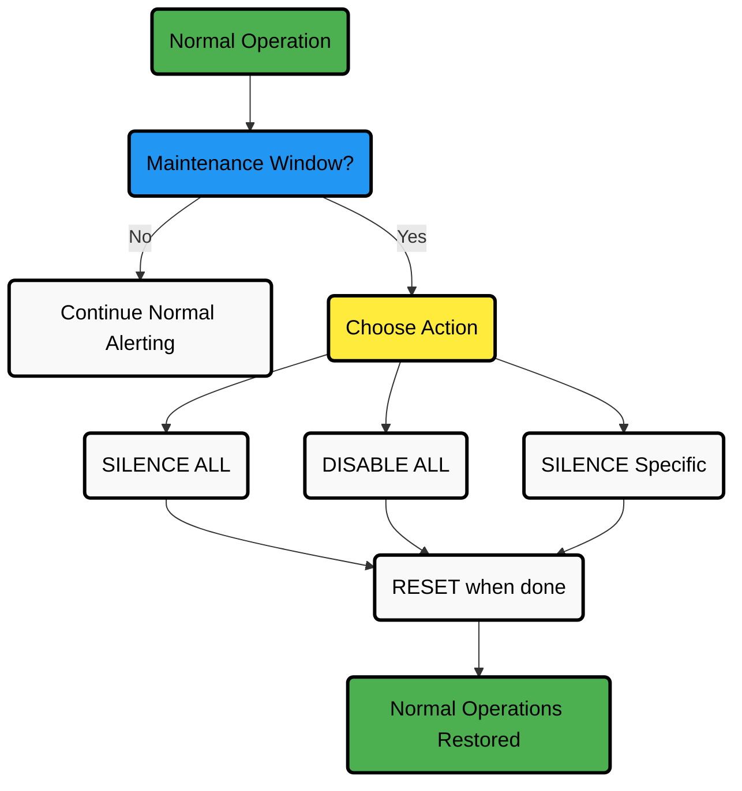

# Agent Alert Notifications

Netdata's Agent can send alert notifications directly from each node. It supports a wide range of services, multiple recipients, and role-based routing.

## How It Works

The Agent uses a notification script defined in `netdata.conf` under the `[health]` section:

```ini
script to execute on alarm = /usr/libexec/netdata/plugins.d/alarm-notify.sh
```

The default script is `alarm-notify.sh`.

This script handles:

- Multiple recipients
- Multiple notification methods
- Role-based routing (e.g., `sysadmin`, `webmaster`, `dba`)

## Role-Based Routing Visualization



## Health Management API Workflow



## Quick Setup

:::tip

Use the `edit-config` script to safely edit configuration files. It automatically creates the necessary files in the right place and opens them in your editor.
[Learn how to use `edit-config`](/docs/netdata-agent/configuration/README.md#edit-a-configuration-file-using-edit-config)

:::

1. Open the Agent's health notification config:
   ```bash
   sudo ./edit-config health_alarm_notify.conf
   ```

2. Set up the required API keys or credentials for the service you want to use.

3. Define recipients per **role** (see below).

4. Restart the Agent for changes to take effect:
   ```bash
   sudo systemctl restart netdata
   ```

## Example: Alert with Role-Based Routing

Here's an example alert assigned to the `sysadmin` role from the `ram.conf` file:

```ini
alarm: ram_in_use
   on: system.ram
class: Utilization
 type: System
component: Memory
     os: linux
  hosts: *
   calc: $used * 100 / ($used + $cached + $free + $buffers)
  units: %
  every: 10s
   warn: $this > (($status >= $WARNING)  ? (80) : (90))
   crit: $this > (($status == $CRITICAL) ? (90) : (98))
  delay: down 15m multiplier 1.5 max 1h
   info: system memory utilization
     to: sysadmin
```

Then, in `health_alarm_notify.conf`, you assign recipients per notification method:

```ini
role_recipients_email[sysadmin]="admin1@example.com admin2@example.com"
role_recipients_slack[sysadmin]="#alerts #infra"
```

## Advanced Role-Based Routing Examples

<details>
<summary><strong>DevOps Team Example</strong></summary><br/>

```ini
# Backend team receives database and application server alerts
role_recipients_slack[backend]="#backend-team"
role_recipients_pagerduty[backend]="PDK3Y5EXAMPLE"

# Frontend team receives web server and CDN alerts
role_recipients_slack[frontend]="#frontend-team"
role_recipients_opsgenie[frontend]="key1example"

# Security team receives all security-related alerts
role_recipients_email[security]="security@example.com"
role_recipients_slack[security]="#security-alerts"

# SRE team receives critical infrastructure alerts 24/7
role_recipients_slack[sre]="#sre-alerts"
role_recipients_pagerduty[sre]="PDK3Y5SREXAMPLE"
role_recipients_telegram[sre]="123456789"
```

</details>

<details>
<summary><strong>Time-Based Routing Example</strong></summary><br/>

You can use external scripts to dynamically change recipients based on work hours, on-call schedules, etc.:

```ini
# Use a script to determine the current on-call engineer
ONCALL_EMAIL=$(get_oncall_email.sh)
role_recipients_email[oncall]="${ONCALL_EMAIL}"
role_recipients_sms[oncall]="${ONCALL_PHONE}"

# Standard business hours team gets non-critical alerts during work hours
role_recipients_slack[business_hours]="#daytime-monitoring"
```

</details>

## Health Management API

Netdata provides a powerful Health Management API that lets you control alert behavior during maintenance windows, testing, or other planned activities.

### API Authorization

The API is protected by an authorization token stored in `/var/lib/netdata/netdata.api.key`:

```bash
# Get your token
TOKEN=$(cat /var/lib/netdata/netdata.api.key)

# Use the token in API calls
curl "http://localhost:19999/api/v1/manage/health?cmd=RESET" -H "X-Auth-Token: ${TOKEN}"
```

### Common API Commands

<details>
<summary><strong>Disable All Health Checks</strong></summary><br/>

Completely stops evaluation of health checks during maintenance:

```bash
curl "http://localhost:19999/api/v1/manage/health?cmd=DISABLE ALL" -H "X-Auth-Token: ${TOKEN}"
```

</details>

<details>
<summary><strong>Silence All Notifications</strong></summary><br/>

Continues to evaluate health checks but prevents notifications:

```bash
curl "http://localhost:19999/api/v1/manage/health?cmd=SILENCE ALL" -H "X-Auth-Token: ${TOKEN}"
```

</details>

<details>
<summary><strong>Disable Specific Alerts</strong></summary><br/>

Target only certain alerts by name, chart, context, host, or family:

```bash
# Silence all disk space alerts
curl "http://localhost:19999/api/v1/manage/health?cmd=SILENCE&context=disk_space" -H "X-Auth-Token: ${TOKEN}"

# Disable CPU alerts for specific hosts
curl "http://localhost:19999/api/v1/manage/health?cmd=DISABLE&context=cpu&hosts=prod-db-*" -H "X-Auth-Token: ${TOKEN}"
```

</details>

<details>
<summary><strong>View Current Silenced/Disabled Alerts</strong></summary><br/>

Check what's currently silenced or disabled:

```bash
curl "http://localhost:19999/api/v1/manage/health?cmd=LIST" -H "X-Auth-Token: ${TOKEN}"
```

</details>

<details>
<summary><strong>Reset to Normal Operation</strong></summary><br/>

Re-enable all health checks and notifications:

```bash
curl "http://localhost:19999/api/v1/manage/health?cmd=RESET" -H "X-Auth-Token: ${TOKEN}"
```

</details>

## Configuration Options

<details>
<summary><strong>Recipients Per Role</strong></summary><br/>

Define who receives alerts and how:

```ini
role_recipients_email[sysadmin]="team@example.com"
role_recipients_telegram[webmaster]="123456789"
role_recipients_slack[dba]="#database-alerts"
```

Use spaces to separate multiple recipients.

To disable a notification method for a role, use:

```ini
role_recipients_email[sysadmin]="disabled"
```

If left empty, the default recipient for that method is used.
</details>

<details>
<summary><strong>Alert Severity Filtering</strong></summary><br/>

You can limit certain recipients to only receive **critical** alerts:

```ini
role_recipients_email[sysadmin]="user1@example.com user2@example.com|critical"
```

This setup:

- Sends all alerts to `user1@example.com`
- Sends only critical-related alerts to `user2@example.com`

Works for all supported methods: email, Slack, Telegram, Twilio, Discord, etc.
</details>

<details>
<summary><strong>Proxy Settings</strong></summary><br/>

To send notifications via a proxy, set these environment variables:

```bash
export http_proxy="http://10.0.0.1:3128/"
export https_proxy="http://10.0.0.1:3128/"
```

</details>

<details>
<summary><strong>Notification Images</strong></summary><br/>

By default, Netdata includes public image URLs in notifications (hosted by the global Registry).

To use custom image paths:

```ini
images_base_url="http://my.public.netdata.server:19999"
```

</details>

<details>
<summary><strong>Custom Date Format</strong></summary><br/>

Change the timestamp format in notifications:

```ini
date_format="+%F %T%:z"   # Example: RFC 3339
```

Common formats:

| Format             | String                      |
|--------------------|-----------------------------|
| ISO 8601           | `+%FT%T%z`                  |
| RFC 5322           | `+%a, %d %b %Y %H:%M:%S %z` |
| RFC 3339           | `+%F %T%:z`                 |
| Local time         | `+%x %X`                    |
| ANSI C / asctime() | *(leave empty)*             |

See `man date` for more formatting options.
</details>

<details>
<summary><strong>Hostname Format</strong></summary><br/>

By default, Netdata uses the short hostname in notifications.

To use the fully qualified domain name (FQDN), set:

```ini
use_fqdn=YES
```

If you've set a custom hostname in `netdata.conf`, that value takes priority.
</details>

## Testing Your Notification Setup

You can test alert notifications manually.

```bash
# Switch to the Netdata user
sudo su -s /bin/bash netdata

# Enable debugging
export NETDATA_ALARM_NOTIFY_DEBUG=1

# Test default role (sysadmin)
./plugins.d/alarm-notify.sh test

# Test specific role
./plugins.d/alarm-notify.sh test "webmaster"
```

:::important

If you're running your own Netdata Registry, set:

```bash
export NETDATA_REGISTRY_URL="https://your.registry.url"
```

before testing.

:::

### Debugging with Trace

To see the full execution output:

```bash
bash -x ./plugins.d/alarm-notify.sh test
```

Then look for the internal calls and re-run the one you want to trace in more detail.

## Troubleshooting Alert Notifications

Here are solutions for common alert notification issues:

### Email Notifications Not Working

1. Verify your email configuration:
   ```bash
   grep -E "SEND_EMAIL|DEFAULT_RECIPIENT_EMAIL" /etc/netdata/health_alarm_notify.conf
   ```

2. Check if the system can send mail:
   ```bash
   echo "Test" | mail -s "Test Email" your@email.com
   ```

3. Look for errors in the Netdata log:
   ```bash
   tail -f /var/log/netdata/error.log | grep "alarm notify"
   ```

4. Test with debugging enabled:
   ```bash
   sudo su -s /bin/bash netdata
   export NETDATA_ALARM_NOTIFY_DEBUG=1
   ./plugins.d/alarm-notify.sh test
   ```

### Slack Notifications Failing

1. Verify your webhook URL is correct:
   ```bash
   grep -E "SLACK_WEBHOOK_URL" /etc/netdata/health_alarm_notify.conf
   ```

2. Check for network connectivity to Slack:
   ```bash
   curl -X POST -H "Content-type: application/json" --data '{"text":"Test"}' YOUR_WEBHOOK_URL
   ```

3. Confirm channel names start with `#` in your configuration.

### PagerDuty Integration Issues

1. Verify your service key:
   ```bash
   grep -E "PAGERDUTY_SERVICE_KEY" /etc/netdata/health_alarm_notify.conf
   ```

2. Test the PagerDuty API directly:
   ```bash
   curl -H "Content-Type: application/json" -X POST -d '{"service_key":"YOUR_SERVICE_KEY","event_type":"trigger","description":"Test"}' https://events.pagerduty.com/generic/2010-04-15/create_event.json
   ```

### Notification Delays

If notifications seem delayed:

1. Check the `delay` parameter in your alarm configuration
2. Verify your `health.d/*.conf` files for delay settings
3. Check the `ALARM_NOTIFY_DELAY` setting in health_alarm_notify.conf

## Related Docs

- [How to configure alerts](/src/health/REFERENCE.md)
- [Notification methods list](/docs/alerts-and-notifications/notifications/README.md#notification-methods)
- [Netdata configuration basics](/docs/netdata-agent/configuration/README.md)
