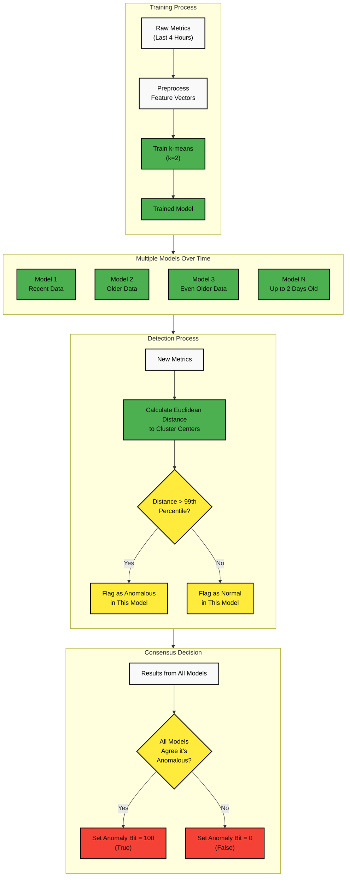

# Machine Learning and Anomaly Detection

## Overview

You can leverage machine learning to detect patterns and anomalies in your large datasets, enabling you to identify issues early before they escalate.

Netdata offers **Anomaly Advisor**, a tool designed to improve your troubleshooting experience, reduce mean time to resolution, and prevent issues from escalating. You can access it through the [Netdata dashboard](/docs/dashboards-and-charts/README.md).

:::tip

To configure ML on your nodes, check the [ML configuration documentation](/src/ml/ml-configuration.md).

:::

## Design Principles

When you use Netdata's machine learning models, you benefit from these key principles:

| Principle                  | Description                                                                                                                |
|----------------------------|----------------------------------------------------------------------------------------------------------------------------|
| **Unsupervised Learning**  | Models operate independently without requiring your input                                                                  |
| **Real-time Performance**  | While ML impacts CPU usage, you won't experience any compromise to Netdata's high-fidelity, real-time monitoring           |
| **Seamless Integration**   | ML-based insights are fully embedded into your existing Netdata infrastructure monitoring and troubleshooting workflow     |
| **Assistance Over Alerts** | ML helps you investigate potential issues rather than triggering unnecessary alerts - no 3 AM wake-ups for minor anomalies |
| **Many Light Models**      | Netdata uses many lightweight models instead of a few heavy ones, optimizing for resource usage while maintaining accuracy |
| **Scalable Architecture**  | The system is designed to handle thousands of metrics simultaneously, scoring each one every second with minimal latency   |

:::note

Netdata deliberately avoids using deep learning models, as they would introduce heavy dependencies and resource requirements that wouldn't align with Netdata's goal of running efficiently on any Linux system. Instead, the implementation uses the lightweight [dlib](https://github.com/davisking/dlib) library and spreads training costs over a wide window to minimize performance impact.

:::

## Types of Anomalies You Can Detect

| Anomaly Type             | Description                                                       | Business Impact                          |
|--------------------------|-------------------------------------------------------------------|------------------------------------------|
| **Point Anomalies**      | Unusually high or low values compared to historical data          | Early warning of service degradation     |
| **Contextual Anomalies** | Sequences of values that deviate from expected patterns           | Identification of unusual usage patterns |
| **Collective Anomalies** | Multivariate anomalies where a combination of metrics appears off | Detection of complex system issues       |
| **Concept Drifts**       | Gradual shifts leading to a new baseline                          | Recognition of evolving system behavior  |
| **Change Points**        | Sudden shifts resulting in a new normal state                     | Identification of system changes         |

## How Netdata ML Works



### Training & Detection

When you enable ML, Netdata trains an unsupervised model for each of your metrics. By default, this model is a [k-means clustering](https://en.wikipedia.org/wiki/K-means_clustering) algorithm (with k=2) trained on the last 4 hours of your data. Instead of just analyzing raw values, the model works with preprocessed feature vectors to improve your detection accuracy.

:::important

To reduce false positives in your environment, Netdata trains multiple models per time-series, covering over two days of data. **An anomaly is flagged only if all models agree on it, eliminating 99% of false positives**. This approach of requiring consensus across models trained on different time scales makes the system highly resistant to spurious anomalies while still being sensitive to real issues.

:::

The anomaly detection algorithm uses the [Euclidean distance](https://en.wikipedia.org/wiki/Euclidean_distance) between recent metric patterns and the learned cluster centers. If this distance exceeds a threshold based on the 99th percentile of training data, the metric is considered anomalous by that model.

### Anomaly Bit

Each trained model assigns an **anomaly score** at every time step based on how far your data deviates from learned clusters. If the score exceeds the 99th percentile of training data, the **anomaly bit** is set to `true` (100); otherwise, it remains `false` (0).

**Key benefits you'll experience:**

- No additional storage overhead since the anomaly bit is embedded in Netdata's floating point number format
- The query engine automatically computes anomaly rates without requiring extra queries

:::note

The anomaly bit is quite literally a bit in Netdata's [internal storage representation](https://github.com/netdata/netdata/blob/89f22f056ca2aae5d143da9a4e94fcab1f7ee1b8/libnetdata/storage_number/storage_number.c#L83). This ingenious design means that for every metric collected, Netdata can also track whether it's anomalous without increasing storage requirements.

:::

You can access the anomaly bits through Netdata's API by adding the `options=anomaly-bit` parameter to your query. For example:

```
https://your-node/api/v1/data?chart=system.cpu&dimensions=user&after=-10&options=anomaly-bit
```

This would return anomaly bits for the last 10 seconds of CPU user data, with values of either 0 (normal) or 100 (anomalous).

### Anomaly Rate

You can see **Node Anomaly Rate (NAR)** and **Dimension Anomaly Rate (DAR)** calculated based on anomaly bits. Here's an example matrix:

| Time    | d1      | d2      | d3      | d4      | d5      | **NAR**               |
|---------|---------|---------|---------|---------|---------|-----------------------|
| t1      | 0       | 0       | 0       | 0       | 0       | **0%**                |
| t2      | 0       | 0       | 0       | 0       | 100     | **20%**               |
| t3      | 0       | 0       | 0       | 0       | 0       | **0%**                |
| t4      | 0       | 100     | 0       | 0       | 0       | **20%**               |
| t5      | 100     | 0       | 0       | 0       | 0       | **20%**               |
| t6      | 0       | 100     | 100     | 0       | 100     | **60%**               |
| t7      | 0       | 100     | 0       | 100     | 0       | **40%**               |
| t8      | 0       | 0       | 0       | 0       | 100     | **20%**               |
| t9      | 0       | 0       | 100     | 100     | 0       | **40%**               |
| t10     | 0       | 0       | 0       | 0       | 0       | **0%**                |
| **DAR** | **10%** | **30%** | **20%** | **20%** | **30%** | **_NAR_t1-10 = 22%_** |

- **DAR (Dimension Anomaly Rate):** Average anomalies for a specific metric over time
- **NAR (Node Anomaly Rate):** Average anomalies across all metrics at a given time
- **Overall anomaly rate:** Computed across your entire dataset for deeper insights

### Node-Level Anomaly Detection

Netdata tracks the percentage of anomaly bits over time for you. When the **Node Anomaly Rate (NAR)** exceeds a set threshold and remains high for a period, a **node anomaly event** is triggered. These events are recorded in the `new_anomaly_event` dimension on the `anomaly_detection.anomaly_detection` chart.

## Viewing Anomaly Data in Your Netdata Dashboard

Once you enable ML, you'll have access to an **Anomaly Detection** menu with key charts:

- **`anomaly_detection.dimensions`**: Number of dimensions flagged as anomalous
- **`anomaly_detection.anomaly_rate`**: Percentage of anomalous dimensions
- **`anomaly_detection.anomaly_detection`**: Flags (0 or 1) indicating when an anomaly event occurs

These insights help you quickly assess potential issues and take action before they escalate.

## Summary

With Netdata ML, you get reliable, real-time anomaly detection with minimal false positives. By incorporating ML within your existing observability workflows, you can enhance troubleshooting and ensure proactive monitoring without unnecessary alerts.

For more information:

- [Anomaly Advisor](/docs/dashboards-and-charts/anomaly-advisor-tab.md)
- [ML Configuiration Guide](/src/ml/ml-configuration.md)
