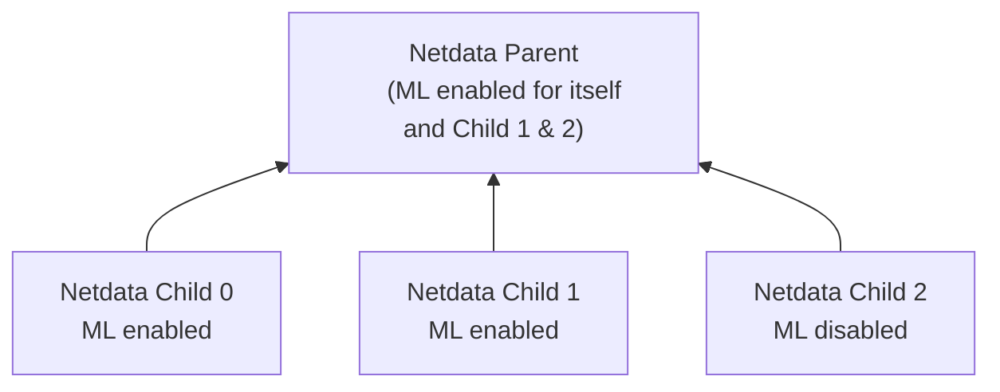

# ML Configuration

Netdata's [Machine Learning](/src/ml/README.md) capabilities are enabled by default if the [Database mode](/src/database/README.md) is set to `db = dbengine`

To enable or disable Machine Learning capabilities on a node:

1. [Edit `netdata.conf`](/docs/netdata-agent/configuration/README.md#edit-a-configuration-file-using-edit-config)
2. In the `[ml]` section, set `enabled` to `yes` to enable ML, `no` to disable it, or leave it at the default `auto` to enable ML only when [Database mode](/src/database/README.md) is set to `dbengine`
3. [Restart Netdata](/docs/netdata-agent/start-stop-restart.md)

Below is a list of all the available configuration params and their default values.

```bash
[ml]
        # enabled = auto
        # maximum num samples to train = 21600
        # minimum num samples to train = 900
        # train every = 3h
        # number of models per dimension = 18
        # dbengine anomaly rate every = 30
        # num samples to diff = 1
        # num samples to smooth = 3
        # num samples to lag = 5
        # random sampling ratio = 0.2
        # maximum number of k-means iterations = 1000
        # dimension anomaly score threshold = 0.99
        # host anomaly rate threshold = 1.0
        # anomaly detection grouping method = average
        # anomaly detection grouping duration = 5m
        # hosts to skip from training = !*
        # charts to skip from training = netdata.*
        # dimension anomaly rate suppression window = 15m
        # dimension anomaly rate suppression threshold = 450
        # delete models older than = 7d
```

## Configuration Examples

If you would like to run ML on a parent instead of at the edge, some configuration options are illustrated below.

This example assumes 3 child nodes [streaming](/docs/observability-centralization-points/metrics-centralization-points/README.md) to 1 parent node and illustrates the main ways you might want to configure running ML for the children on the parent, running ML on the children themselves, or even a mix of approaches.



```text
# parent will run ML for itself and child 1,2, it will skip running ML for child 0.
# child 0 will run its own ML at the edge.
# child 1 will run its own ML at the edge, even though parent will also run ML for it, a bit wasteful potentially to run ML in both places but is possible (Netdata Cloud will essentially average any overlapping models).
# child 2 will not run ML at the edge, it will be run in the parent only.

# parent-ml-enabled
# run ML on all hosts apart from child-ml-enabled
[ml]
        enabled = yes
        hosts to skip from training = child-0-ml-enabled

# child-0-ml-enabled
# run ML on child-0-ml-enabled
[ml]
        enabled = yes

# child-1-ml-enabled
# run ML on child-1-ml-enabled
[ml]
        enabled = yes

# child-2-ml-disabled
# do not run ML on child-2-ml-disabled
[ml]
        enabled = no
```

## Descriptions (min/max)

- `enabled`: `yes` to enable, `no` to disable, or `auto` to let Netdata decide when to enable ML.
- `maximum num samples to train`: (`3600`/`86400`) This is the maximum amount of time you would like to train each model on. For example, the default of `21600` trains on the preceding 6 hours of data, assuming an `update every` of 1 second.
- `minimum num samples to train`: (`900`/`21600`) This is the minimum amount of data required to be able to train a model. For example, the default of `900` implies that once at least 15 minutes of data is available for training, a model is trained, otherwise it is skipped and checked again at the next training run.
- `train every`: (`3h`/`6h`) This is how often each model will be retrained. For example, the default of `3h` means that each model is retrained every 3 hours. Note: The training of all models is spread out across the `train every` period for efficiency, so in reality, it means that each model will be trained in a staggered manner within each `train every` period.
- `number of models per dimension`: (`1`/`168`) This is the number of trained models that will be used for scoring. For example the default `number of models per dimension = 18` means that the most recently trained 18 models for the dimension will be used to determine the corresponding anomaly bit. This means that under default settings of `maximum num samples to train = 21600`, `train every = 3h` and `number of models per dimension = 18`, netdata will store and use the last 18 trained models for each dimension when determining the anomaly bit. This means that for the latest feature vector in this configuration to be considered anomalous it would need to look anomalous across _all_ the models trained for that dimension in the last 18*(10800/3600) ~= 54 hours. As such, increasing `number of models per dimension` may reduce some false positives since it will result in more models (covering a wider time frame of training) being used during scoring.
- `dbengine anomaly rate every`: (`30`/`900`) This is how often netdata will aggregate all the anomaly bits into a single chart (`anomaly_detection.anomaly_rates`). The aggregation into a single chart allows enabling anomaly rate ranking over _all_ metrics with one API call as opposed to a call per chart.
- `num samples to diff`: (`0`/`1`) This is a `0` or `1` to determine if you want the model to operate on differences of the raw data or just the raw data. For example, the default of `1` means that we take differences of the raw values. Using differences is more general and works on dimensions that might naturally tend to have some trends or cycles in them that is normal behavior to which we don't want to be too sensitive.
- `num samples to smooth`: (`0`/`5`) This is a small integer that controls the amount of smoothing applied as part of the feature processing used by the model. For example, the default of `3` means that the rolling average of the last 3 values is used. Smoothing like this helps the model be a little more robust to spiky types of dimensions that naturally "jump" up or down as part of their normal behavior.
- `num samples to lag`: (`0`/`5`) This is a small integer that determines how many lagged values of the dimension to include in the feature vector. For example, the default of `5` means that in addition to the most recent (by default, differenced and smoothed) value of the dimension, the feature vector will also include the 5 previous values too. Using lagged values in our feature representation allows the model to work over strange patterns over recent values of a dimension as opposed to just focusing on if the most recent value itself is big or small enough to be anomalous.
- `random sampling ratio`: (`0.2`/`1.0`) This parameter determines how much of the available training data is randomly sampled when training a model. The default of `0.2` means that Netdata will train on a random 20% of training data. This parameter influences cost efficiency. At `0.2` the model is still reasonably trained while minimizing system overhead costs caused by the training.
- `maximum number of k-means iterations`: This is a parameter that can be passed to the model to limit the number of iterations in training the k-means model. Vast majority of cases can ignore and leave as default.
- `dimension anomaly score threshold`: (`0.01`/`5.00`) This is the threshold at which an individual dimension at a specific timestep is considered anomalous or not. For example, the default of `0.99` means that a dimension with an anomaly score of 99% or higher is flagged as anomalous. This is a normalized probability based on the training data, so the default of 99% means that anything that is as strange (based on distance measure) or more strange as the most strange 1% of data observed during training will be flagged as anomalous. If you wanted to make the anomaly detection on individual dimensions more sensitive you could try a value like `0.90` (90%) or to make it less sensitive you could try `1.5` (150%).
- `host anomaly rate threshold`: (`0.1`/`10.0`) This is the percentage of dimensions (based on all those enabled for anomaly detection) that need to be considered anomalous at specific timestep for the host itself to be considered anomalous. For example, the default value of `1.0` means that if more than 1% of dimensions are anomalous at the same time then the host itself is considered in an anomalous state.
- `anomaly detection grouping method`: The grouping method used when calculating node level anomaly rate.
- `anomaly detection grouping duration`: (`1m`/`15m`) The duration across which to calculate the node level anomaly rate, the default of `900` means that the node level anomaly rate is calculated across a rolling 5 minute window.
- `hosts to skip from training`: This parameter allows you to turn off anomaly detection for any child hosts on a parent host by defining those you would like to skip from training here. For example, a value like `dev-*` skips all hosts on a parent that begin with the "dev-" prefix. The default value of `!*` means "don't skip any".
- `charts to skip from training`: This parameter allows you to exclude certain charts from anomaly detection. By default, only netdata related charts are excluded. This is to avoid the scenario where accessing the netdata dashboard could itself trigger some anomalies if you don't access them regularly. If you want to include charts that are excluded by default, add them in small groups and then measure any impact on performance before adding additional ones. Example: If you want to include system, apps, and user charts:`!system.* !apps.* !user.* *`.
- `delete models older than`: (`1d`/`7d`) Delete old models from the database that are unused, by default models will be deleted after 7 days.
