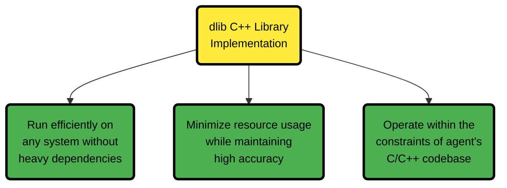
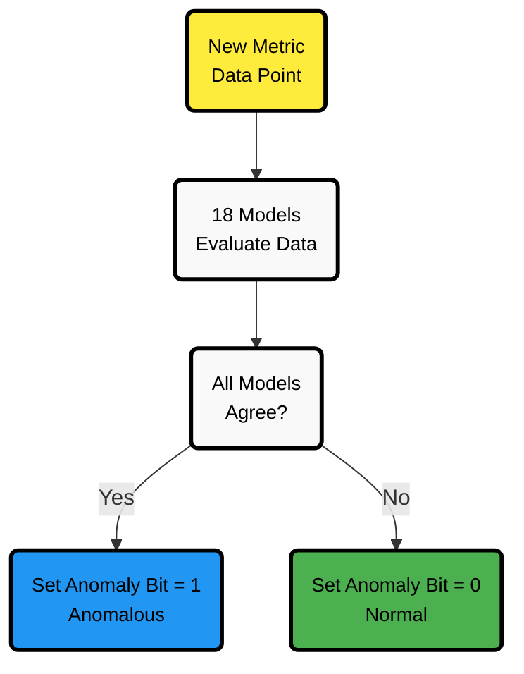
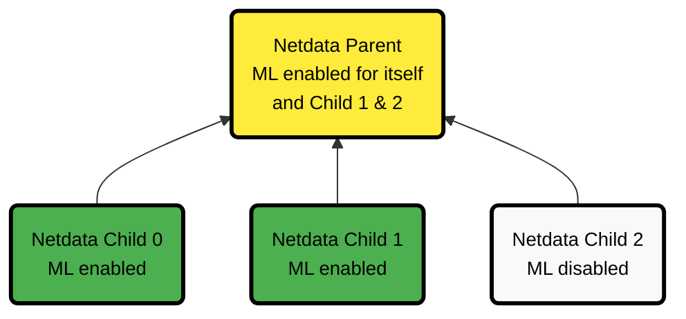

# ML Configuration

You can use Netdata's [Machine Learning](/src/ml/README.md) capabilities to detect anomalies in your infrastructure metrics. This feature is enabled by default if your [Database mode](/src/database/README.md) is set to `db = dbengine`.

## Enabling or Disabling Machine Learning

To enable or disable Machine Learning capabilities on your node:

1. [Edit `netdata.conf`](/docs/netdata-agent/configuration/README.md#edit-configuration-files).
2. In the `[ml]` section:
    - Set `enabled` to `yes` to enable ML.
    - Set `enabled` to `no` to disable ML.
    - Leave it at the default `auto` to enable ML only when [Database mode](/src/database/README.md) is set to `dbengine`.
3. [Restart Netdata](/docs/netdata-agent/start-stop-restart.md).

## Technical Implementation

Netdata implements machine learning using the lightweight [dlib](https://github.com/davisking/dlib) C++ library. This implementation choice allows Netdata to:



:::note

The ML implementation prioritizes minimal storage impact. Model objects are designed to be small, with each trained model typically requiring only a few kilobytes of memory.

:::

## Available Configuration Parameters

Below is a list of all available configuration parameters and their default values:

```bash
[ml]
        # enabled = auto
        # maximum num samples to train = 21600
        # minimum num samples to train = 900
        # train every = 3h
        # number of models per dimension = 18
        # dbengine anomaly rate every = 30
        # num samples to diff = 1
        # num samples to smooth = 3
        # num samples to lag = 5
        # random sampling ratio = 0.2
        # maximum number of k-means iterations = 1000
        # dimension anomaly score threshold = 0.99
        # host anomaly rate threshold = 1.0
        # anomaly detection grouping method = average
        # anomaly detection grouping duration = 5m
        # hosts to skip from training = !*
        # charts to skip from training = netdata.*
        # dimension anomaly rate suppression window = 15m
        # dimension anomaly rate suppression threshold = 450
        # delete models older than = 7d
```

## Multiple Models and False Positive Reduction

One of the **key strengths of Netdata's ML implementation is its use of multiple models** to virtually eliminate false positives.

When you configure the `number of models per dimension` parameter (default: 18), you're specifying how many trained models Netdata maintains for each metric.

:::note

The default setting of 18 models spanning approximately 54 hours (with models trained every 3 hours) ensures that anomalies are verified across different time frames before being flagged.

:::

### How Multiple Models Work Together

When your system detects a potential anomaly:

1. **The new data point is evaluated against all trained models** (up to 18 by default)
2. **Each model independently determines if the data point is anomalous** based on its training period
3. Only if **ALL** models agree that the data point is anomalous will Netdata set the anomaly bit to 1 (anomalous)



:::note

This consensus approach **reduces false positives by approximately 99%**, ensuring that you only see alerts for genuine anomalies that persist across different time scales.

:::

**Models trained on different time frames capture various patterns in your data**, making the system robust against temporary fluctuations.

## Configuration Examples

If you want to **run ML on a parent instead of at the edge**, the examples below illustrate various configurations.

This example assumes three child nodes [streaming](/docs/observability-centralization-points/metrics-centralization-points/README.md) to one parent node. It shows different ways to configure ML:

- Running ML on the parent for some or all children.
- Running ML on the children themselves.
- A mixed approach.



```text
# Parent will run ML for itself and Child 1 & 2, but skip Child 0.
# Child 0 and Child 1 will run ML independently.
# Child 2 will rely on the parent for ML and will not run it itself.

# Parent configuration
[ml]
        enabled = yes
        hosts to skip from training = child-0-ml-enabled

# Child 0 configuration
[ml]
        enabled = yes

# Child 1 configuration
[ml]
        enabled = yes

# Child 2 configuration
[ml]
        enabled = no
```

## Resource Considerations

When configuring machine learning, it's important to understand the resource implications:

:::note

Netdata's ML is designed to be lightweight, using approximately 1–2% of a single CPU core under default settings on a typical system.

:::

Several configuration options directly impact resource usage:

- **Increasing `number of models per dimension`** increases memory usage as more models are stored
- **Decreasing `train every`** increases CPU usage as models are trained more frequently
- **Increasing `maximum num samples to train`** increases memory usage during training but may improve accuracy
- **Adjusting `random sampling ratio`** allows you to control how much data is used during training (lower values reduce CPU usage)

For resource-constrained systems, consider these adjustments:

- Set `random sampling ratio = 0.1` to reduce training data by half from default
- Use `number of models per dimension = 6` to maintain multiple model consensus with reduced memory footprint
- Increase `train every = 6h` to reduce training frequency

## Parameter Descriptions (Min/Max Values)

# ML Parameter Settings

| Category                          | Parameter                              | Range            | Description                                                                                                                              |
|-----------------------------------|----------------------------------------|------------------|------------------------------------------------------------------------------------------------------------------------------------------|
| **General Settings**              | `enabled`                              | `yes/no/auto`    | Controls whether ML is enabled. `yes` to enable, `no` to disable, `auto` lets Netdata decide based on database mode.                     |
|                                   | `maximum num samples to train`         | `3600` - `86400` | Defines the maximum training period. Default `21600` trains on your last 6 hours of data.                                                |
|                                   | `minimum num samples to train`         | `900` - `21600`  | Minimum data needed to train a model. Training is skipped if less than `900` samples (15 minutes) are available.                         |
|                                   | `train every`                          | `3h` - `6h`      | How often models are retrained. Default `3h` means retraining every three hours. Training is staggered to distribute system load.        |
| **Model Behavior**                | `number of models per dimension`       | `1` - `168`      | Specifies how many trained models per dimension are used. Default `18` means models trained over the last ~54 hours are considered.      |
|                                   | `dbengine anomaly rate every`          | `30` - `900`     | How frequently Netdata aggregates anomaly bits into a single chart.                                                                      |
| **Feature Processing**            | `num samples to diff`                  | `0` - `1`        | Determines whether ML operates on raw data (`0`) or differences (`1`). Using differences helps detect anomalies in cyclical patterns.    |
|                                   | `num samples to smooth`                | `0` - `5`        | Controls data smoothing. Default `3` averages the last three values to reduce noise.                                                     |
|                                   | `num samples to lag`                   | `0` - `5`        | How many past values are included in the feature vector. Default `5` helps detect patterns over time.                                    |
| **Training Efficiency**           | `random sampling ratio`                | `0.2` - `1.0`    | Fraction of data used for training. Default `0.2` means 20% of available data is used, reducing system load while maintaining accuracy.  |
|                                   | `maximum number of k-means iterations` | -                | Limits iterations during k-means clustering (leave at default in most cases).                                                            |
| **Anomaly Detection Sensitivity** | `dimension anomaly score threshold`    | `0.01` - `5.00`  | Threshold for flagging an anomaly. Default `0.99` flags values in the top 1% of anomalies based on training data.                        |
|                                   | `host anomaly rate threshold`          | `0.1` - `10.0`   | Percentage of dimensions that must be anomalous for host to be considered anomalous. Default `1.0` means more than 1% must be anomalous. |
| **Anomaly Detection Grouping**    | `anomaly detection grouping method`    | -                | Method used to calculate node-level anomaly rate.                                                                                        |
|                                   | `anomaly detection grouping duration`  | `1m` - `15m`     | Time window for calculating anomaly rates. Default `5m` calculates over a 5-minute rolling window.                                       |
| **Skipping Hosts and Charts**     | `hosts to skip from training`          | -                | Excludes specific child hosts from training. Default `!*` means no hosts are skipped.                                                    |
|                                   | `charts to skip from training`         | -                | Excludes charts from anomaly detection. By default, Netdata-related charts are excluded.                                                 |
| **Model Retention**               | `delete models older than`             | `1d` - `7d`      | How long old models are stored. Default `7d` removes unused models after seven days.                                                     |