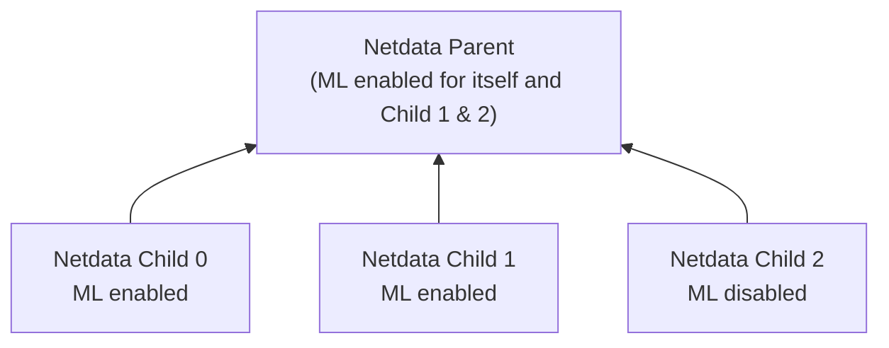

# ML Configuration

Netdata's [Machine Learning](/src/ml/README.md) capabilities are enabled by default if the [Database mode](/src/database/README.md) is set to `db = dbengine`.

## Enabling or Disabling Machine Learning

To enable or disable Machine Learning capabilities on a node:

1. [Edit `netdata.conf`](/docs/netdata-agent/configuration/README.md#edit-a-configuration-file-using-edit-config).
2. In the `[ml]` section:
    - Set `enabled` to `yes` to enable ML.
    - Set `enabled` to `no` to disable ML.
    - Leave it at the default `auto` to enable ML only when [Database mode](/src/database/README.md) is set to `dbengine`.
3. [Restart Netdata](/docs/netdata-agent/start-stop-restart.md).

## Available Configuration Parameters

Below is a list of all available configuration parameters and their default values:

```bash
[ml]
        # enabled = auto
        # maximum num samples to train = 21600
        # minimum num samples to train = 900
        # train every = 3h
        # number of models per dimension = 18
        # dbengine anomaly rate every = 30
        # num samples to diff = 1
        # num samples to smooth = 3
        # num samples to lag = 5
        # random sampling ratio = 0.2
        # maximum number of k-means iterations = 1000
        # dimension anomaly score threshold = 0.99
        # host anomaly rate threshold = 1.0
        # anomaly detection grouping method = average
        # anomaly detection grouping duration = 5m
        # hosts to skip from training = !*
        # charts to skip from training = netdata.*
        # dimension anomaly rate suppression window = 15m
        # dimension anomaly rate suppression threshold = 450
        # delete models older than = 7d
```

## Configuration Examples

If you want to run ML on a parent instead of at the edge, the examples below illustrate various configurations.

This example assumes three child nodes [streaming](/docs/observability-centralization-points/metrics-centralization-points/README.md) to one parent node. It shows different ways to configure ML:

- Running ML on the parent for some or all children.
- Running ML on the children themselves.
- A mixed approach.



```text
# Parent will run ML for itself and Child 1 & 2, but skip Child 0.
# Child 0 and Child 1 will run ML independently.
# Child 2 will rely on the parent for ML and will not run it itself.

# Parent configuration
[ml]
        enabled = yes
        hosts to skip from training = child-0-ml-enabled

# Child 0 configuration
[ml]
        enabled = yes

# Child 1 configuration
[ml]
        enabled = yes

# Child 2 configuration
[ml]
        enabled = no
```

## Parameter Descriptions (Min/Max Values)

### General Settings

- **`enabled`**: Controls whether ML is enabled.
    - `yes` to enable.
    - `no` to disable.
    - `auto` lets Netdata decide based on database mode.

- **`maximum num samples to train`** (`3600` - `86400`): Defines the maximum training period. The default of `21600` trains on the last 6 hours of data.

- **`minimum num samples to train`** (`900` - `21600`): The minimum amount of data needed to train a model. If less than `900` samples (15 minutes of data) are available, training is skipped.

- **`train every`** (`3h` - `6h`): Determines how often models are retrained. The default of `3h` means retraining occurs every three hours. Training is staggered to distribute system load.

### Model Behavior

- **`number of models per dimension`** (`1` - `168`): Specifies how many trained models per dimension are used for anomaly detection. The default of `18` means models trained over the last ~54 hours are considered.

- **`dbengine anomaly rate every`** (`30` - `900`): Defines how frequently Netdata aggregates anomaly bits into a single chart.

### Feature Processing

- **`num samples to diff`** (`0` - `1`): Determines whether ML operates on raw data (`0`) or differences (`1`). Using differences helps detect anomalies in cyclical patterns.

- **`num samples to smooth`** (`0` - `5`): Controls data smoothing. The default of `3` averages the last three values to reduce noise.

- **`num samples to lag`** (`0` - `5`): Defines how many past values are included in the feature vector. The default `5` helps the model detect patterns over time.

### Training Efficiency

- **`random sampling ratio`** (`0.2` - `1.0`): Controls the fraction of data used for training. The default `0.2` means 20% of available data is used, reducing system load.

- **`maximum number of k-means iterations`**: Limits iterations during k-means clustering (leave at default in most cases).

### Anomaly Detection Sensitivity

- **`dimension anomaly score threshold`** (`0.01` - `5.00`): Sets the threshold for flagging an anomaly. The default `0.99` flags values that are in the top 1% of anomalies based on training data.

- **`host anomaly rate threshold`** (`0.1` - `10.0`): Defines the percentage of dimensions that must be anomalous for the host to be considered anomalous. The default `1.0` means more than 1% must be anomalous.

### Anomaly Detection Grouping

- **`anomaly detection grouping method`**: Defines the method used to calculate the node-level anomaly rate.

- **`anomaly detection grouping duration`** (`1m` - `15m`): Determines the time window for calculating anomaly rates. The default `5m` calculates anomalies over a 5-minute rolling window.

### Skipping Hosts and Charts

- **`hosts to skip from training`**: Allows excluding specific child hosts from training. The default `!*` means no hosts are skipped.

- **`charts to skip from training`**: Excludes charts from anomaly detection. By default, Netdata-related charts are excluded to prevent false anomalies caused by normal dashboard activity.

### Model Retention

- **`delete models older than`** (`1d` - `7d`): Defines how long old models are stored. The default `7d` removes unused models after seven days.