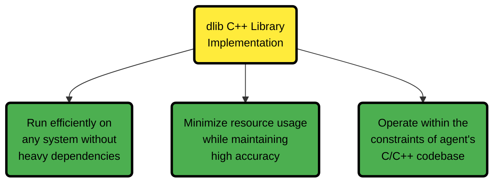
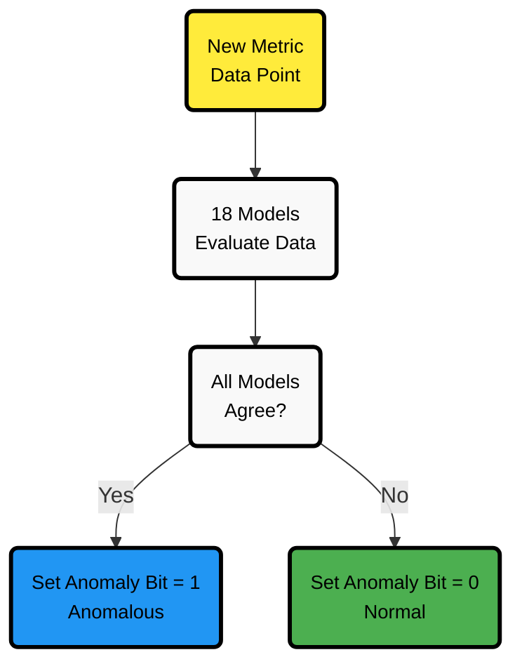
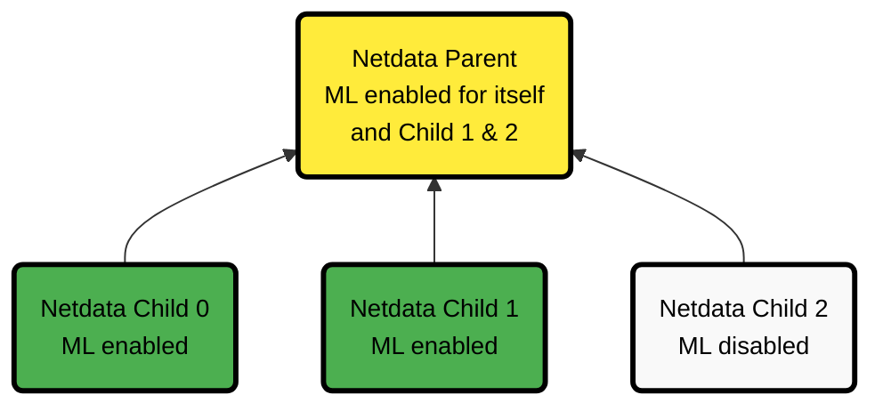

# ML Configuration

You can use Netdata's [Machine Learning](/src/ml/README.md) capabilities to detect anomalies in your infrastructure metrics. This feature is enabled by default if your [Database mode](/src/database/README.md) is set to `db = dbengine`.

## Enabling or Disabling Machine Learning

To enable or disable Machine Learning capabilities on your node:

1. [Edit `netdata.conf`](/docs/netdata-agent/configuration/README.md#edit-configuration-files).
2. In the `[ml]` section:
    - Set `enabled` to `yes` to enable ML.
    - Set `enabled` to `no` to disable ML.
    - Leave it at the default `auto` to enable ML only when [Database mode](/src/database/README.md) is set to `dbengine`.
3. [Restart Netdata](/docs/netdata-agent/start-stop-restart.md).

## Technical Implementation

Netdata implements machine learning using the lightweight [dlib](https://github.com/davisking/dlib) C++ library. This implementation choice allows Netdata to:


```mermaid
flowchart TD
    Dlib("dlib C++ Library<br/>Implementation")
    
    Efficiency("Run efficiently on<br/>any system without<br/>heavy dependencies")
    Resources("Minimize resource usage<br/>while maintaining<br/>high accuracy")
    Codebase("Operate within the<br/>constraints of agent's<br/>C/C++ codebase")
    
    Dlib --> Efficiency
    Dlib --> Resources
    Dlib --> Codebase
    
    %% Style definitions
    classDef alert fill:#ffeb3b,stroke:#000000,stroke-width:3px,color:#000000,font-size:14px
    classDef neutral fill:#f9f9f9,stroke:#000000,stroke-width:3px,color:#000000,font-size:14px
    classDef complete fill:#4caf50,stroke:#000000,stroke-width:3px,color:#000000,font-size:14px
    classDef database fill:#2196F3,stroke:#000000,stroke-width:3px,color:#000000,font-size:14px

    %% Apply styles
    class Dlib alert
    class Efficiency,Resources,Codebase complete
```

:::note

The ML implementation prioritizes minimal storage impact. Model objects are designed to be small, with each trained model typically requiring only a few kilobytes of memory.

:::

## Available Configuration Parameters

Below is a list of all available configuration parameters and their default values:

```bash
[ml]
        # enabled = auto
        # training window = 6h
        # min training window = 15m
        # train every = 3h
        # number of models per dimension = 18
        # num samples to diff = 1
        # max samples to smooth = 3
        # num samples to lag = 5
        # max training vectors = 1440
        # maximum number of k-means iterations = 1000
        # dimension anomaly score threshold = 0.99
        # host anomaly rate threshold = 1.0
        # anomaly detection grouping method = average
        # anomaly detection grouping duration = 5m
        # hosts to skip from training = !*
        # charts to skip from training = netdata.*
        # dimension anomaly rate suppression window = 15m
        # dimension anomaly rate suppression threshold = 450
        # delete models older than = 7d
        # num training threads = auto
        # flush models batch size = 256
        # stream anomaly detection charts = yes
        # enable statistics charts = yes
```

:::note

If your existing `netdata.conf` uses older parameter names (`maximum num samples to train`, `minimum num samples to train`, `num samples to smooth`, `random sampling ratio`), the Agent automatically migrates them to the current names on startup. Your existing configuration will continue to work, but you should update to the current parameter names.

:::

## Multiple Models and False Positive Reduction

One of the **key strengths of Netdata's ML implementation is its use of multiple models** to virtually eliminate false positives.

When you configure the `number of models per dimension` parameter (default: 18), you're specifying how many trained models Netdata maintains for each metric.

:::note

The default setting of 18 models spanning approximately 54 hours (with models trained every 3 hours) ensures that anomalies are verified across different time frames before being flagged.

:::

### How Multiple Models Work Together

When your system detects a potential anomaly:

1. **The new data point is evaluated against all trained models** (up to 18 by default)
2. **Each model independently determines if the data point is anomalous** based on its training period
3. Only if **ALL** models agree that the data point is anomalous will Netdata set the anomaly bit to 1 (anomalous)


```mermaid
flowchart TD
    NewData("New Metric<br/>Data Point")
    
    Models("18 Models<br/>Evaluate Data")
    
    AllAgree("All Models<br/>Agree?")
    
    SetNormal("Set Anomaly Bit = 0<br/>Normal")
    SetAnomalous("Set Anomaly Bit = 1<br/>Anomalous")
    
    NewData --> Models
    Models --> AllAgree
    AllAgree -->|"Yes"| SetAnomalous
    AllAgree -->|"No"| SetNormal
    
    %% Style definitions
    classDef alert fill:#ffeb3b,stroke:#000000,stroke-width:3px,color:#000000,font-size:14px
    classDef neutral fill:#f9f9f9,stroke:#000000,stroke-width:3px,color:#000000,font-size:14px
    classDef complete fill:#4caf50,stroke:#000000,stroke-width:3px,color:#000000,font-size:14px
    classDef database fill:#2196F3,stroke:#000000,stroke-width:3px,color:#000000,font-size:14px

    %% Apply styles
    class NewData alert
    class Models,AllAgree neutral
    class SetNormal complete
    class SetAnomalous database
```

:::note

This consensus approach **reduces false positives by approximately 99%**, ensuring that you only see alerts for genuine anomalies that persist across different time scales.

:::

**Models trained on different time frames capture various patterns in your data**, making the system robust against temporary fluctuations.

## Configuration Examples

If you want to **run ML on a parent instead of at the edge**, the examples below illustrate various configurations.

This example assumes three child nodes [streaming](/docs/observability-centralization-points/metrics-centralization-points/README.md) to one parent node. It shows different ways to configure ML:

- Running ML on the parent for some or all children.
- Running ML on the children themselves.
- A mixed approach.


```mermaid
flowchart BT
    C1("Netdata Child 0<br/>ML enabled")
    C2("Netdata Child 1<br/>ML enabled")
    C3("Netdata Child 2<br/>ML disabled")
    P1("Netdata Parent<br/>ML enabled for itself<br/>and Child 1 & 2")
    
    C1 --> P1
    C2 --> P1
    C3 --> P1
    
    %% Style definitions
    classDef alert fill:#ffeb3b,stroke:#000000,stroke-width:3px,color:#000000,font-size:14px
    classDef neutral fill:#f9f9f9,stroke:#000000,stroke-width:3px,color:#000000,font-size:14px
    classDef complete fill:#4caf50,stroke:#000000,stroke-width:3px,color:#000000,font-size:14px
    classDef database fill:#2196F3,stroke:#000000,stroke-width:3px,color:#000000,font-size:14px

    %% Apply styles
    class C1,C2 complete
    class C3 neutral
    class P1 alert
```

```text
# Parent will run ML for itself and Child 1 & 2, but skip Child 0.
# Child 0 and Child 1 will run ML independently.
# Child 2 will rely on the parent for ML and will not run it itself.

# Parent configuration
[ml]
        enabled = yes
        hosts to skip from training = child-0-ml-enabled

# Child 0 configuration
[ml]
        enabled = yes

# Child 1 configuration
[ml]
        enabled = yes

# Child 2 configuration
[ml]
        enabled = no
```

## Resource Considerations

When configuring machine learning, it's important to understand the resource implications:

:::note

Netdata's ML is designed to be lightweight, using approximately 1–2% of a single CPU core under default settings on a typical system.

:::

Several configuration options directly impact resource usage:

- **Increasing `number of models per dimension`** increases memory usage as more models are stored
- **Decreasing `train every`** increases CPU usage as models are trained more frequently
- **Increasing `training window`** increases memory usage during training but may improve accuracy
- **Adjusting `max training vectors`** allows you to control how much data is used during training (lower values reduce CPU usage)

For resource-constrained systems, consider these adjustments:

- Set `max training vectors = 720` to reduce training data from the default 1440
- Use `number of models per dimension = 6` to maintain multiple model consensus with reduced memory footprint
- Increase `train every = 6h` to reduce training frequency

## Parameter Descriptions (Min/Max Values)

# ML Parameter Settings

| Category                          | Parameter                                      | Range                   | Description                                                                                                                         |
|-----------------------------------|------------------------------------------------|-------------------------|-------------------------------------------------------------------------------------------------------------------------------------|
| **General Settings**              | `enabled`                                      | `yes`/`no`/`auto`       | Controls whether ML is enabled. `yes` to enable, `no` to disable, `auto` lets Netdata decide based on database mode.                |
|                                   | `training window`                              | `1h` - `24h`            | Maximum training period. Default `6h` trains on your last 6 hours of data.                                                         |
|                                   | `min training window`                          | `15m` - `6h`            | Minimum data period needed to train a model. Training is skipped if less than `15m` of data is available. Default `15m`.            |
|                                   | `train every`                                  | `1h` - `6h`             | How often models are retrained. Default `3h` means retraining every three hours. Training is staggered to distribute system load.   |
| **Model Behavior**                | `number of models per dimension`               | `1` - `168`             | Specifies how many trained models per dimension are used. Default `18` means models trained over the last ~54 hours are considered. |
| **Feature Processing**            | `num samples to diff`                          | `0` - `1`               | Determines whether ML operates on raw data (`0`) or differences (`1`). Using differences helps detect anomalies in cyclical patterns.|
|                                   | `max samples to smooth`                        | `0` - `5`               | Controls data smoothing. Default `3` averages the last three values to reduce noise.                                                |
|                                   | `num samples to lag`                           | `1` - `5`               | How many past values are included in the feature vector. Default `5` helps detect patterns over time.                               |
| **Training Efficiency**           | `max training vectors`                         | -                       | Maximum number of training vectors used per dimension. Default `1440`. Controls the training data subsample size.                   |
|                                   | `maximum number of k-means iterations`         | `500` - `1000`          | Limits iterations during k-means clustering (leave at default in most cases).                                                       |
|                                   | `num training threads`                         | `4` - `auto`            | Number of threads used for training. Default is auto-calculated based on CPU count (1/4 of CPUs on parent nodes).                   |
|                                   | `flush models batch size`                      | `8` - `512`             | Number of models to flush to disk per batch. Default `256`.                                                                         |
| **Anomaly Detection Sensitivity** | `dimension anomaly score threshold`            | `0.01` - `5.00`         | Threshold for flagging an anomaly. Default `0.99` flags values in the top 1% of anomalies based on training data.                   |
|                                   | `host anomaly rate threshold`                  | `0.1` - `10.0`          | Percentage of dimensions that must be anomalous for host to be considered anomalous. Default `1.0` means more than 1% must be anomalous. |
| **Anomaly Detection Grouping**    | `anomaly detection grouping method`            | -                       | Method used to calculate node-level anomaly rate.                                                                                   |
|                                   | `anomaly detection grouping duration`          | `1m` - `15m`            | Time window for calculating anomaly rates. Default `5m` calculates over a 5-minute rolling window.                                  |
| **Anomaly Suppression**           | `dimension anomaly rate suppression window`    | `1` - `training window` | Time window for anomaly rate suppression. Default `15m`.                                                                            |
|                                   | `dimension anomaly rate suppression threshold` | `1` - `suppression window` | Threshold for suppressing repeated anomaly flags. Default is half the suppression window.                                        |
| **Streaming & Statistics**        | `stream anomaly detection charts`              | `yes`/`no`              | Whether to stream anomaly detection charts to parent nodes. Default `yes`.                                                          |
|                                   | `enable statistics charts`                     | `yes`/`no`              | Whether to enable ML statistics charts. Default `yes`.                                                                              |
| **Skipping Hosts and Charts**     | `hosts to skip from training`                  | -                       | Excludes specific child hosts from training. Default `!*` means no hosts are skipped.                                               |
|                                   | `charts to skip from training`                 | -                       | Excludes charts from anomaly detection. By default, Netdata-related charts are excluded.                                            |
| **Model Retention**               | `delete models older than`                     | `1d` - `7d`             | How long old models are stored. Default `7d` removes unused models after seven days.                                                |