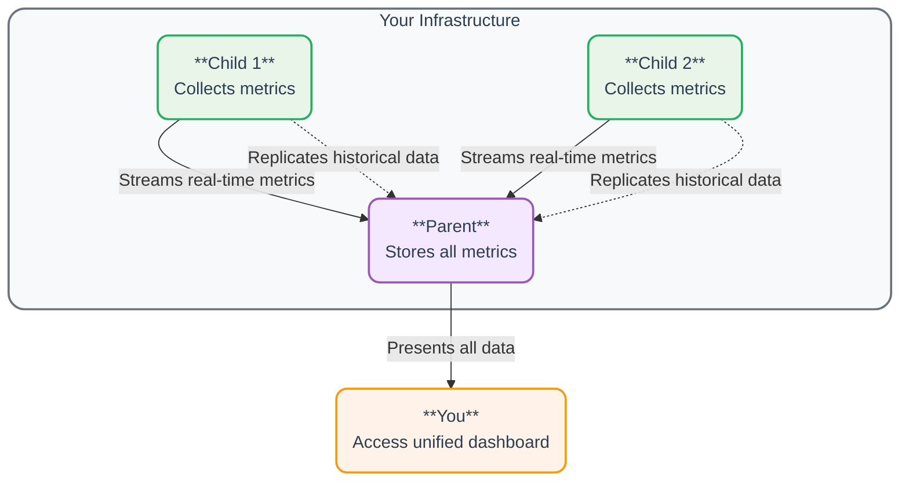
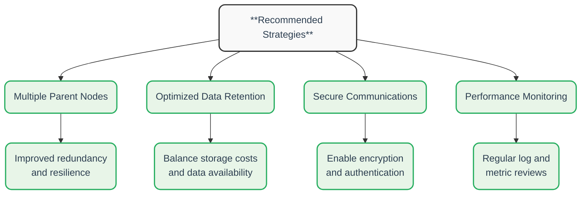

# Parent-Child Configuration Reference

## Introduction

This guide covers Netdata's advanced streaming and replication capabilities, which allow you to build centralized observability points across your infrastructure.

**[Streaming and replication](https://learn.netdata.cloud/docs/developer-and-contributor-corner/glossary#r)** work together to send metrics data from one Netdata Agent (Child) to another Netdata Agent (Parent). Streaming sends metrics in real-time, while replication ensures historical data is copied, as well, maintaining complete data integrity even after connection interruptions.

:::tip

If you're new to Netdata streaming or prefer a guided approach, [jump to our step-by-step guide](#step-by-step-setup-guide) at the end of this document. The guide will walk you through setting up a basic streaming configuration and then connecting to the comprehensive reference sections as needed.

For a quick reference on setting up the Parent-Child relationship, see the [Configuration Examples](#complete-configuration-examples) or refer to our comprehensive [Parents: Your Centralization Points](https://learn.netdata.cloud/docs/deployment-guides/parents-your-centralization-points) documentation for more details.

:::

## Understanding Streaming Architecture

Before diving into configuration details, it's important to understand the key concepts behind Netdata's streaming architecture:

<details>
<summary><strong>Click to see how streaming and replication work</strong></summary><br/>



</details><br/>

### Parent-Child Relationship

- **Child nodes** (data sources) collect metrics directly from systems they monitor
- **Parent nodes** (data centralization points) receive, store, and visualize metrics from multiple Child nodes
- **A single Parent can receive data from many Children**, creating a centralized monitoring hub
- **Child nodes maintain independence and continue collecting metrics** even if the connection to a Parent is lost

### Data Flow

1. **Collection**: Child nodes collect metrics from their local systems
2. **Streaming**: Child nodes send real-time metrics to Parent nodes
3. **Replication**: When a connection is established or restored, Child nodes replicate historical data to ensure Parents have complete history
4. **Storage**: Parent nodes store metrics based on their configured retention policies
5. **Visualization**: Users access the Parent node's dashboard to view metrics from all connected Child nodes

### Benefits of This Architecture

- **Efficiency**: Distribute collection workload across multiple nodes while centralizing visualization
- **Resilience**: Maintain data collection even during network disruptions or Parent node failures
- **Scalability**: Add more Child nodes or additional Parent nodes as your infrastructure grows
- **Flexibility**: Configure retention, alerts, and dashboards according to your specific needs

## Quick Reference

| Task | Configuration | Example |
|------|---------------|---------|
| Enable streaming on a Child | Set `enabled = yes` in `[stream]` section | `[stream]`<br/>`enabled = yes`<br/>`destination = 192.168.1.5` |
| Configure a Parent to accept connections | Create an `[API_KEY]` section | `[API_KEY]`<br/>`enabled = yes`<br/>`allow from = *` |
| Set up high availability | Configure multiple destinations on Child | `[stream]`<br/>`destination = parent1:19999 parent2:19999` |
| Filter which metrics to send | Use `send charts matching` setting | `send charts matching = system.* !system.uptime` |

## Configuration Overview

Netdata's streaming capabilities are configured through two key files:

- **`stream.conf`** – Controls streaming behavior, including Parent and Child configurations.
- **`netdata.conf`** – Contains global settings that can impact streaming.

To edit these files, navigate to your Netdata configuration directory (typically `/etc/netdata`) and run:

```sh
# Edit streaming configuration
sudo ./edit-config stream.conf

# Edit global Netdata settings
sudo ./edit-config netdata.conf
```

## Configuring `stream.conf`

The `stream.conf` file has three main sections:

1. **`[stream]`** – With these settings, you can configure how Child nodes send metrics.
2. **`[API_KEY]`** – Here you can define settings for authentication and access control between Parents and Children.
3. **`[MACHINE_GUID]`** – This area lets you customize settings for specific Child nodes by their unique ID.

### Identifying a Node's GUID

Each Netdata node has a unique identifier stored in:

```sh
/var/lib/netdata/registry/netdata.public.unique.id
```

This file is generated automatically the first time Netdata starts and remains unchanged.

## Recommended Deployment Strategies

For a production-ready streaming setup, consider the following best practices:

<details>
<summary><strong>Click to see deployment best practices</strong></summary><br/>



</details><br/>

:::tip

### Multiple Parent Nodes

Setting up multiple Parent nodes creates redundancy in your monitoring infrastructure. **If one Parent fails, Child nodes can automatically switch to another available Parent.** This approach:

- **Prevents single points of failure** in your monitoring system
- **Allows for maintenance** on Parent nodes without monitoring interruptions
- Can be **geographically distributed to reduce latency** for global deployments

### Optimized Data Retention

Configure data retention settings based on your specific monitoring needs:

- **Use longer retention periods** for critical systems and metrics
- **Implement tiered storage strategies** with different retention policies
- **Balance storage requirements with data availability** for historical analysis

### Secure Communications

**Protect your metrics data** during transmission:

- **Enable SSL/TLS encryption** for all streaming connections
- Implement **proper API key management** and rotation
- Use **IP-based restrictions** to control which nodes can connect

### Performance Monitoring

Regularly evaluate the **health of your** streaming **setup**:

- **Monitor network traffic** between Child and Parent nodes
- **Check for buffer overflows** or connection issues
- **Adjust settings** like buffer size based on actual performance

**By following these guidelines, you can set up a scalable and reliable Netdata streaming environment.**

:::

## `stream.conf` Detailed Reference

### `[stream]` Section (Child Node Settings)

With these settings, you can configure how your Child nodes send metrics to Parent nodes.

| Setting | Default | Description |
|---------|---------|-------------|
| `enabled` | `no` | Enables streaming. Set to `yes` to allow this node to send metrics. |
| [`destination`](#destination) | (empty) | Defines one or more Parent nodes to send data to. |
| `ssl skip certificate verification` | `yes` | Accepts self-signed or expired SSL certificates. |
| `CApath` | `/etc/ssl/certs/` | Directory for trusted SSL certificates. |
| `CAfile` | `/etc/ssl/certs/cert.pem` | File containing trusted certificates. |
| `api key` | (empty) | API key used by the Child to authenticate with the Parent. |
| `timeout` | `1m` | Connection timeout duration. |
| `default port` | `19999` | Default port for streaming if not specified in `destination`. |
| [`send charts matching`](#send-charts-matching) | `*` | Filters which charts are streamed. |
| `buffer size bytes` | `10485760` | Buffer size (10MB by default). Increase for higher latencies. |
| `reconnect delay` | `5s` | Time before retrying connection to the Parent. |
| `initial clock resync iterations` | `60` | Syncs chart clocks during startup. |
| `parent using h2o` | `no` | Set to `yes` if connecting to a Parent using the H2O web server. |

### `[API_KEY]` Section (Parent Node Authentication)

Here you can define settings for authentication and access control between Parents and Children.

| Setting | Default | Description |
|---------|---------|-------------|
| `enabled` | `no` | Enables or disables this API key. |
| `type` | `api` | Defines the section as an API key configuration. |
| [`allow from`](#allow-from) | `*` | Specifies which Child nodes (IP addresses) can connect. |
| `retention` | `1h` | How long to keep Child node metrics in RAM-based storage. |
| [`db`](#db) | `dbengine` | Specifies the database type for this API key. |
| `health enabled` | `auto` | Controls alerts and notifications (`auto`, `yes`, or `no`). |
| `postpone alerts on connect` | `1m` | Delay alerts for a period after the Child connects. |
| `health log retention` | `5d` | Duration (in seconds) to keep health log events. |
| `proxy enabled` | (empty) | Enables routing metrics through a proxy. |
| `proxy destination` | (empty) | IP and port of the proxy server. |
| `proxy api key` | (empty) | API key for the proxy server. |
| `send charts matching` | `*` | Defines which charts to stream. |
| `enable compression` | `yes` | Enables or disables data compression. |
| `enable replication` | `yes` | Enables or disables data replication. |
| `replication period` | `1d` | Maximum time window replicated from each Child. |
| `replication step` | `10m` | Time interval for each replication step. |
| `is ephemeral node` | `no` | Marks the Child as ephemeral (removes it after inactivity). |

### `[MACHINE_GUID]` Section (Per-Node Customization)

This area lets you customize settings for specific Child nodes by their unique ID.

| Setting | Default | Description |
|---------|---------|-------------|
| `enabled` | `no` | Enables or disables this specific node's configuration. |
| `type` | `machine` | Defines the section as a machine-specific configuration. |
| [`allow from`](#allow-from) | `*` | Lists IP addresses allowed to stream metrics. |
| `retention` | `3600` | Retention period for Child metrics in RAM-based storage. |
| [`db`](#db) | `dbengine` | Database type for this node. |
| `health enabled` | `auto` | Controls alerts (`auto`, `yes`, `no`). |
| `postpone alerts on connect` | `1m` | Delay alerts for a period after connection. |
| `health log retention` | `5d` | Duration to keep health log events. |
| `proxy enabled` | (empty) | Routes metrics through a proxy if enabled. |
| `proxy destination` | (empty) | Proxy server IP and port. |
| `proxy api key` | (empty) | API key for the proxy. |
| `send charts matching` | `*` | Filters streamed charts. |
| `enable compression` | `yes` | Enables or disables compression. |
| `enable replication` | `yes` | Enables or disables replication. |
| `replication period` | `1d` | Maximum replication window. |
| `replication step` | `10m` | Time interval for each replication step. |
| `is ephemeral node` | `no` | Marks the node as ephemeral (removes after inactivity). |

### Additional Settings

#### `destination`

Defines Parent nodes for streaming using the format:  
`[PROTOCOL:]HOST[%INTERFACE][:PORT][:SSL]`

- **PROTOCOL**: `tcp`, `udp`, or `unix` (only `tcp` and `unix` are supported for Parents).
- **HOST**: IPv4, IPv6 (in brackets `[ ]`), hostname, or Unix domain socket path.
- **INTERFACE** (IPv6 only): Network interface to use.
- **PORT**: Port number or service name.
- **SSL**: Enables TLS/SSL encryption.

Example (TCP connection with SSL to `203.0.113.0` on port `20000`):

```ini
[stream]
    # Send metrics securely to the Parent at 203.0.113.0:20000
    destination = tcp:203.0.113.0:20000:SSL
```

#### `send charts matching`

Controls which charts are streamed.

- `*` (default) – Streams all charts.
- Specific charts:

  ```ini
  [stream]
      # Only send CPU application charts and all system charts
      send charts matching = apps.cpu system.*
  ```

- Exclude charts using `!`:

  ```ini
  [stream]
      # Send all charts except CPU application charts
      send charts matching = !apps.cpu *
  ```

#### `allow from`

Defines which Child nodes (by IP) can connect.

- Allow a single IP:

  ```ini
  [API_KEY]
      # Only allow connections from 203.0.113.10
      allow from = 203.0.113.10
  ```

- Allow a range but exclude one:

  ```ini
  [API_KEY]
      # Allow all 10.*.*.* addresses except 10.1.2.3
      allow from = !10.1.2.3 10.*
  ```

#### `db`

Defines the database mode:

- `dbengine` – Stores recent metrics in RAM and writes older data to disk.
- `ram` – Stores metrics only in RAM (lost on restart).
- `none` – No database.

```ini
[API_KEY]
    # Use disk-based database for all metrics
    db = dbengine
```

## `netdata.conf` Settings Affecting Streaming

The `netdata.conf` file is the primary configuration file for the Netdata agent. The following sections can impact streaming:

### [global]

This section defines global settings for the Netdata agent.

- **hostname**: The hostname used by the agent.
- **memory mode**: Choose the memory mode for data collection (e.g., `ram` or `swap`).
- **error log file**: Path to the file where error logs are saved.

### [web]

Configure the web interface settings here.

- **bind to**: Define the network address to which Netdata binds.
- **port**: Set the port for the web interface (default: 19999).
- **disable SSL**: Set to `yes` to disable SSL support.

### [database]

Manage database settings for data storage and retention.

- **memory mode**: Choose between in-memory or disk-based storage.
- **data retention**: Set how long to keep historical data.
- **compression**: Enable or disable data compression.

## Complete Configuration Examples

### Basic Parent-Child Setup

**Parent node configuration (stream.conf):**

```ini
# Generate a random UUID first: uuidgen
[11111111-2222-3333-4444-555555555555]
    # Enable this API key
    enabled = yes
    # Allow all IPs to connect with this key
    allow from = *
    # Store data using dbengine for persistence
    db = dbengine
```

**Child node configuration (stream.conf):**

```ini
[stream]
    # Enable streaming on this node
    enabled = yes
    # Connect to Parent at 192.168.1.5 port 19999
    destination = 192.168.1.5
    # Use the same API key defined on the Parent
    api key = 11111111-2222-3333-4444-555555555555
```

### High Availability Setup with Multiple Parents

**Parent nodes configuration (stream.conf on both Parents):**

```ini
# Configuration for accepting metrics from Children
[11111111-2222-3333-4444-555555555555]
    enabled = yes
    allow from = *
    db = dbengine

# Configuration for accepting metrics from other Parents
[22222222-3333-4444-5555-666666666666]
    enabled = yes
    # Only allow the other Parent's IP
    allow from = 192.168.1.5 192.168.1.6
    db = dbengine
```

**First Parent node's configuration for streaming to the second Parent:**

```ini
[stream]
    enabled = yes
    destination = 192.168.1.6
    api key = 22222222-3333-4444-5555-666666666666
```

**Second Parent node's configuration for streaming to the first Parent:**

```ini
[stream]
    enabled = yes
    destination = 192.168.1.5
    api key = 22222222-3333-4444-5555-666666666666
```

**Child node configuration:**

```ini
[stream]
    enabled = yes
    # List both Parents for failover
    destination = 192.168.1.5 192.168.1.6
    api key = 11111111-2222-3333-4444-555555555555
```

## Verifying Successful Connections

If the streaming configuration is working correctly, you'll see logs similar to the following.

On the Parent side:

```
2017-03-09 09:38:52: netdata: INFO : STREAM [receive from [10.11.12.86]:38564]: new client connection.
2017-03-09 09:38:52: netdata: INFO : STREAM xxx [10.11.12.86]:38564: receive thread created (task id 27721)
```

On the Child side:

```
2017-03-09 09:38:28: netdata: INFO : STREAM xxx [send to box:19999]: connecting...
2017-03-09 09:38:28: netdata: INFO : STREAM xxx [send to box:19999]: established communication - sending metrics...
```

Both Parent and Child nodes log information in `/var/log/netdata/error.log`.

## Troubleshooting

<details>
<summary><strong>Slow Connection Issues</strong></summary>
<br/>

**Symptoms:**

- Buffer overflow errors
- Connection resets
- Partial message errors

**Child logs:**

```
netdata ERROR : STREAM_SENDER[CHILD HOSTNAME] : STREAM CHILD HOSTNAME [send to PARENT IP:PARENT PORT]: too many data pending - buffer is X bytes long, Y unsent - we have sent Z bytes in total, W on this connection. Closing connection to flush the data.
```

**Parent logs:**

```
netdata ERROR : STREAM_PARENT[CHILD HOSTNAME,[CHILD IP]:CHILD PORT] : read failed: end of file
```

**What's happening:**
Slow network connections or high-latency links can cause the streaming buffer to fill up faster than it can be transmitted. When the buffer reaches its maximum size, Netdata closes the connection to flush the pending data, then re-establishes the connection. This can lead to data gaps or inconsistencies if it happens frequently.

**Solutions:**

- Increase buffer size in `stream.conf`: `buffer size bytes = 20971520` (20MB)
- Check network bandwidth and latency between nodes
- Consider reducing the collection frequency on high-volume metrics
- If possible, place Parent nodes closer (network-wise) to Child nodes

</details>

<details>
<summary><strong>Connection Issues</strong></summary>
<br/>

**Symptoms:**

- Child can't establish a connection to a Parent
- Repeated reconnection attempts

**Child logs:**

```
ERROR : STREAM_SENDER[HOSTNAME] : Failed to connect to 'PARENT IP', port 'PARENT PORT' (errno 113, No route to host)
```

**What's happening:**
This error indicates network connectivity problems between the Child and Parent nodes. It could be due to firewall rules, incorrect IP addresses, or the Parent node not running.

**Solutions:**

- Verify firewalls allow traffic on port 19999 (or your custom port)
- Check that the Parent node is running and listening on the correct interface
- Verify that the IP address/hostname is correct in Child's configuration
- Test basic connectivity with tools like `ping` or `telnet`
- Check network routing between the nodes

</details>

<details>
<summary><strong>Authentication and Permission Issues</strong></summary>
<br/>

**Symptoms:**

- Connection established but immediately rejected
- "Forbidding access" errors

**Parent logs:**

```
STREAM [receive from [child HOSTNAME]:child IP]: `API key 'VALUE' is not allowed`. Forbidding access.
```

**What's happening:**
The Parent node is rejecting the connection because the API key doesn't match or the Child's IP address is not allowed by the `allow from` setting.

**Solutions:**

- Verify if the API key matches exactly between Parent and Child
- Check that the `allow from` setting permits the Child's IP address
- Ensure GUID formats are valid
- Check for whitespace or invisible characters in the API key
- Remember that API keys are case-sensitive

</details>

<details>
<summary><strong>'Is This a Netdata?' Error</strong></summary>
<br/>

**Symptoms:**

- Child tries to connect but receives an unexpected response

**Child logs:**

```
ERROR : STREAM_SENDER[CHILD HOSTNAME] : STREAM child HOSTNAME [send to PARENT HOSTNAME:PARENT PORT]: server is not replying properly (is it a netdata?).
```

**What's happening:**
The Child node is connecting to the destination, but the server is not responding with the expected Netdata streaming protocol. This commonly occurs when there's a mismatch in SSL/TLS settings or when the destination is not a Netdata server.

**Solutions:**

- Check SSL settings in the destination URL (add or remove `:SSL` as needed)
- Verify that you're connecting to a Netdata server and not another service
- Ensure both nodes are running compatible Netdata versions
- Check if a proxy or firewall is altering the connection

</details>

<details>
<summary><strong>Stream Charts Wrong</strong></summary>
<br/>

**Symptoms:**

- Data inconsistencies between Parent and Child
- Gaps in metrics collection

**What's happening:**
When the database settings between Parent and Child nodes don't match, it can cause inconsistencies in how data is stored and displayed. The most common cause is different memory modes or retention settings.

**Solutions:**

- Check for mismatch in the `[db].db` settings between the Parent and Child
- Ensure database retention settings are compatible
- Verify replication is enabled and properly configured
- Make sure both nodes are using the same (or compatible) database engine
- Check that clocks are synchronized between nodes

</details>

## FAQ

<details>
<summary><strong>Can I stream to multiple Parents simultaneously?</strong></summary>
<br/>

No, you can't stream to multiple Parents at the same time. However, you can configure multiple destinations for failover. Your Child node will connect to the first available Parent in the list.
</details>

<details>
<summary><strong>How does replication work with interrupted connections?</strong></summary>
<br/>

When you re-establish a connection, your Child node will replicate historical data based on the `replication period` setting. This ensures your Parent has a complete history even after interruptions.
</details>

<details>
<summary><strong>How much bandwidth does streaming use?</strong></summary>
<br/>

Your streaming setup will be very efficient, especially with compression enabled. Typically, it uses about 10–20 KB/s for a moderately active node. The actual bandwidth depends on the number of metrics and collection frequency you've configured.
</details>

<details>
<summary><strong>Can I filter which metrics are sent to the Parent?</strong></summary>
<br/>

Yes, you can use the `send charts matching` setting to include or exclude specific metrics from streaming. This works with wildcard patterns, giving you precise control over what metrics are transferred.
</details>

<details>
<summary><strong>How do I secure the streaming connection?</strong></summary>
<br/>

You can enable SSL in the destination setting by adding `:SSL` at the end. Configure proper certificates using the `CAfile` and `CApath` settings for production environments to ensure your metric data is protected in transit.
</details>

<details>
<summary><strong>Do I need to configure streaming on every Child node?</strong></summary>
<br/>

Yes, you need to configure each Child node with its own streaming configuration. However, you can use configuration management tools to deploy a standard configuration across your infrastructure, making this process more efficient.
</details>

## Step-by-Step Setup Guide

This guide will walk you through setting up Netdata streaming between nodes. **By following these sequential steps, you'll create a basic streaming configuration** that you can later customize based on your needs.

<details>
<summary><strong>Step 1: Prepare Your Environment</strong></summary>
<br/>

Before configuring streaming, ensure you have:

1. At least two Netdata instances are installed (one to act as Parent, one as Child)
2. Network connectivity between the instances
3. Administrative access to edit configuration files on both systems

</details>

<details>
<summary><strong>Step 2: Generate an API Key</strong></summary>
<br/>

The API key is used to authenticate the connection between Parent and Child nodes.

1. On the Parent node, generate a UUID to use as your API key:

   ```bash
   uuidgen
   ```

2. If the command isn't available, you can use an online UUID generator or create one with:

   ```bash
   cat /proc/sys/kernel/random/uuid
   ```

3. Copy the generated UUID (it should look like `11111111-2222-3333-4444-555555555555`)

</details>

<details>
<summary><strong>Step 3: Configure the Parent Node</strong></summary>
<br/>

The Parent node receives and stores metrics from Child nodes.

1. Open the stream configuration file for editing:

   ```bash
   cd /etc/netdata
   sudo ./edit-config stream.conf
   ```

2. Add a section for your API key (replace with your actual UUID):

   ```ini
   [11111111-2222-3333-4444-555555555555]
       enabled = yes
       allow from = *
   ```

3. Save and close the file

4. Restart Netdata to apply changes:

   ```bash
   sudo systemctl restart netdata
   ```

:::tip

**Deployment Strategy**
For critical environments, consider setting up at least two Parent nodes for redundancy. Each Parent should have enough disk space for your required retention period.

:::

</details>

<details>
<summary><strong>Step 4: Configure the Child Node</strong></summary>
<br/>

The Child node streams its metrics to the Parent node.

1. Open the stream configuration file on the Child node:

   ```bash
   cd /etc/netdata
   sudo ./edit-config stream.conf
   ```

2. Find the `[stream]` section and update it (replace PARENT_IP with your Parent's actual IP address):

   ```ini
   [stream]
       enabled = yes
       destination = PARENT_IP:19999
       api key = 11111111-2222-3333-4444-555555555555
   ```

3. Save and close the file

4. Restart Netdata on the Child node:

   ```bash
   sudo systemctl restart netdata
   ```

:::tip

**Security**

For production environments, enable SSL by adding `:SSL` to your destination. This encrypts the metric data in transit.

:::

</details>

<details>
<summary><strong>Step 5: Verify the Connection</strong></summary>
<br/>

Check that streaming is working properly between your nodes.

1. Check the Netdata logs on the Parent node:

   ```bash
   tail -f /var/log/netdata/error.log | grep STREAM
   ```

2. You should see connection messages similar to:

   ```
   STREAM [receive from [CHILD_IP]]: new client connection.
   STREAM xxx [CHILD_IP]: receive thread created (task id xxxxx)
   ```

3. On the Child node, you should see:

   ```
   STREAM xxx [send to PARENT_IP:19999]: connecting...
   STREAM xxx [send to PARENT_IP:19999]: established communication - sending metrics...
   ```

4. Open the Netdata dashboard on the Parent node (http://PARENT_IP:19999) and look for the Child node's hostname in the menu

:::tip

**Performance**
Monitor the connection logs for the first few hours to ensure there are no buffer overflow issues or frequent disconnections.

:::

</details>

<details>
<summary><strong>Step 6: Customize Your Setup (Optional)</strong></summary>
<br/>

Now that you have a working basic setup, you can customize it based on your deployment strategy:

### To Filter Which Metrics Are Streamed (Optimize Performance)

Add the following to the Child's `[stream]` section:

```ini
[stream]
    # Only send system and disk metrics, but not uptime
    send charts matching = system.* disk.* !system.uptime
```

### To Enable SSL Encryption (Security Enhancement)

1. On the Child node, update the destination to include SSL:

   ```ini
   [stream]
       destination = PARENT_IP:19999:SSL
   ```

2. If using self-signed certificates, you may need to add:

   ```ini
   [stream]
       ssl skip certificate verification = yes
   ```

### To Set Up Multiple Parents for High Availability (Redundancy Strategy)

1. Configure multiple destinations on the Child:

   ```ini
   [stream]
       destination = PARENT1_IP:19999 PARENT2_IP:19999
   ```

2. The Child will connect to the first available Parent and automatically switch if that connection fails

### Optimizing Data Retention (Storage Strategy)

On the Parent node, you can [configure retention settings](/src/database/CONFIGURATION.md#retention-settings) to control how long metrics are stored.

:::tip

**Advanced**
For large-scale deployments, consider setting up Parent-to-Parent streaming to create a hierarchical architecture that balances local responsiveness with centralized monitoring.

:::

</details>

## Quick Troubleshooting Tips

<details>
<summary><strong>Connection Problems</strong></summary>
<br/>

Verify that:

- Firewalls allow traffic on port 19999
- Both Netdata instances are running
- The API key matches exactly on both systems
- The Parent IP address is correct

</details>

<details>
<summary><strong>Metrics Not Appearing</strong></summary>
<br/>

Verify that:

- The connection is established (check logs)
- The Child node hasn't been excluded with `allow from` settings
- The metrics aren't being filtered out with `send charts matching`

</details>

<details>
<summary><strong>SSL/TLS Issues</strong></summary>
<br/>

If you're using SSL encryption:

- Make sure `:SSL` is added to the destination on the Child node
- Set `ssl skip certificate verification = yes` if using self-signed certificates
- Check that certificate paths are correct if using custom certificates

</details>

<details>
<summary><strong>Performance Problems</strong></summary>
<br/>

If streaming is slow or unstable:

- Increase the buffer size: `buffer size bytes = 20971520` (20MB)
- Check network quality between nodes
- Consider streaming fewer metrics with `send charts matching`

</details>