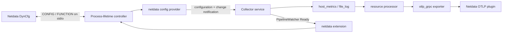

# Netdata DynCfg facade for OpenTelemetry: POC

This custom Collector distribution exposes two simple Netdata configuration
templates and generates ordinary OpenTelemetry pipelines behind them. It uses
real plugins.d DynCfg commands and exports metrics and logs to Netdata's existing
OTLP/gRPC plugin. It requires neither CollectorV2 nor a custom chart converter.

The implementation is experimental and deliberately outside production packaging.
It uses released OTel 0.157.0 components, with stable API modules at 1.63.0.



## Build and test

Run from this directory in a Netdata checkout. Go 1.27+, Make, and network access
for the pinned Go modules are required. OCB is invoked through `go run`; the local
Contrib checkout is not modified or required.

```sh
make test          # controller/provider race tests and go vet
make integration   # build with OCB, then test the actual executable
make agent-smoke   # Linux build plus an isolated real Netdata Docker Agent
```

`agent-smoke` also needs Python 3 and Docker. The Linux binary uses the build
machine's architecture; select `GOARCH=amd64` or `GOARCH=arm64` when the Docker
daemon uses a different architecture. Override the image with
`make agent-smoke IMAGE=netdata/netdata:<tag-or-digest>`.

Generated sources and binaries live under `.build/`, which is gitignored.
`builder-config.yaml` includes the custom provider and extension, two Contrib
receivers, file storage, resource processing, and the standard OTLP exporter.
The environment provider is included because the Collector CLI uses `env` as its
default scheme even when `--config=netdata:local` is explicit.

## What the user configures

The facade registers templates at `/collectors/otel-poc`:

| Template | Job configuration | Generated receiver |
| --- | --- | --- |
| `otel-poc:hostmetrics` | `{"interval":"2s","service_name":"host"}` | CPU and memory scrapers in `host_metrics` |
| `otel-poc:filelogs` | `{"paths":["/var/log/example.log"],"service_name":"app"}` | `file_log` with persistent offsets |

Job IDs append `:<name>`. Names accept ASCII letters, digits, `_`, and `-`.
File paths must be absolute; glob patterns are supported. New file jobs start at
the end of discovered files. `service_name` defaults to `otel-facade-poc`, and
the host collection interval defaults to `2s` with a minimum of `1s`.

Templates support `schema`, `add`, and `test`. Jobs support `schema`, `get`,
`update`, `test`, `enable`, `disable`, `remove`, and `restart`. JSON schemas use
Netdata's `jsonSchema` / `uiSchema` envelope. `test` validates configuration,
including upstream receiver validation; it does not open files or test delivery.

No receiver names, processor lists, exporter settings, or pipeline YAML appear in
these job forms. Every pipeline attaches `service.name` and `netdata.poc.job`
resource attributes, then exports OTLP/gRPC to `127.0.0.1:4317` by default.

## Run the facade directly

Keep stdin open while the Collector runs. Stdout is exclusively the Netdata
protocol; Collector diagnostics go to stderr.

```sh
mkdir -p /tmp/otel-facade-state
NETDATA_OTEL_POC_STATE_DIR=/tmp/otel-facade-state \
NETDATA_OTEL_POC_ENDPOINT=127.0.0.1:4317 \
  .build/collector/otel-facade \
  --config=netdata:local --feature-gates=service.AllowNoPipelines
```

The state directory must be absolute and writable by the plugin account. It
stores file offsets, not job configuration. Netdata owns durable job configuration
and replays it when the plugin registers its templates after a process restart.

For a manual protocol experiment, paste these frames into the running process:

```text
FUNCTION_PAYLOAD add-host 30 "config otel-poc:hostmetrics add host" "0xffff" "poc" "application/json"
{"interval":"2s","service_name":"host"}
FUNCTION_PAYLOAD_END
FUNCTION enable-host 30 "config otel-poc:hostmetrics:host enable" "0xffff" "poc"
FUNCTION get-host 30 "config otel-poc:hostmetrics:host get" "0xffff" "poc"
```

With Netdata supervising the executable, the daemon sends the enable/disable
decision itself. A plugins.d launcher must ignore Netdata's numeric update-interval
argument and execute the command above. The smoke test provides such a launcher
inside its temporary container; it does not install anything on the host.

## Ownership and reload behavior

- `internal/control` owns stdio and accepted job intent for the process lifetime.
  It reuses Netdata's Go Function parser and protocol encoder without importing
  the collector runtime. OCB factories share one lazily initialized controller;
  merely constructing a factory or asking for its scheme performs no I/O.
- `netdataprovider` returns a configuration snapshot and a one-shot watch callback.
  Rapid edits coalesce. Changes between closing a watch and retrieving another
  snapshot are retained. Callbacks never run under the command owner's lock.
  Literal dollars are escaped at this boundary so file paths and service names
  cannot become Collector `${provider:...}` expressions; GET preserves input.
- `netdataextension` reports revision-specific pipeline readiness. Old service
  callbacks cannot mark a newer configuration running.
- ADD adopts a passive job and returns 202 before registration. Enable or an
  enabled update returns 202 before activation. Invalid edits return 400 and
  preserve the accepted configuration. Disabled updates do not restart pipelines.
- An effective runtime change reloads the **whole Collector service**, including
  other enabled jobs. The DynCfg controller survives. Stable receiver IDs and the
  `file_storage` extension retain file offsets through these reloads.

## Demonstrated behavior and limits

The executable tests capture real OTLP messages and cover both signals, passive
ADD, rejected updates, rapid edits, stale readiness, cross-job reload with file
offset retention, literal dollar/expression strings, disable/remove, and EOF/QUIT shutdown.

The Docker smoke test was validated with Netdata `v2.11.0-305-nightly` on Linux
arm64. It checks daemon-issued enable commands, actual numeric chart samples,
a synthetic log marker stored in the OTLP plugin's WAL, accepted/rejected updates,
job replay after Agent restart, disabled-state replay, and removal.

The smoke container has no network interfaces beyond loopback, publishes no ports,
and mounts only its generated fixtures and the POC binary. A **test-only stdout
relay** grants anonymous DynCfg access to this facade's registrations so the test
can use an unclaimed Agent. The distribution retains Netdata's normal permissions.
The fixture disables log compression to verify the stored marker; it does not test
the authenticated Logs UI or Cloud UI rendering. It removes its own container and
temporary volumes afterward.

This POC does not provide per-pipeline reload isolation, rollback, persistent
export queues, TLS/credentials configuration, arbitrary receivers, or deployment
wiring. `running` means the Collector started the pipeline; it is **not** proof of
a successful scrape, file discovery, or exporter delivery. Runtime startup failure
can terminate the Collector and affect all jobs; daemon replay is recovery, not
transactional rollback. EOF/QUIT stop the process; EOF during an in-progress reload
may be reported as a configuration error. Reusing a removed file job's name also
reuses its retained offset storage. Zero-job startup uses the experimental
`service.AllowNoPipelines` feature gate.

For production, the existing Netdata OTLP metric mapping and supported data types
still determine the resulting charts. See [OTLP ingestion](../../docs/opentelemetry/otlp-ingestion.md).
Adding another curated integration would add its factory to the OCB manifest and
a job-to-pipeline mapping here; it does not require editing upstream Contrib code.

References: [OCB guide](https://opentelemetry.io/docs/collector/extend/ocb/),
[external DynCfg protocol](../../src/plugins.d/DYNCFG.md),
[Go Function input parser](../../src/go/plugin/framework/functions/README.md).
