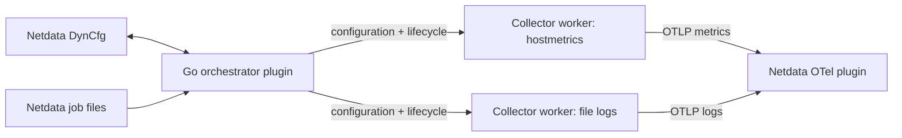

# External OpenTelemetry job orchestrator: POC

This alternative POC puts Netdata's existing Go job manager in charge of one
OpenTelemetry Collector process per job. Users configure host metrics or file
logs through real DynCfg forms or Netdata configuration files. Each worker is a
real OCB-built Collector distribution and sends OTLP directly to Netdata's OTel
plugin. Updating one job replaces only its worker.



The experimental feature is disabled in default builds. It uses Collector
v0.157.0 with stable APIs v1.63.0. Building needs Go 1.27+, Python 3, Make, a C
compiler for the local `nd-run` helper, and access to the pinned Go modules.
No local Contrib checkout is needed.

## Build and test

From this directory:

```sh
make build
make test
make integration
make installer-test
make linux-amd64
make agent-smoke SMOKE_ARCH=arm64  # Docker Desktop on Apple Silicon
```

`make build` produces `.build/otel-orchestrator.plugin` and `.build/otel-worker`.
The local manager uses the real helper built at `.build/bin/nd-run`.
`make integration` exercises the actual binaries and framework using plugins.d
DynCfg frames and an OTLP capture server. `make installer-test` checks installer
flag handling and CMake wiring without installing on the host. Docker smoke tests
need Docker and use an isolated temporary Agent container; select its image with
`IMAGE=netdata/netdata:<tag-or-digest>` and a matching `SMOKE_ARCH`.

The Linux x86-64 pair is:

```text
.build/linux-amd64/otel-orchestrator.plugin
.build/linux-amd64/otel-worker
```

These are static Go binaries; no Go runtime is needed on the VM. Keep the pair in
the same plugins directory. The prebuilt Linux manager expects Netdata's `nd-run`
at `/usr/sbin/nd-run`. An older Agent may lack this helper; the source installer
below supplies the matching helper and handles custom installation prefixes.
`make linux-arm64` is also available.

Generated sources and binaries stay in ignored `.build/` directories.

## Install the branch on a Linux VM

From the repository root:

```sh
sudo ./netdata-installer.sh --enable-plugin-otelcolpoc --enable-plugin-otel
```

Use the usual Netdata source-build prerequisites, plus Go 1.27+ and the Rust
toolchain required by `src/crates/Cargo.toml` for the OTLP sink. The installer
checks/provisions Go. The flags are independent: the first installs the manager
and worker; the second builds Netdata's OTLP receiver. The installer starts or
restarts Netdata unless `--dont-start-it` is passed.

The installed files are `otel-orchestrator.plugin` and `otel-worker` under
`usr/libexec/netdata/plugins.d` beneath the installation prefix. Only the manager
has a `.plugin` suffix. Netdata starts it with the usual positional interval
(e.g. `1`); it starts idle and requires no Collector YAML. Workers are created
when jobs are enabled.

Ensure these entries are enabled in the existing `netdata.conf` section:

```ini
[plugins]
    otel-orchestrator = yes
    otel = yes
```

If the first POC is still installed, disable its separate `otel-facade` plugin
while comparing approaches to avoid collecting the same sources twice.

The CMake option is `-DENABLE_PLUGIN_OTELCOLPOC=ON`.
`--disable-plugin-otelcolpoc` skips building/installing the POC; it does not remove
an existing installation. Disable an installed manager through `[plugins]`.

## Configure jobs

The DynCfg templates are:

| Template | Purpose |
| --- | --- |
| `otel-orchestrator:collector:hostmetrics` | CPU and memory via `host_metrics` |
| `otel-orchestrator:collector:filelogs` | File tailing via `file_log` |

A job ID appends `:<name>`. The framework owns names, passive ADD, enable/disable,
GET, schema, test, update, restart and remove. The frontend's `name` field is
accepted by the schema. Job names remain the framework's authoritative identity.

Hostmetrics form fields:

- `service_name`: resource attribute, default `otel-orchestrator-poc`.
- `collection_interval`: default `2s`, minimum `1s`.
- `scrapers`: `cpu`, `memory`, or both; both are selected by default.

Filelogs form fields:

- `service_name`: resource attribute, same default.
- `include`: absolute file paths or glob patterns, readable by the Netdata user.
- `start_at`: `end` (default) or `beginning`, used only when no saved offset exists.

`update_every` is the framework's worker-uptime chart cadence. It does not alter
the hostmetrics receiver's collection interval. It is accepted but hidden in the
form to keep the two intervals distinct.

File-based configuration uses normal Netdata `jobs:` files. For example,
`/etc/netdata/otel-orchestrator/hostmetrics.conf`:

```yaml
jobs:
  - name: host
    service_name: vm-host
    collection_interval: 2s
    scrapers: [cpu, memory]
```

And `/etc/netdata/otel-orchestrator/filelogs.conf`:

```yaml
jobs:
  - name: app
    service_name: application
    include: [/var/log/example.log]
    start_at: end
```

Use the Agent's configured user configuration directory if different. Restart the
plugin after adding static files, or use the Go framework's configured watch path.
Netdata owns durable DynCfg configuration and replays its jobs after restart.

Workers export insecure OTLP/gRPC to `127.0.0.1:4317` by default. The manager reads
`NETDATA_OTEL_POC_ENDPOINT` to override it. File offsets live under
`${NETDATA_LIB_DIR}/otel-orchestrator`; `NETDATA_OTEL_POC_STATE_DIR` can override
that with an absolute writable directory. Each file job has a stable hashed
subdirectory, independent of editable attributes. Removing a job retains its
offsets; reusing the same name reuses them. These files store offsets, not a
persistent export queue.

For direct protocol experiments, keep stdin open:

```sh
NETDATA_OTEL_POC_STATE_DIR=/tmp/otel-orchestrator-state \
  .build/otel-orchestrator.plugin 1
```

```text
FUNCTION_PAYLOAD add-host 30 "config otel-orchestrator:collector:hostmetrics add host" "0xffff" "poc" "application/json"
{"service_name":"host","collection_interval":"2s","scrapers":["cpu","memory"]}
FUNCTION_PAYLOAD_END
FUNCTION enable-host 30 "config otel-orchestrator:collector:hostmetrics:host enable" "0xffff" "poc"
FUNCTION get-host 30 "config otel-orchestrator:collector:hostmetrics:host get" "0xffff" "poc"
QUIT
```

When Netdata supervises the manager, the daemon supplies enable/disable decisions.

## Ownership and lifecycle

- The manager reuses the Agent's DynCfg, file discovery, config precedence,
  candidate validation and V2 long-lived job runner. A discovery source with no
  default jobs keeps a fileless installation available for manual DynCfg. It does not parse or
  implement a second DynCfg state machine.
- The V2 adapter generates native OTel configuration and exposes a worker uptime
  chart. OTel telemetry travels directly to the sink; no V2 metric conversion is
  involved.
- `Check` calls the real worker's `validate` command. This checks upstream component
  configuration without opening the file-offset database or starting pipelines.
  Invalid candidates leave the accepted worker running. Runtime permissions,
  resource acquisition and destination delivery can still fail after validation.
- `Run` acquires the job's resources after its predecessor has stopped. A custom
  `netdata_worker` extension reports `PipelineWatcher.Ready` over the private
  stdout pipe. This means pipelines started, not that the sink received data.
- A custom `worker:stdin` provider accepts one native JSON configuration line.
  It escapes literal dollar signs before OTel's resolver runs. The pipe remains
  open for the worker's lifetime; EOF requests normal Collector shutdown. The
  provider and extension contain no DynCfg or job orchestration logic.
- Cancellation closes that pipe. If shutdown does not complete within five
  seconds, `ndexec` terminates the owned process group and reaps the worker.
  Worker stdout is consumed internally; the manager alone writes Netdata protocol.
- Enable/update/restart replaces only the selected job's worker. Its previous
  process stops before the replacement starts, allowing exclusive offset storage.
  Other jobs keep their processes and pipelines.

## POC boundaries

This implements two curated job types, not arbitrary receiver/processor editing,
raw Collector YAML jobs, or incoming-OTLP normalization. The distribution contains
upstream hostmetrics/filelog receivers, resource processor, OTLP exporter and file
storage, plus the small Netdata lifecycle bridge. Adding a different receiver
requires updating the OCB manifest and its curated configuration adapter.

One Collector per job has a higher memory/process cost than a shared Collector.
A configuration edit creates a collection gap for that job. There is no
zero-downtime handoff or persistent export queue. File offsets preserve position
through ordinary restarts but do not provide exactly-once delivery.

Unexpected worker exit marks that job failed through the existing framework;
this POC does not add an automatic post-readiness crash-restart policy. The manager
can keep other jobs running, and DynCfg restart can start the failed job again.
QUIT and normal Agent signals shut down owned workers. Unexpected stdin EOF is
reported as a framework input failure and may exit nonzero after cleanup.

This is an opt-in comparative POC, not an integration catalogue entry or a
production support commitment. Build, runtime and smoke tests live beside it.
